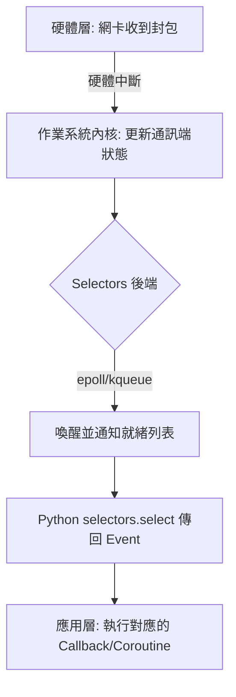

# 模組與硬體層級事件通知的聯繫

作為一名深耕系統架構多年的工程師，我常說：**「不要試圖比作業系統更聰明。」** 在處理併發 I/O 時，初學者最容易犯的錯誤就是用應用層的邏輯去硬碰硬地輪詢狀態。這不僅浪費 CPU 週期，更是一種設計上的怠惰。

Python 的 `selectors` 模組本質上是核心系統呼叫（System Calls）的封裝器，它建立了一條從 Python 虛擬機直接通往硬體層級中斷機制的快速道路。以下是理解並實踐這一機制的關鍵準則。

---

### 情境 1：終止手動輪詢，改用 `selectors` 實現事件驅動

在處理非阻塞（Non-blocking） Socket 時，新手常會陷入一個死循環：不斷詢問「資料好了嗎？」。這種行為被稱為「忙碌等待（Busy-waiting）」，會導致 CPU 使用率瞬間飆升至 100%。

#### 核心概念
手動輪詢會不斷在用戶空間（User Space）與內核空間（Kernel Space）之間切換，並拋出大量的 `BlockingIOError`。而 `selectors` 則是告訴作業系統：「這是我的 Socket 列表，有資料時叫我。」這讓 CPU 在沒有事件發生時進入休眠狀態。

#### 程式碼範例：Bad vs. Better

```python
# Bad: 毀滅性的手動輪詢
import socket

server = socket.socket()
server.setblocking(False)
# ... bind and listen ...

while True:
    try:
        # 每毫秒都在浪費 CPU 週期，即使沒有連線
        conn, addr = server.accept()
    except BlockingIOError:
        continue # CPU 使用率飆升至 100%

# Better: 優雅的 selectors 事件驅動
import selectors
import socket

selector = selectors.DefaultSelector() # 自動選擇最優系統呼叫
server = socket.socket()
server.setblocking(False)
server.bind(('localhost', 8000))
server.listen()

# 向作業系統註冊我們關心的事件 (讀取連線)
selector.register(server, selectors.EVENT_READ)

while True:
    # select() 會阻塞，但不會佔用 CPU。作業系統會在硬體中斷發生時喚醒它
    events = selector.select(timeout=1)
    for key, mask in events:
        callback = key.data
        # 處理連線...
```

#### 底層原理探討與權衡
**為什麼（Rationale）**：`select()` 調用會將控制權交還給 OS 內核。內核會將該進程排入等待隊列，直到網卡（NIC）收到封包觸發硬體中斷，或是設定的超時時間到達。這種設計實現了極高的能量效率。

**權衡**：雖然 `selectors` 大幅降低了 CPU 消耗，但它引入了非同步編程的複雜性。你不再擁有順序執行的控制流，而是必須依賴回調（Callbacks）或協程（Coroutines）來管理狀態。

---

### 情境 2：識別並配置作業系統特定的後端驅動

不同作業系統處理事件通知的效率天差地遠。如果你在 Linux 上開發卻使用最原始的 `select()`，你將無法處理數萬個併發連線。

#### 核心概念
`selectors.DefaultSelector` 是架構師的好友，它會根據你的執行環境自動選擇效能最佳的實作：
*   **Linux**: `epoll` - 支援大量的檔案描述符（FD），且效能不會隨數量線性下降。
*   **macOS/FreeBSD**: `kqueue` - 高效的內核事件佇列。
*   **Windows**: `select` 或 `IOCP` (I/O Completion Port)。

#### 比較表

| 系統機制 | 適用作業系統 | 特性 | 併發能力 |
| :--- | :--- | :--- | :--- |
| `select` | 所有系統 | 每次調用需傳遞完整 FD 列表， O(n) 複雜度 | 低 (< 1024) |
| `epoll` | Linux | 內核維護事件列表，僅返回就緒的 FD，O(1) 複雜度 | 極高 |
| `kqueue` | BSD / macOS | 類似 epoll，支援多種過濾器，效能極佳 | 極高 |
| `IOCP` | Windows | 基於「完成通知」而非「就緒通知」的異步模型 | 高 |

#### 流程圖：從硬體中斷到 Python 回調



---

### 情境 3：理解 Selectors 如何支撐 `asyncio` 的事件循環

`asyncio` 並非魔術，它只是將 `selectors` 的低階機制封裝成了更易讀的 `async/await` 語法。

#### 核心概念
`asyncio` 的事件循環（Event Loop）本質上就是一個運行中的 `selectors`。當你 `await` 一個 Socket 操作時，`asyncio` 會將該 Socket 註冊到它的 `selector` 中，並暫停當前協程；直到 `selector.select()` 回報該 Socket 已就緒，事件循環才會恢復協程的執行。

#### 適用場景
*   **拇指法則**：如果你需要建立高性能的伺服器（如 Web Server、Chat Server），應直接使用 `asyncio` 或 `uvloop`。
*   **例外情況**：當你正在開發底層網路框架，或者需要自定義非 Socket 的檔案描述符處理邏輯時，才需要直接操作 `selectors`。

---

### 延伸思考

**1️⃣ 問題一**：如果我在 Linux 上手動指定使用 `select` 而非 `epoll`，會發生什麼事？

**👆 回答**：根據 `selectors` 模組的特性，雖然功能上仍然可行，但在處理大量連線（例如超過 1024 個）時，`select` 會面臨系統層級的限制，且每次檢查連線狀態都要遍歷整個列表，導致 CPU 開銷隨連線數線性增長，這在現代高併發系統中是不可接受的。

---

**2️⃣ 問題二**：`uvloop` 為什麼宣稱比標準 `asyncio` 更快？

**👆 回答**：`uvloop` 是基於 `libuv` 的 C 實作，它對底層的 `epoll/kqueue` 調用進行了極致的優化，減少了 Python 層級的開銷。這再次證明了**愈貼近內核機制，效能就愈強大**。

---

**3️⃣ 問題三**：非同步 I/O 與多執行緒（Multithreading）在作業系統層級的主要區別是什麼？

**👆 回答**：多執行緒依賴 OS 的**搶佔式多工（Preemptive Multitasking）**，由內核進行上下文切換（Context Switch），這非常消耗資源。而基於 `selectors` 的非同步 I/O 則是**協作式多工（Cooperative Multitasking）**，切換發生在用戶空間，僅在 I/O 等待時釋放 CPU，實現了更高的併發密度。