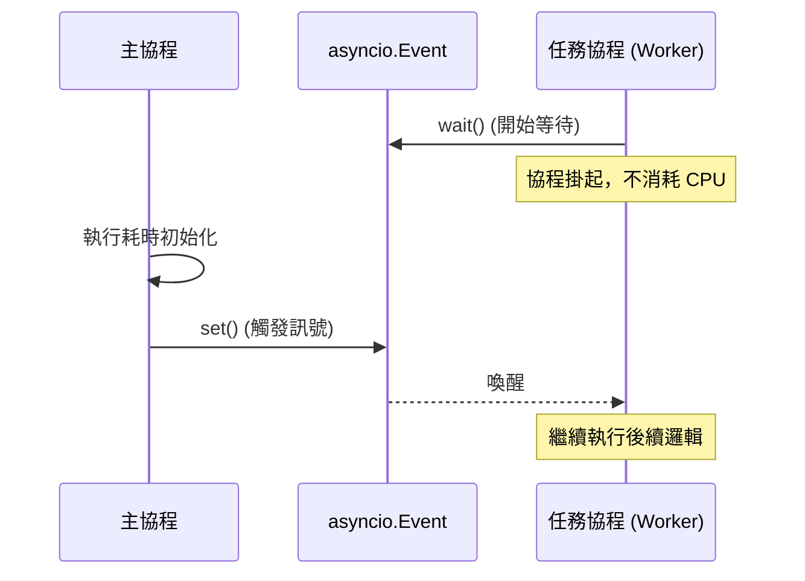

# 非同步併發安全性與競態條件防範

在分散式系統與高效能後端架構中，開發者常有一個致命的誤區：認為 Python 的 `asyncio` 是單執行緒運行的，因此絕對不會發生競態條件（Race Conditions）。身為一名架構師，我必須糾正：**這是一個價值連城的錯誤結論。**

雖然 `asyncio` 確實避免了傳統多執行緒因「搶佔式多工」在位元組碼層級產生的不確定性，但它引入了「協作式多工」下的 **懸掛點（Suspension Points）** 風險。只要你的邏輯跨越了 `await` 關鍵字，共享狀態就有可能被其他協程篡改。以下是確保非同步環境下狀態一致性的實戰指南。

---

### 情境 1：嚴防「讀取－暫停－寫入」造成的邏輯非原子性

單執行緒的 `asyncio` 雖能保證單個非同步操作中不被中斷，但一旦代碼中出現 `await`，執行權就會交回事件循環，這時其他協程可能進入並修改同一個全域變數。

#### 核心概念
非同步環境下的競態條件主要發生在**協程懸掛期間**。當協程 A 讀取狀態後因 I/O 操作掛起，協程 B 可能在此期間修改該狀態。當協程 A 恢復執行時，它手上的資料已經是過時的「髒數據」。

#### 程式碼範例：Bad vs. Better

```python
# 探討單執行緒競態條件
import asyncio

counter = 0

# // Bad: 跨越 await 的非原子操作
async def increment_bad():
    global counter
    temp_counter = counter
    # 懸掛點：此時執行權交出，其他協程會讀取到舊的 counter
    await asyncio.sleep(0.01)
    counter = temp_counter + 1 # 覆寫了其他協程的更新

# // Better: 確保操作在不被中斷的區塊內完成
async def increment_better(lock):
    global counter
    async with lock: # 使用非同步鎖保護臨界區
        temp_counter = counter
        await asyncio.sleep(0.01)
        counter = temp_counter + 1
```

#### 底層原理探討與權衡
**為什麼（Rationale）**：`asyncio.Lock` 提供了類似於多執行緒鎖的語法，但它是為協程設計的。當一個協程在 `async with lock` 中遇到 `await` 並掛起時，雖然執行權交還給了事件循環，但其他試圖獲取同一個鎖的協程會被阻塞在鎖的門外，直到第一個協程完成作業並釋放鎖。

---

### 情境 2：使用 `Semaphore` 進行精確的資源併發控制

在處理高併發 I/O（如同時向 1000 個 API 發送請求）時，單純的非同步並不能解決資源過載問題。你必須限制同時運行的協程數量，以防止觸發對方的限流或耗盡本地文件描述符。

#### 核心概念
訊號標（Semaphore）是一個內部計數器，它允許多個協程同時進入，但限制最大併發數。這對於需要控制「流量整形（Traffic Shaping）」的場景至關重要。

#### 適用場景：流量控制比較表

| 同步原語 | 核心用途 | 拇指法則 (Rule of Thumb) |
| :--- | :--- | :--- |
| `Lock` | 互斥存取 (Mutual Exclusion) | 當多個協程必須**排隊**修改同一個狀態時使用。 |
| `Semaphore` | 併發量限制 (Throttling) | 當你需要限制**同時進行**的任務數（如 API 呼叫限制 10 併發）時使用。 |
| `Event` | 狀態通知 (Notification) | 當多個協程需要**等待**某個特定訊號（如初始化完成）後再啟動時使用。 |
| `Condition` | 複雜狀態同步 | 當協程需要等待特定狀態成立（如資料夾已滿）且需互斥存取時使用。 |

---

### 情境 3：利用 `asyncio.Event` 協調協程間的執行順序

有些任務是依賴性的，例如資料庫連接尚未初始化前，所有查詢協程都應該處於「待機」狀態，而非不斷重試。

#### 核心概念
`asyncio.Event` 提供了一個執行緒安全的「紅綠燈」機制。協程調用 `event.wait()` 會進入休眠，直到另一個協程調用 `event.set()`。

#### 流程圖：非同步事件通知機制



---

### 情境 4：多進程環境下禁用共享變數，優先使用 `Queue`

若為了繞過 GIL 限制使用 `multiprocessing` 處理 CPU 密集型任務，記住：進程間並不共享記憶體。

#### 核心概念
雖然 Python 提供 `Value` 或 `Array` 等共享對象，但它們極易引發硬體層級的 Race Condition，且性能開銷巨大（涉及核心鎖）。**最佳實踐是透過消息傳遞來共享資料**。

#### 程式碼範例：Bad vs. Better

```python
# 進程間的競態條件
from multiprocessing import Process, Value, Queue

# // Bad: 依賴共享 Value 且未妥善加鎖
def worker_bad(val):
    val.value += 1 # 這裡在進程間是不安全的

# // Better: 透過 Queue 傳遞結果，避免狀態衝突
def worker_better(q):
    result = perform_heavy_task()
    q.put(result) # 透過 FIFO 隊列傳遞資料
```

---

### 延伸思考

**1️⃣ 問題一**：如果我在 `asyncio` 中完全不使用 `await`，是否還會發生競態條件？

**👆 回答**：在不含 `await` 的純同步代碼塊中，協程不會被中斷。這意味著單執行緒下的這段代碼具有「邏輯原子性」。然而，這也意味著你正在**阻塞事件循環**，會導致整個應用程序失去響應。

---

**2️⃣ 問題二**：`BoundedSemaphore` 與普通 `Semaphore` 的差別在哪？

**👆 回答**：根據來源，`BoundedSemaphore` 會檢查 `release()` 的次數是否超過了 `acquire()`。如果超過，它會拋出 `ValueError`。這是一個極佳的防錯機制，能防止因代碼邏輯錯誤而不經意地增加了可用資源配額。

---

**3️⃣ 問題三**：如何測試非同步代碼中的 Race Condition？

**👆 回答**：這極具挑戰，因為它們是隨機發生的。實戰中，架構師會利用 `pytest-asyncio` 結合**參數化測試（Parameterization）**，並故意在臨界區加入微小的 `asyncio.sleep(0)` 以強制執行權切換，藉此模擬高併發環境下的狀態交錯。