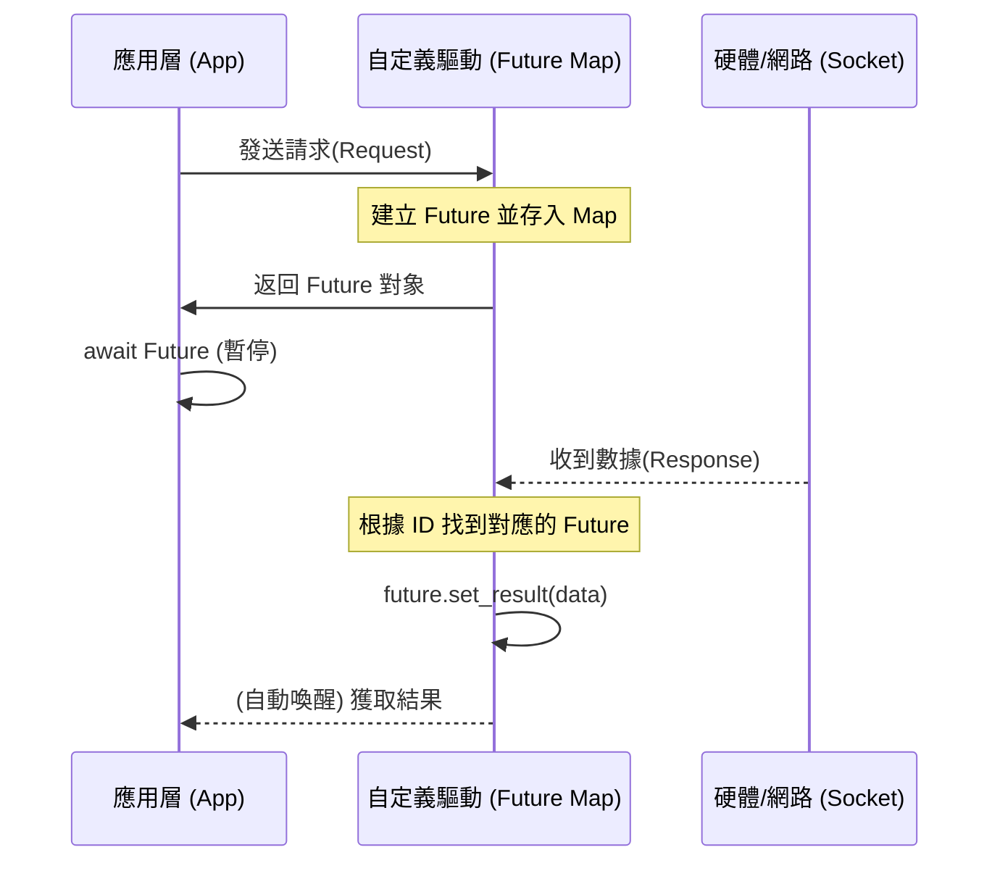

# asyncio.Future 底層組件封裝實戰

在非同步編程的世界裡，大多數開發者只需要掌握 `async/await` 和 `Task`。但作為一名架構師，如果你想打造自己的底層驅動（如自定義協議棧或硬體感測器接口），你必須深入了解 `asyncio.Future`。

`Future` 是一個底層對象，它代表一個**現在尚未完成，但未來會產生結果**的非同步操作。它是連接「回調式（Callback-based）舊世界」與「非同步（Async/Await）新世界」的橋樑。

---

### 情境 1：利用 Future 封裝回調式（Callback-based）舊代碼

許多老舊的庫或低階系統接口（如早期感測器驅動）是基於回調機制的。直接在 `async` 函式中使用它們會破壞控制流。

#### 核心概念
`Future` 充當了一個「佔位符」。你可以先建立一個 `Future` 並將其返回給呼叫者（呼叫者會 `await` 它），當回調函式被觸發時，再手動呼叫 `set_result()` 來喚醒掛起的協程。

#### 程式碼範例：Bad vs. Better

```python
# // Bad: 混合回調與非同步，導致控制流斷裂
def legacy_fetch(url, callback):
    # 模擬耗時操作後執行回調
    import threading
    threading.Timer(1, callback, ["Success Data"]).start()

async def bad_wrapper():
    result = None
    def my_callback(data):
        nonlocal result
        result = data
    legacy_fetch("http://api", my_callback)
    # 問題：這裡無法直接 await 回調結果，代碼會繼續往下跑
    return result

# // Better: 使用 Future 進行橋接
import asyncio

async def better_wrapper():
    loop = asyncio.get_running_loop()
    future = loop.create_future() # 建立一個 Future 對象

    def my_callback(data):
        # 當資料到達時，手動填充 Future 結果
        if not future.done():
            future.set_result(data)

    # 呼叫舊接口
    legacy_fetch("http://api", my_callback)

    # 現在可以優雅地 await 這個 Future
    return await future
```

#### 底層原理探討與權衡
**為什麼（Rationale）**：`await future` 會將當前協程掛起，並將控制權交還給事件循環。事件循環會持續運行其他任務，直到 `future.set_result()` 被呼叫，這時事件循環才會在下一輪迭代中喚醒等待該 `Future` 的協程。

**權衡**：手動操作 `Future` 時必須極其小心。如果你忘記呼叫 `set_result()` 或 `set_exception()`，等待的協程將永遠掛起（導致記憶體洩漏）。此外，`asyncio.Future` **並非執行緒安全**，若要在多執行緒環境中設置結果，必須使用 `loop.call_soon_threadsafe(future.set_result, value)`。

---

### 情境 2：自定義 Awaitable 以實現高精準度控制

有時 `asyncio.Future` 的開銷對你來說仍嫌太重，或者你需要自定義底層的輪詢行為（如模擬事件循環）。

#### 核心概念
任何實現了 `__await__` 魔術方法的類別都是 `Awaitable`。你可以透過手動實現此方法來模仿 `Future` 的行為。

#### 程式碼範例：Bad vs. Better

```python
# // Bad: 使用 while 循環輪詢狀態，浪費 CPU 週期
async def poll_status(device):
    while not device.is_ready():
        await asyncio.sleep(0.1) # 雖不阻塞，但效率低下
    return device.get_data()

# // Better: 實作自定義 Awaitable 進行狀態通知
class CustomAwaitable:
    def __init__(self, device):
        self.device = device

    def __await__(self):
        # 模仿 Future 的核心邏輯：未完成則 yield 自己，完成則 return
        while not self.device.is_ready():
            yield self # 告訴事件循環：我還沒好，下一輪再檢查我
        return self.device.get_data()

async def smart_usage(device):
    return await CustomAwaitable(device)
```

#### 更多說明：組件關係對照表

| 組件名稱 | 角色定位 | 核心特性 |
| :--- | :--- | :--- |
| `Coroutine` | 邏輯單元 | 由 `async def` 定義，封裝了執行步驟。 |
| `Future` | 狀態容器 | 代表未來的一個值，通常用於低階協議開發。 |
| `Task` | 執行實體 | `Future` 的子類，將協程排入事件循環並驅動其執行。 |
| `Awaitable` | 接口協議 | 只要實現 `__await__` 即可被 `await`。 |

---

### 情境 3：在低階網路協議中封裝結果（如 NTP 實作）

當你在實作自定義 UDP 協議或原始套接字操作時，通常沒有內建的請求/響應對應機制。

#### 核心概念
在協議處理器中維護一個映射表（Map），將請求 ID 與 `Future` 對象關聯起來。

#### 流程圖：低階協議與 Future 的連動機制



#### 適用場景
*   **拇指法則**：除非你正在撰寫驅動程序、包裝 C 語言回調、或開發類似 `Quart` 這種需要精細控制底層 `datagram` 傳輸的框架，否則請優先使用 `asyncio.create_task()`。
*   **例外情況**：當你需要同時支持 `concurrent.futures`（多執行緒/多進程池）與 `asyncio` 時，可能需要處理這兩種不同型別的 `Future` 物件。

---

### 延伸思考

**1️⃣ 問題一**：`asyncio.Future` 和 `concurrent.futures.Future` 可以互換嗎？

**👆 回答**：絕對不行。`asyncio.Future` 是為單執行緒事件循環設計的，非執行緒安全。`concurrent.futures.Future` 則用於執行緒池或進程池。不過，你可以使用 `asyncio.wrap_future()` 將後者轉裝為前者，以便在協程中 `await` 它。

---

**2️⃣ 問題二**：為什麼 `Task` 繼承自 `Future`？

**👆 回答**：因為 `Task` 本質上就是一個「會自動執行的 Future」。`Future` 只負責存儲結果，而 `Task` 會包裝一個協程，並負責在事件循環中一步步驅動該協程運行，直到協程返回結果並寫入 `Future` 的狀態中。

---

**3️⃣ 問題三**：如果對同一個 `Future` 呼叫兩次 `set_result()` 會發生什麼？

**👆 回答**：會拋出 `InvalidStateError`。在框架開發中，務必先使用 `if not future.done():` 進行檢查，以確保健壯性。