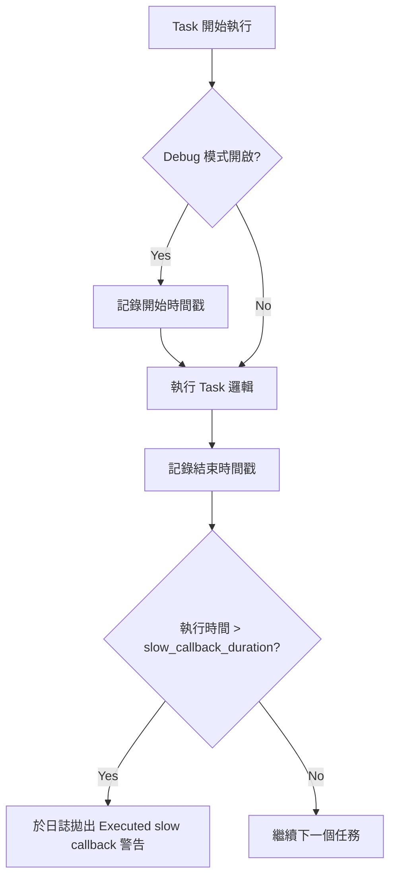

# asyncio Debug 模式與阻塞診斷

在非同步架構設計中，**「事件循環（Event Loop）即生命線」**。身為架構師，我最常看到的災難是開發者在 `async` 函式中塞入了一個耗時的同步計算，這就像在單行道上停了一輛壞掉的卡車，後方所有的任務（Coroutine）都會因此癱瘓。

Python 的 `asyncio` 提供了一套強大的 Debug 模式，專門用來捕捉這些隱形的阻塞者。理解如何利用開發工具定位延遲問題，是從「會寫非同步」晉升為「能寫高效能系統」的必經之路。

---

### 情境 1：開發階段強制開啟 Debug 模式以捕捉「長回調」

許多開發者在遇到效能瓶頸時，習慣直覺地在程式碼中到處加 `print`。這不僅低效，更可能因為觀測者效應（Observer Effect）隱藏真正的問題。

#### 核心概念
`asyncio` 的 Debug 模式能自動監控執行時間。如果一個協程或回調（Callback）佔用 CPU 超過預設的 **100 毫秒**，系統會主動在日誌中拋出警告。這讓隱形的阻塞任務無所遁形。

#### 程式碼範例：Bad vs. Better

```python
# // Bad: 盲目運行，完全不知道哪個任務阻塞了事件循環
import asyncio
import time

async def main():
    # 這個同步阻塞會讓整個 Event Loop 停擺 2 秒
    time.sleep(2)
    print("Done")

asyncio.run(main())

# // Better: 開啟 Debug 模式，主動捕捉阻塞者
import asyncio
import logging

# 配置日誌以查看 Debug 警告
logging.basicConfig(level=logging.DEBUG)

async def main():
    # 故意製造阻塞
    time.sleep(0.5)
    print("Task finished")

# 開啟 debug=True，當 time.sleep 發生時，日誌會提示該回調過長
asyncio.run(main(), debug=True)
```

#### 底層原理探討與權衡
**為什麼（Rationale）**：`asyncio` 是協作式多工。當你在執行同步程式碼時，事件循環無法跳轉到其他任務。Debug 模式會追蹤每個 Task 的開始與結束時間，一旦超標（Slow Callback），就表示該處需要重構成非同步版本或移至執行緒池執行。

**權衡**：Debug 模式會增加額外的運作開銷（例如追蹤資源分配），因此**絕對不要在生產環境開啟**。

---

### 情境 2：自定義監測閾值以定位微秒級延遲

預設的 100 毫秒閾值對於極高效能的服務（如金融交易或即時通訊）來說太寬鬆了。有時，連續多個 20 毫秒的阻塞累積起來也會造成明顯的延遲。

#### 核心概念
你可以透過存取底層事件循環，手動調整 `slow_callback_duration`。這能讓你根據應用場景精確定義何謂「阻塞」。

#### 程式碼範例：Bad vs. Better

```python
# // Bad: 依賴預設值，無法發現 50ms 的關鍵延遲
asyncio.run(main(), debug=True)

# // Better: 根據業務需求收緊監控網
async def main():
    loop = asyncio.get_running_loop()
    # 開啟 Debug 模式
    loop.set_debug(True)
    # 將「長回調」閾值設定為 50 毫秒 (0.05秒)
    loop.slow_callback_duration = 0.05

    # 執行業務邏輯...
```

#### 流程圖：Debug 模式監控機制



---

### 情境 3：結合統計型分析工具（Scalene/py-spy）進行全方位診斷

Debug 模式能告訴你「哪個任務慢」，但當問題涉及 C 擴充套件或底層 OS 呼叫時，你需要更深層的工具。

#### 核心概念
對於複雜的 GenAI 或數據處理服務，建議使用 **Scalene** 或 **py-spy**。這些工具採用「統計採樣法」，能分別測量 Python 程式碼、原生 C 程式碼以及系統等待時間（System Time）。

#### 分析工具對比表

| 工具 | 診斷類型 | 優點 | 缺點 |
| :--- | :--- | :--- | :--- |
| **asyncio Debug** | 事件循環監控 | 內建、無需外部依賴、定位協程問題精準 | 僅能偵測 Python 回調，無法診斷 C 程式碼 |
| **Scalene** | 資源全分析 | 可區分 CPU/GPU/記憶體，支持非同步 | 較重，需額外安裝 |
| **py-spy** | 統計採樣剖析 | 無需修改程式碼、支持生成火焰圖（Flame Graph） | 無法即時攔截，需事後分析日誌 |

---

### 適用場景與拇指法則
*   **拇指法則**：如果你的協程中沒有 `await` 關鍵字，或者呼叫的是同步 I/O 函式庫（如 `requests`），它就是潛在的阻塞源。
*   **例外情況**：極短的同步操作（如簡單的數學運算）不需要非同步化，因為 Task 切換的成本（Context Switch）可能比計算本身還高。

---

### 延伸思考

**1️⃣ 問題一**：除了效能，Debug 模式還能偵測到什麼錯誤？

**👆 回答**：它能偵測到「未被等待的協程（Un-awaited Coroutines）」。如果你呼叫了一個 `async` 函式卻忘了加 `await`，Debug 模式會發出警告，防止該函式根本沒有被執行的邏輯錯誤。

---

**2️⃣ 問題二**：如果在 Linux 環境下想快速開啟診斷，不想修改程式碼怎麼辦？

**👆 回答**：可以利用環境變數。在啟動應用時設定 `PYTHONASYNCIODEBUG=1`，這會直接在該進程中強制啟用 `asyncio` 的 Debug 模式。

---

**3️⃣ 問題三**：面對長回調警告，架構師的首選解決方案是什麼？

**👆 回答**：這取決於任務屬性。若是 **I/O 密集型**（如 `requests`），應使用 `loop.run_in_executor` 移至 `ThreadPoolExecutor`；若是 **CPU 密集型**（如大量矩陣運算），則應移至 `ProcessPoolExecutor` 以避開 GIL。