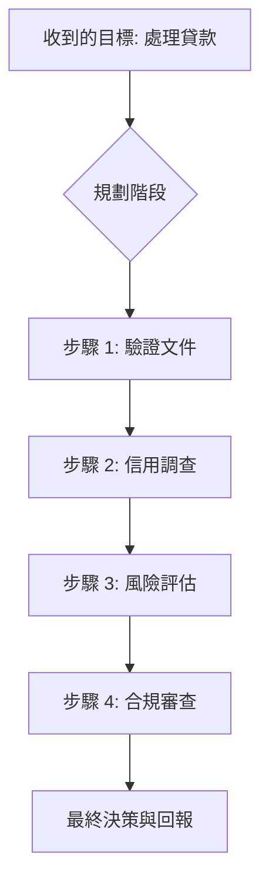

# AI Agent 的基本解剖：感知、思考、規劃、行動

在分散式系統與生成式 AI 的交匯點上，身為架構師，我們必須體認到：一個真正的 AI Agent 不僅僅是一個「會說話的程式」，它是一個具備**自主性 (Autonomy)**、**反應性 (Reactivity)** 與 **主動性 (Proactivity)** 的完整運作系統,。其核心架構在於將大語言模型 (LLM) 作為「認知引擎」，嵌入到一個持續運作的「感知—思考—規劃—行動」循環中,。

---

### 情境 1：感知 (Sense) —— 建立標準化的環境上下文接入

**核心概念簡述**：
感知是 Agent 獲取「上下文 (Context)」的機制。Agent 必須能從數位環境（API、資料庫）或物理環境（感測器）中提取資訊，並將其轉化為模型可理解的語義空間,,。

**程式碼範例 (Bad vs. Better)**：
```python
# ❌ Bad: 靜態且硬編碼的感知，缺乏靈活性
def get_user_context():
    return "User ID: 123, Order: XYZ" # 限制了 Agent 獲取即時環境資訊的能力

# ✅ Better: 使用 Google ADK 的 FunctionTool 建立動態感知介面,
from google.adk import FunctionTool

async def look_up_order(order_id: str) -> dict:
    """查詢訂單系統的即時狀態。"""
    # 模擬從生產資料庫感知即時數據
    return {"order_id": order_id, "status": "In Transit", "eta": "2025-09-22"}

order_tool = FunctionTool.from_function(look_up_order)
```

---

### 情境 2：思考 (Reason) —— 利用 LLM 進行結構化認知分析

**核心概念簡述**：
思考是 Agent 的核心處理單元，負責分析感測資訊、評估目標並進行複雜推理,。為了提升可靠性，我們應避免讓模型直接給出答案，而是引導其進行結構化推理。

**程式碼範例 (Bad vs. Better)**：
```python
# ❌ Bad: 缺乏思考過程，容易產生幻覺,
prompt = "Decide the loan for John Doe based on history."

# ✅ Better: 使用 FCoT (Fractal Chain-of-Thought) 模式引導結構化推理,,
agent_instructions = """
## FCoT RECURSIVE LOOP
Iteration 1: REASON
- RECAP: 回顧當前收集到的數據與目標。
- REASON: 分析數據與政策的匹配度。
- VERIFY: 驗證推理邏輯是否符合合規性約束。
"""
```

---

### 情境 3：規劃 (Plan) —— 將高階目標分解為可執行的任務序列

**核心概念簡述**：
規劃是將思考轉化為戰術步驟的過程。Agent 必須能將複雜目標分解為一系列有依賴關係的子任務或工具呼叫序列,,。

**更多說明 (流程圖與比較表)**：



---

### 情境 4：行動 (Act) —— 透過工具執行副作用並產生觀測

**核心概念簡述**：
行動是核心循環的出口。Agent 透過「函數呼叫 (Function Calling)」機制，利用可用的工具（如 API、代碼執行器）作用於環境並產生副作用 (Side Effects),,。行動後產生的結果將作為「觀測 (Observation)」反饋回感知層，形成閉環學習,。

**程式碼範例 (Bad vs. Better)**：

```python
# ❌ Bad: Agent 僅產生文字建議，無法對真實世界產生影響
# "I suggest completing the refund for this user." -> 僅為文字，無實際副作用

# ✅ Better: 使用 Google ADK 的實作，將 Action 轉化為受控的工具執行,
from google.adk.agents import LlmAgent

def process_refund(amount: int, user_id: str) -> str:
    """執行退款作業並返回交易 ID。"""
    # 實際與支付網關互動
    return f"REFUND_SUCCESS_ID_{amount}_{user_id}"

# 定義 Actionable Agent
refund_agent = LlmAgent(
    model="gemini-2.0-flash",
    instruction="根據策略執行退款動作...",
    tools=[process_refund] # 將動作封裝為工具
)
```

**底層原理探討與權衡**：
行動階段的關鍵在於**資料合約 (Data Contracts)**。Agent 不直接「執行」工具，而是輸出結構化的意圖（如 JSON 物件），由執行環境 (Runtime) 負責代為呼叫,,。這種設計實現了「推理」與「執行」的解耦，讓開發者能在行動前加入監控或攔截邏輯,。

**適用場景之「拇指法則 (Rule of Thumb)」**：
*   **確定性優先**：對於簡單、重複性的 API 呼叫，直接使用 `FunctionTool`,。
*   **決策複雜性**：若行動涉及判斷與溝通（如與客戶協商退款金額），應將該動作封裝為一個「子 Agent (Sub-agent)」，而非單一工具,。
*   **安全性原則**：對於具備破壞性或高風險的行動（如刪除數據、轉帳），必須實施 **人機協作 (Human-in-the-Loop, HITL)** 模式，在執行前請求人工確認,。
*   **冪等性要求**：所有工具應具備冪等性 (Idempotency)，以防止 Agent 在重試循環中產生重複的副作用。

| 行動類型 | 技術實現 | 適用場景 |
| :--- | :--- | :--- |
| **原子操作** | `FunctionTool` | 資料庫查詢、發送 Email、計算, |
| **複合任務** | `AgentTool` | 疑難排解、談判、多步驟工作流, |
| **異步操作** | `LongRunningFunctionTool` | 需要經理審核或後端異步處理的流程 |

---

### 延伸思考

**1️⃣ 問題一**：為什麼「記憶 (Memory)」在行動後的反饋循環中不可或缺？

**👆 回答**：記憶是連結多次行動的「膠水」。短期記憶（Session State）保存當前任務的執行狀態，避免 Agent 重複執行相同的錯誤動作,；長期記憶（Memory Bank）則保存歷史教訓，讓 Agent 在後續循環中能「記住」哪些工具在特定環境下無效，從而實現自我改進,。

---

**2️⃣ 問題二**：當 Agent 陷入「無效行動」的無限死循環時，架構上該如何防禦？

**👆 回答**：應實施 **看門狗超時監控 (Watchdog Timeout Supervisor)** 模式,。為 Agent 的執行區塊設定最大步驟數 (Max Iterations) 或時間限制。一旦超時，系統應強制終止任務並觸發後退策略 (Fallback) 或人工介入，防止資源浪費與系統凍結,。

---

**3️⃣ 問題三**：多 Agent 系統 (MAS) 如何優化行動階段的負載？

**👆 回答**：透過 **任務委派 (Task Delegation)**。主管 Agent (Supervisor) 僅負責規劃，將具體的「行動副作用」分配給專門的子 Agent 執行,。這不僅減少了單一模型處理過長上下文的壓力，還能針對不同行動類型選擇最適合的模型（如：用低延遲模型進行數據提取，用高推理模型進行合規審核）。