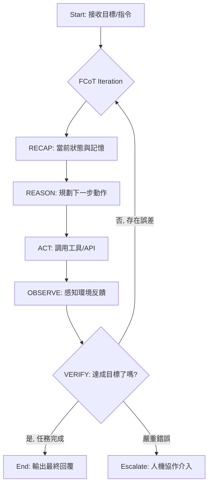

# Agentic Loop：持續學習與反饋循環

在資深架構師眼中，軟體開發的演進是從「確定的指令」走向「意圖的達成」。傳統的自動化工作流（Workflow）本質上是 **線性（Linear）** 且 **脆弱（Brittle）** 的；而 Agentic Loop 則是 **閉環（Closed-loop）** 且 **具備彈性（Resilient）** 的。這不僅是程式碼結構的改變，更是從「做 A 之後做 B」到「做 A 之後觀察結果，若未達目標則修正再試」的思維跳躍。

---

### 情境 1：優先建立「閉環反饋」而非「單向觸發」

#### 核心概念
一個真正的 Agent 不應在執行完動作後就任務結束。它必須具備感知環境變化的能力，並根據工具回傳的「觀察結果（Observation）」與預期目標進行比對。如果結果不符，Agent 必須有權力且有能力修改其原始計畫，重新進入下一個迭代循環。

#### 程式碼範例（以 Google ADK 為例）

```python
# // **Bad：單向觸發（線性思維）**
# 直接執行順序代理，若中間出錯，系統將拋出異常或停在錯誤狀態。
# 線性執行，缺乏根據結果修正的能力
workflow = SequentialAgent(
    sub_agents=[doc_validator, credit_checker, risk_assessor]
)


# // **Better：閉環反饋（Loop 模式）**
# 利用 `LoopAgent` 結合評估邏輯，直到達到「合格」標籤或觸發「升級（Escalate）」為止。
from google.adk import LoopAgent, Event

# LoopAgent 會不斷重複執行 sub_agents 直到條件達成或達到 max_iterations
agentic_loop = LoopAgent(
    sub_agents=[
        solution_generator, # 生成決策或動作
        validator_agent      # 感知環境反饋並驗證結果
    ],
    max_iterations=5
)

# 在 validator_agent 中，若發現決策正確，則 yield Event(actions={'escalate': True}) 終止循環
```

#### 底層原理探討與權衡
**為什麼（Rationale）**：線性工作流假設環境是靜態且可預測的，但在企業級應用中（如貸款審核或庫存管理），外部 API 可能暫時失效，或者資料可能存在模糊性。閉環循環將「錯誤」視為一種「新的輸入」，讓 LLM 在下一次迭代中學習如何避開坑洞。
**權衡（Trade-offs）**：循環次數過多會導致 **權杖（Token）成本爆炸** 與 **延遲增加**。因此，必須設定嚴格的 `max_iterations` 或 `thinking_budget`。

---

### 情境 2：透過「內省機制 (Reflection)」實現決策自我修正

#### 核心概念
Agentic Loop 的精髓在於 **內省（Reflection）**。當 Agent 執行某項動作失敗時，它不應只是重複同樣的動作，而是應該「思考」失敗的原因（例如：API 參數錯誤），然後產生一個修正後的 Prompt 再次嘗試。

#### 程式碼範例

```python
# // **Bad：忽略反饋的簡單重試**
只是重複嘗試，容易陷入死循環。
# 只是不斷重複，LLM 依然會因為相同的 Prompt 產生相同的錯誤
for _ in range(3):
    result = call_llm(prompt)
    if validate(result): break

# // **Better：具備「變異能力」的自適應重試 (Adaptive Retry with Prompt Mutation)**
# 將失敗的錯誤訊息（Observation）作為新的 Context，要求 LLM 修正其思考邏輯。

# 在 ADK 中，利用內省模式引導 LLM 自我檢測
class SelfCorrectingAgent(BaseAgent):
    async def _run_async_impl(self, ctx: InvocationContext):
        # 1. 產生初步計畫
        plan = await self.generate_plan(ctx)

        # 2. 進行自我檢查 (Critique Step)
        critique = await self.critique_plan(plan, ctx) # LLM-as-Judge 模式

        if "ERROR" in critique:
            # 3. 根據反饋修正計畫再執行
            revised_plan = await self.revise_plan(plan, critique)
            yield Event(content=f"修正計畫: {revised_plan}")
```

#### 適用場景與拇指法則
*   **拇指法則 (Rule of Thumb)**：當任務涉及高度非確定性（如生成程式碼或複雜數據提取）時，強制加入至少一次的 Reflection 步驟。
*   **例外**：延遲極度敏感的簡單任務（如簡單的標籤分類）應避免使用複雜的循環。

---

### 情境 3：應用 Fractal CoT 進行遞迴式驗證與規劃

#### 核心概念
在循環中，Agent 的決策不應是一次性的。**Fractal Chain-of-Thought (FCoT)** 強調在每一個執行階段都要進行「回顧（RECAP）-> 思考（REASON）-> 驗證（VERIFY）」的遞迴循環。這確保了 Agent 在感知到環境變化後，能重新校準其目標，防止「目標偏移（Goal Drift）」。

#### 流程圖表示 (Agentic Loop Logic)



---

### 比較表：自動化工作流 vs. Agentic Loop

| 特性 | 傳統自動化工作流 (Traditional Workflow) | Agentic Loop (持續學習循環) |
| :--- | :--- | :--- |
| **決策邏輯** | 硬編碼的 If-Then-Else | 基於 LLM 語意推理與規劃 |
| **適應性** | 遇到預期外狀況會直接崩潰 | 能根據錯誤訊息動態調整策略 |
| **記憶利用** | 通常無狀態或僅限簡單參數傳遞 | 結合 Working Memory 與長期回憶 |
| **失敗處理** | 觸發異常處理路徑 (Retry/Stop) | 內省失敗原因並嘗試不同路徑 (Self-correct) |
| **執行成本** | 極低且可控 | 較高，需考量 Token 與延遲 |

---

### 延伸思考

**1️⃣ 問題一**：Agent 如何在不斷的循環中避免產生「幻覺累積」？

**👆 回答**：這必須依賴「地面真理（Grounding）」。在 Agentic Loop 的 VERIFY 階段，不能只讓 LLM 自己覺得對不對，必須強制引入外部工具（如 RAG 檢索或數據庫查詢）來驗證事實。如果 Agent 的輸出與 RAG 檢索到的事實不符，循環必須回溯並修正。

---

**2️⃣ 問題二**：當 LoopAgent 陷入邏輯死循環（LLM 反覆嘗試同樣的錯誤方法）時，架構上如何解套？

**👆 回答**：這是「自適應重試」的邊界。架構師應實施「衰減評分機制 (Trust Decay)」或「提示變異 (Prompt Mutation)」。如果嘗試 3 次依然失敗，應強制切換至「Fallback Model」使用更強的 LLM（如從 Flash 切換至 Pro），或者應用「Agent Calls Human」模式將上下文打包交給人類決策。