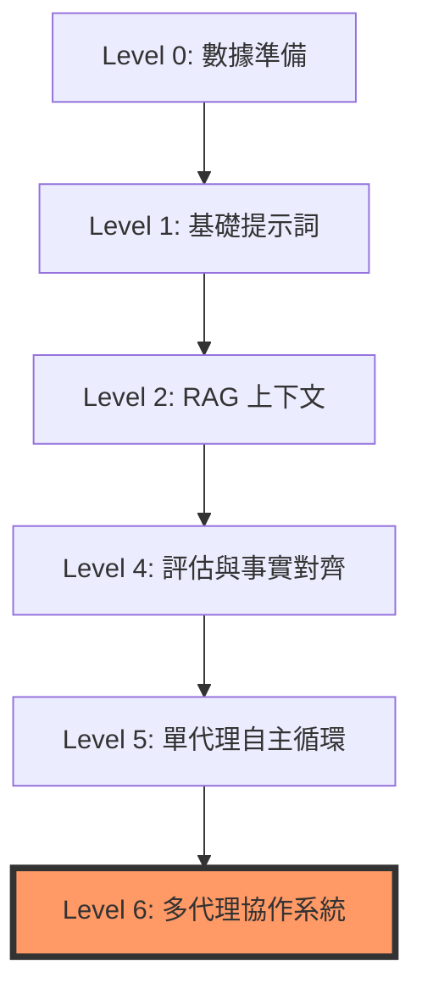

# GenAI 成熟度模型

在分散式系統與大語言模型（LLM）交織的今天，構建一個 GenAI 應用不再僅是寫一段好的 Prompt，而是一場關於數據、工程與協作的演進過程。身為架構師，我們必須體認到：**過度設計與設計不足同樣危險**。你需要根據業務場景，將系統對齊到正確的成熟度階段。

---

### 情境 1：夯實數據地基，優先於模型選型 (Level 0 - Data Foundation)

**核心概念簡述**
成熟度的起點並非 LLM，而是數據的質量與可訪問性。Level 0 關注於如何獲取、清洗並治理數據，確保它們能被 AI 有效「消費」。沒有乾淨的數據，再強大的模型也只會產生高品質的垃圾（GIGO）。

**程式碼範例 (Bad vs. Better)**
```python
# ❌ Bad: 直接將未經處理的原始文件內容塞入 Prompt。
# 這會導致模型無法理解數據結構，且容易被噪音干擾。
# ✅ Better: 使用 Google ADK 或 BigQuery ML 預先進行清洗與結構化提取，使用結構化提取工具，確保數據一致性與可解釋性。
from google.adk.agents import LlmAgent
from pydantic import BaseModel

class OrderInfo(BaseModel):
    order_id: str
    status: str
    amount: float

# 定義具有結構化輸出的 LlmAgent，確保數據地基穩固
data_processor = LlmAgent(
    name="DataCleaner",
    output_schema=OrderInfo,  # 強制結構化輸出
    instruction="從原始日誌中提取訂單資訊，排除噪音。"
)
```

**底層原理探討與權衡**
Level 0 的核心在於**語義一致性**。例如，不同數據庫對「利率」的定義可能不同（float vs string）。在進入 AI 邏輯前，必須在數據層解決這些矛盾，否則會導致代理推理崩潰。

---

### 情境 2：導入 RAG 以突破模型知識截斷 (Level 2 - Contextual Enhancement)

**核心概念簡述**
LLM 的知識是靜態且有截止日期的。Level 2 通過檢索增強生成（RAG），動態地為模型注入當前的、私有的業務上下文。這能顯著減少幻覺，並提供引文支持。

**程式碼範例 (Bad vs. Better)**
```python
# ❌ Bad: 依賴模型權重記憶過時資訊。
# 這會導致模型產生幻覺，且無法提供可靠的參考資料。

# ✅ Better: 使用 ADK 的檢索工具實作動態上下文注入，實作 RAG 模式以 Google Vertex AI RAG 為例。
# 可參考程式碼：https://github.com/lastingyeh/google-adk-study/blob/master/workspace/python/agents/pack-rag/rag/agent.py
import os
from google.adk import LlmAgent, ToolContext
from google.adk.tools.retrieval.vertex_ai_rag_retrieval import (
    VertexAiRagRetrieval,
)

# 設定 Vertex AI RAG 檢索工具
ask_vertex_retrieval = VertexAiRagRetrieval(
    name="retrieve_rag_documentation",
    description=("使用此工具從 RAG 語料庫中檢索與問題相關的文件與參考資料。"),
    rag_resources=[
        rag.RagResource(
            # 請填入您自己的 RAG 語料庫 (RAG Corpus) ID
            # 範例格式：projects/123/locations/us-central1/ragCorpora/456
            rag_corpus=os.environ.get("RAG_CORPUS")
        )
    ],
    similarity_top_k=10,  # 檢索最相似的前 10 個區塊
    vector_distance_threshold=0.6,  # 向量距離閾值，過濾關聯性較低的結果
)

root_agent = Agent(
    model="gemini-2.0-flash-001",  # 使用的 Gemini 模型版本
    name="ask_rag_agent",
    instruction="根據可透過 ask_vertex_retrieval 檢索到的文件，提供準確且簡潔的答案。",
    tools=[ask_vertex_retrieval],  # 註冊檢索工具
)
```

**底層原理探討與權衡**
RAG 的本質是**將記憶從參數空間轉移到外部存儲空間**。這樣做的好處是降低了更新成本（不需要重新訓練），但也增加了檢索延遲與維度不匹配的風險。

---

### 情境 3：從簡單提示轉向自主代理循環 (Level 5 - Single-Agent Systems)

**核心概念簡述**
當系統不再只是「問與答」，而是能自主規劃路徑並執行任務時，便進入了 Level 5。此階段的代理具備感知（Sense）、推理（Reason）、規劃（Plan）與行動（Act）的完整解剖構造。

**程式碼範例 (Bad vs. Better)**
❌ Bad:  使用寫死的 If-Else 邏輯控制流程。
✅ Better: 使用 ADK `BuiltInPlanner` 讓 LLM 自主決定下一步。

```python
# // Better: 配置具備推理規劃能力的自主代理
from google.adk.agents import LlmAgent
from google.adk.planners import BuiltInPlanner
from google.genai.types import ThinkingConfig

# 創建一個自主代理來處理貸款審核
autonomous_agent = LlmAgent(
    name="LoanProcessor",
    planner=BuiltInPlanner(
        # 啟用內部思考鏈
        thinking_config=ThinkingConfig(include_thoughts=True)
    ),
    # 中文指示：代理自主決定何時調用工具
    instruction="你的目標是完成貸款審核。自主決定何時調用信用檢查或風險評估工具，確保審核流程全面且高效。",
)
```

**底層原理探討與權衡**
自主代理依賴於**反應式循環（Reactive Loop）**。這賦予了系統彈性，能處理非預期的錯誤，但也帶來了不可預測性。因此，在此階段必須導入「思考預算（Thinking Budget）」以避免無限循環與成本失控。

---

### 情境 4：實踐多代理協作與分權治理 (Level 6 - Multi-Agent Systems)

**核心概念簡述**
最強大的系統是由專業化的代理組成的團隊。Level 6 解決了單一模型「認知負荷」過重的問題，透過主管（Supervisor）代理分配任務給專業子代理（Specialists），實現大規模並行處理與故障隔離。

**技術演進流程圖**



**成熟度對比表**

| 特徵 | 基礎系統 (L1-L2) | 自主代理 (L5) | 多代理協作 (L6) |
| :--- | :--- | :--- | :--- |
| **決策邏輯** | 寫死的流程或單次 Prompt | LLM 自主規劃 (Planner) | 跨代理談判與任務委派 (A2A) |
| **記憶模式** | 無狀態或簡單對話歷史 | 持久性 Session 狀態 | 共享語義存儲 (Shared Memory) |
| **出錯處理** | 直接崩潰或拋出錯誤 | 內部自我修正 (Reflexion) | 代理間互相稽核與冗餘驗證 |
| **適用場景** | 簡單客服、摘要生成 | 複雜單一人員工作自動化 | 跨部門決策、大型供應鏈優化 |

**拇指法則 (Rule of Thumb)**：始於 Level 1 的 MVP 驗證邏輯，但在架構上要為 Level 6 的 A2A（代理對代理）協議預留接口，以避免未來的重構成本。

---
### 延伸思考

**1️⃣ 問題一**：什麼時候應該從 Level 5（單代理）升級到 Level 6（多代理）？

**👆 回答**：當你的 Prompt 開始變得像是一本法律教科書，且模型頻繁出現「迷失在中間（Lost in the Middle）」或工具選擇癱瘓時，就是拆分代理的時機。將複雜的認知勞動拆分，能提升每個專家的精度。

---

**2️⃣ 問題二**：成熟度模型中，Level 4（事實對齊與評估）為何如此關鍵？

**👆 回答**：沒有評估，優化就只是盲人摸象。Level 4 引入了「事實根據（Grounding）」與評估框架，確保代理不只是給出答案，而是給出「正確且可追溯」的答案。這是邁向生產環境的非遞減條件。
