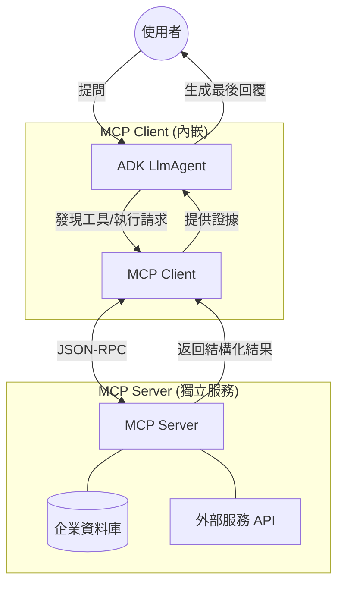

# Model Context Protocol

在分散式系統的演進史中，我們見證了從自定義 Socket 到 SOAP，再到 RESTful API 的標準化過程。如今，AI Agent 領域正經歷同樣的轉變。**Model Context Protocol (MCP)** 被譽為 AI 界的「USB 接口」，旨在解決 LLM 與外部資料來源及工具之間日益嚴重的硬編碼與耦合問題。

身為架構師，我們深知「解耦（Decoupling）」的價值。MCP 的出現，讓開發者能將工具的託管與執行從 Agent 邏輯中抽離，實現真正的「開發一次，處處調用」。

---

### 情境 1：優先使用 MCP 進行工具解耦，避免硬編碼接口

在早期的開發模式中，開發者通常在 Agent 代碼中手動定義每一項工具的 Schema（如 `name`, `description`, `parameters`）。這種做法在工具數量增加或需要跨團隊共享時，會導致代碼庫極其脆弱且難以維護。

#### 核心概念
MCP 引入了 **Server-Client 架構**：
*   **MCP Server**：負責暴露資源與工具清單，並處理實際的執行邏輯（如執行 SQL、發送 REST API）。
*   **MCP Client**：嵌入在 Agent 應用中，負責動態發現 Server 提供的工具並進行調用。

#### 程式碼範例（Bad vs. Better）

```python
# // **Bad：硬編碼工具定義，導致 Agent 邏輯與基礎設施高度耦合**
# 開發者必須手動維護 Schema，且若資料庫改動，所有 Agent 都需更新
from google.adk.agents import LlmAgent

def legacy_db_tool(query: str) -> dict:
    # 實際連接資料庫的邏輯
    pass

agent = LlmAgent(
    name="DataAgent",
    tools=[legacy_db_tool]
)

# // **Better：使用 MCP 標準協議，實現動態發現與橫向擴展**
from google.adk.agents import LlmAgent
from google.adk.tools.toolbox_toolset import ToolboxToolset

# 連接到標準化的 MCP Server (例如 Google 提供的 Toolbox 工具)
toolset = ToolboxToolset(
    server_url="http://127.0.0.1:5000"
)

agent = LlmAgent(
    name="ModernAgent",
    instructions="利用資料庫工具回答客戶問題",
    # Agent 自動發現 Server 暴露的所有工具，開發者無需手動定義 Schema
    tools=[mcp_tools]
)
```

#### 底層原理探討與權衡
MCP 採用輕量級的 **JSON-RPC** 協議進行通訊。
*   **為什麼要這樣做（Rationale）**：傳統方式中，LLM 需要在 Prompt 中載入大量工具描述，這會迅速耗盡上下文視窗（Context Window）並增加 Token 成本。MCP 允許 Agent 僅在需要時查詢註冊表（Registry），有效降低了「認知負荷（Cognitive Load）」。
*   **權衡**：引入 MCP 會增加一次額外的網絡跳轉（Network Hop），這可能在極低延遲要求的場景中成為瓶頸。

---

### 情境 2：利用 MCP Toolbox 實現標準化的資料存取層

對於架構師而言，安全性與一致性是永恆的主題。讓 Agent 直接生成 SQL 並操作資料庫是危險的。MCP 提倡透過「工具箱（Toolbox）」模式，將複雜的域協議（如 FHIR, DICOM 或 SQL 模式）封裝在 Server 端。

#### 核心概念
MCP 充當了 **垂直整合（Vertical Integration）** 的角色，解決的是「Agent 如何連接到它的工具」的問題。

#### 運作流程圖 (Mermaid)



#### 適用場景與拇指法則（Rule of Thumb）
*   **Rule of Thumb**：當多個 Agent 需要共用同一組資料來源，或工具執行環境需要特殊權限（如存取受保護的內部網絡）時，必須使用 MCP。
*   **例外**：若工具僅是簡單的本地邏輯運算且不涉及外部狀態，直接使用 Python 函數包裝成 `FunctionTool` 即可。

---

### 比較分析：MCP vs. A2A Protocol

在設計大規模 multi-agent 系統時，必須區分這兩種協議：

| 特性 | MCP (Model Context Protocol) | A2A (Agent-to-Agent) |
| :--- | :--- | :--- |
| **通訊目標** | Agent 與 工具/資料來源 之間 | 不同 Agent 之間 |
| **整合方向** | 垂直整合 (存取能力) | 水平整合 (任務授權) |
| **狀態性** | 通常是無狀態的請求-響應 | 支援多輪對話的狀態遷移 |
| **主要組件** | MCP Server, MCP Client | Agent Card, Agent Server |

---

### 延伸思考

**1️⃣ 問題一**：MCP 是否內建了完善的安全性機制（如身份驗證）？

**👆 回答**：MCP 目前被視為一種**語言互操作性協議**，其核心規範並未強制執行特定的安全原則。在企業環境中，架構師必須在傳輸層實施額外的控制，例如透過 OAuth 2.0、IAM 權限管理或 VPC Service Controls 來保護 MCP Client 與 Server 之間的連線。

---

**2️⃣ 問題二**：如何防止 Agent 透過 MCP 進行工具調用時發生「Prompt Injection」？

**👆 回答**：這是一個關鍵的攻擊向量。建議採用 **Plan-Then-Execute** 模式：Agent 必須先生成一個固定的執行計畫，且不允許來自工具的反饋在執行中途修改計畫邏輯，從而防止惡意資料劫持控制流。此外，Server 端應對輸入參數進行嚴格的 Schema 校驗。

---

**3️⃣ 問題三**：MCP 對於「長時間運行（Long-running）」的工具任務支援如何？

**👆 回答**：標準的 MCP 調用受限於網絡配置（通常為 30-60 秒超時）。對於需要數分鐘的任務（如生成大型報表），ADK 建議結合 `LongRunningFunctionTool` 模式，讓工具以異步方式回傳中間進度，而不是阻塞等待。