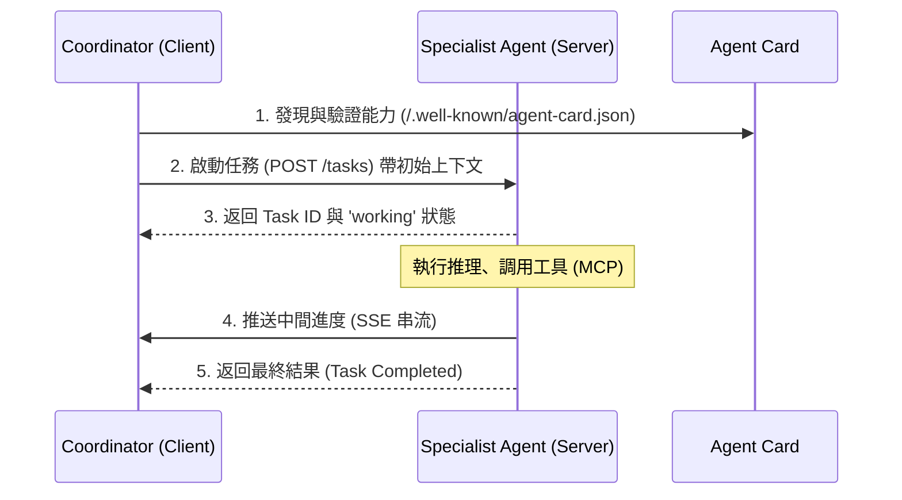

# Agent-to-Agent 通訊標準

在分散式 AI 架構中，我們正面臨與當年 SOA（服務導向架構）興起時相同的挑戰：如何讓不同團隊、甚至不同組織開發的代理人（Agents）有效地交談？如果每個 Agent 都使用私有的 API 格式，系統將迅速退化成難以維護的「義大利麵式代碼」。

**Agent-to-Agent (A2A)** 協議是由 Google 提出並貢獻至 Linux Foundation 的標準。它被設計為 AI 界的「SMTP 協議」，旨在提供一種通用的語言，讓代理人之間能夠跨框架、跨語言地進行訊息交換與意圖委派。

---

### 情境 1：優先使用 A2A 標準協議進行跨組織協作，而非自定義接口

當你的系統需要與外部合作夥伴的 Agent（例如銀行代理人與保險代理人）對接時，手寫集成邏輯會導致嚴重的供應商鎖定與維護負擔。

#### 核心概念
A2A 專注於 **水平整合（Horizontal Integration）**，即代理人之間的對等協作。它與專注於「代理人連接工具」的 MCP（垂直整合）不同，A2A 支援多輪對話與狀態化的任務遷移。

#### 程式碼範例（Bad vs. Better）

```python
# ❌ Bad: 使用私有 HTTP 接口，缺乏標準化的意圖聲明與狀態管理
# 必須手動處理序列化、狀態追蹤與錯誤路由
import requests

def delegate_to_finance_service(query):
    # 硬編碼的 URL 與非標準的 JSON 格式
    response = requests.post("https://finance-team.com/api/v1/chat", json={"q": query})
    return response.json()

# ✅ Better: 使用 ADK 的 A2A 標準實現，透過 Agent Card 進行解耦委派
# 使用 Google ADK 的 RemoteA2aAgent，自動遵循 A2A 協議規範
from google.adk.agents import LlmAgent
from google.adk.agents.remote_a2a_agent import RemoteA2aAgent
from google.adk.agents.remote_a2a_agent import AGENT_CARD_WELL_KNOWN_PATH

# 1. 消費者端：透過標準 URL 載入遠端 Agent 的「名片」(Agent Card)
billing_agent = RemoteA2aAgent(
    name="prime_agent",
    description="處理帳單相關查詢的專家代理人",
    agent_card=(
        f"http://localhost:8001/a2a/billing_agent{AGENT_CARD_WELL_KNOWN_PATH}"
    ),
)

# 2. 協調者端：將其視為本地子代理人進行委派
coordinator = LlmAgent(
    name="Coordinator",
    instructions="處理客戶問題，涉及帳單時委派給 billing_agent",
    sub_agents=[billing_agent] # 遵循標準 A2A 握手與狀態轉換
)
```

#### 底層原理探討與權衡
*   **為什麼要這樣做（Rationale）**：A2A 引入了 **Agent Card** 的概念，這是一份公開的描述文件，定義了代理人的能力、輸入需求與安全機制。這讓 Agent 能夠像 Web 服務一樣被動態發現與集成，而無需共享內部的記憶體或邏輯。
*   **權衡**：跨網絡的 A2A 調用會引入 HTTP 序列化開銷與網絡延遲。對於同一個團隊、同一個安全邊界內的 Agent，建議維持「本地子代理人」模式；僅在跨組織或需獨立維護生命週期時才使用 A2A。

---

### 情境 2：透過標準任務生命週期管理長時運行的異步協作

在複雜的業務流程（如貸款審批）中，Agent A 委派任務給 Agent B 後，可能需要數分鐘甚至數小時才能得到結果。

#### 核心概念
A2A 協議標準化了任務的 **生命週期狀態**（如：`submitted`, `working`, `input-required`, `completed`）。這使得協調者能精確追蹤進度，甚至在 Agent 重新啟動後恢復上下文。

#### 運作流程圖 (Mermaid)



#### 適用場景與拇指法則（Rule of Thumb）
*   **Rule of Thumb**：如果你的 Agent 協作鏈中包含「等待人工審核」或「調用耗時 API」的環節，必須使用 A2A 或類似具備任務狀態追蹤的協議，以確保系統的穩定性（Resilience）。

---

### 比較分析：A2A 與其他通訊模式

| 維度 | A2A (Agent-to-Agent) | MCP (Model Context Protocol) |
| :--- | :--- | :--- |
| **通訊方向** | 水平 (Peer-to-Peer) | 垂直 (Agent-to-Resource) |
| **狀態性** | 有狀態 (Stateful)，支援多輪對話 | 無狀態 (Stateless)，請求-響應模式 |
| **主要用途** | 複雜目標委派與協作 | 存取數據庫、API 或文件系統 |
| **互操作性** | 跨框架、跨組織標準 | 統一工具定義的「USB」標準 |

---

### 延伸思考

**1️⃣ 問題一**：A2A 如何處理安全性與存取控制？

**👆 回答**：A2A 支援與 **OpenAPI 3.0** 相同的安全方案，包括 OAuth 2.0、OpenID Connect 和 Mutual TLS (mTLS)。Agent Card 會聲明其要求的安全機制，ADK 的遠端代理人會讀取這些需求並要求客戶端提供正確的憑證（如 Bearer Token）。

---

**2️⃣ 問題二**：如何擴展 A2A 協議以支援特定的業務需求？

**👆 回答**：A2A 內建了 **Extensions（擴展機制）**。代理人可以在其 Agent Card 中聲明支援的擴展（如 `Data-only`, `Profile`, 或 `Method extensions`）。這允許組織在不破壞核心標準的前提下，添加如「合規性證明」或「特定的 SLA 保證」等元數據。

---

**3️⃣ 問題三**：當多個 Agent 跨網絡協作時，如何進行有效監控？

**👆 回答**：必須實施 **分散式追蹤 (Distributed Tracing)**。ADK 在進行 A2A 調用時，會透過 W3C Trace Context 標頭傳遞 `trace_id`。這使得開發者能在 Google Cloud Trace 或 LangSmith 等平台中看到跨越多個獨立 Agent 服務的完整請求路徑。