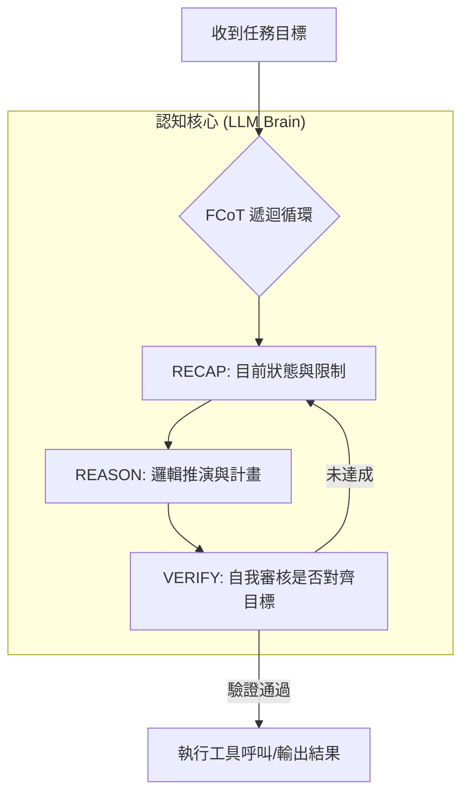

# LLM 作為 Agent 的「認知核心」

在現代 AI 系統設計中，最常見的錯誤就是將 **大型語言模型 (LLM)** 單純視為一個「更聰明的 API」。作為架構師，我們必須意識到 LLM 在 Agent 中不只是負責「說話」，而是充當系統的 **認知引擎 (Cognitive Engine)** 或「大腦」。它負責解釋輸入、制定計畫，並在 **感知—推理—計畫—行動 (SRPA)** 的循環中進行決策。

若僅將其視為文本生成器，你得到的是一個隨機的聊天機器人；若將其視為認知核心，你得到的則是一個能解決複雜業務問題的自主代理人。

---

### 情境 1：將 LLM 從「文本生成器」轉換為「自主推理中心」

開發者常犯的錯誤是直接向 LLM 詢問結果（Stateless Call），這會導致模型在面對複雜邏輯時容易產生幻覺。正確的做法是強制 LLM 進入「推理循環」，使其在行動前先進行環境感知與邏輯對齊。

#### 核心概念
Agent 與單純 LLM 呼叫的區別在於 **自主性 (Autonomy)** 與 **目標導向 (Goal-orientation)**。認知核心必須具備處理非決定性任務的能力，透過 `Planner` 來拆解目標。

#### 程式碼範例（Bad vs. Better）

```python
# // **Bad：將 LLM 視為簡單的函數調用，缺乏計畫與自省機制**
# 這只是單純的 Prompt Engineering，不是 Agent 認知架構
response = llm.generate("請幫我審核這筆貸款申請：ID-123")
print(response) # 容易直接給出 Approved/Denied，缺乏推理鏈

# // **Better：使用 Google ADK 構建具備「思考預算」與「計畫器」的認知核心**
from google.adk.agents import LlmAgent
from google.adk.planners import BuiltInPlanner
from google.genai.types import ThinkingConfig

# 配置具備「思考過程」的可觀察式認知核心
agent = LlmAgent(
    name="LoanProcessor",
    model="gemini-2.5-pro", # 使用具備強大推理能力的模型
    instructions="你是一個信貸審核專家，必須遵循『感知-推理-計畫-行動』循環。",
    # 啟用 BuiltInPlanner 讓 LLM 具備規劃能力
    planner=BuiltInPlanner(
        thinking_config=ThinkingConfig(include_thoughts=True)
    )
)
```

#### 底層原理探討與權衡
*   **為什麼要這樣做（Rationale）**：透過 `ThinkingConfig` 暴露模型的「思考鏈」(Chain of Thought)，能讓開發者在偵錯時看到模型為何選擇某個工具。這解決了 AI 的「黑盒」問題，提升了決策的可解釋性。
*   **權衡**：引入推理循環會增加 **首字延遲 (TTFT)** 與 Token 消耗。對於簡單、低延遲要求的任務（如翻譯），單純的 LLM 呼叫優於 Agent 架構。

---

### 情境 2：導入分形思維 (FCoT) 確保決策一致性，防止目標漂移

在長對話或多步驟任務中，LLM 容易產生「目標漂移」(Goal Drift)，遺忘最初的限制條件。身為架構師，我們需要一套「認知操作系統」來規範它的思考路徑。

#### 核心概念
**分形思維 (Fractal Chain of Thought, FCoT)** 是一種遞迴式的推理架構。它要求模型在每一輪迭代中都要進行 **摘要 (RECAP) -> 推理 (REASON) -> 驗證 (VERIFY)**。

#### 運作流程圖 (Mermaid)



#### 適用場景與拇指法則（Rule of Thumb）
*   **Rule of Thumb**：當任務涉及超過三個步驟，或需要嚴格遵守法規（如金融、醫療）時，認知核心必須採用 FCoT 模式進行自我校準。
*   **例外**：如果任務是純創意的（如寫詩），過度的驗證與結構化推理會抑制模型的發散性思考。

---

### 認知核心能力比較表

| 特性 | 傳統自動化工作流 (Workflow) | LLM 認知核心 (Agent) |
| :--- | :--- | :--- |
| **決定性** | 高（嚴格遵循 if-then 邏輯） | 低（基於機率與邏輯推演） |
| **適應性** | 弱（遇到預期外情況會崩潰） | 強（能根據環境變動修正計畫） |
| **決策依據** | 預寫的程式碼路徑 | 指令、工具反饋與內部記憶 |
| **狀態管理** | 顯式狀態機 (Node/Edge) | 隱式上下文與語義記憶 |

---

### 延伸思考

**1️⃣ 問題一**：如果 LLM 作為核心，如何處理「非決定性」導致的決策錯誤？

**👆 回答**：我們不能依賴 LLM 每次都完美，因此架構上必須設計 **LLM-as-Judge** (評審模式) 或 **多代理共識 (Majority Voting)**。由一個獨立的「審核代理」來評估認知核心產生的計畫是否安全且正確，這就是所謂的「雙重決策」架構。

---

**2️⃣ 問題二**：如何判斷應選用大型模型 (LLM) 還是小型模型 (SLM) 作為認知核心？

**👆 回答**：這取決於任務的 **推理深度**。若任務需要複雜的直覺與多領域綜合判斷（如醫療診斷），必須選用 Frontier Model（如 Gemini Pro）。若任務邊界清晰且重複性高（如提取發票內容），經過微調 (Fine-tuned) 的 SLM（如 Gemma）能提供更低的延遲與成本。

---

**3️⃣ 問題三**：認知核心如何「記住」之前的決策？

**👆 回答**：認知核心依賴兩種記憶機制：**短期工作記憶**（存在於對話上下文視窗中）與 **長期語義記憶**（透過 RAG 或 Memory Bank 進行向量檢索）。架構師的職責是確保這些記憶在不同 session 間能正確掛載，避免模型出現「失憶症」。