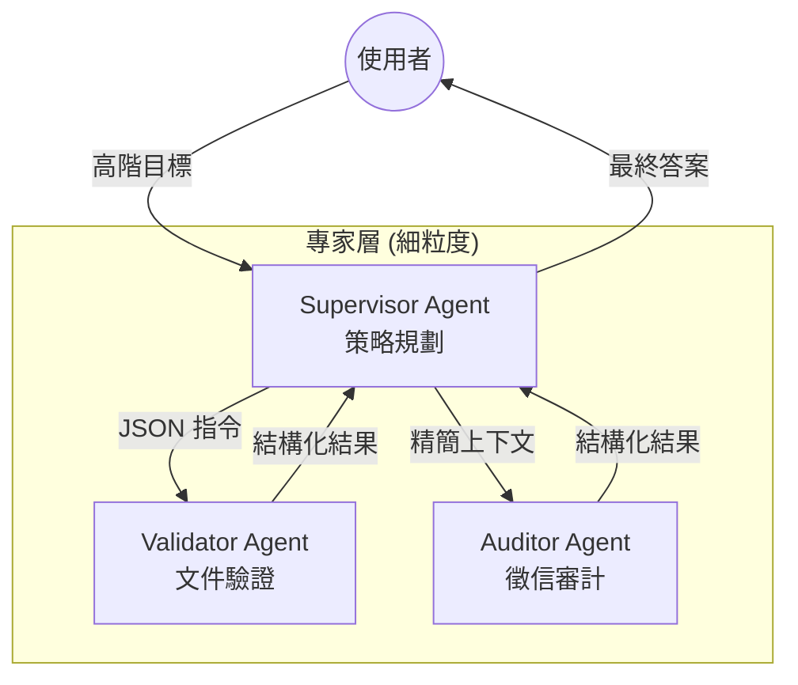

# Agent 粒度設計與權責分配

在分散式系統設計中，過早的優化是萬惡之源；但在 AI Agent 的架構設計中，**模糊的粒度邊界**才是真正的災難。正如資深架構師會區分「控制器（Controller）」與「業務邏輯（Service）」，設計 Agent 時，我們必須嚴格區分「粗粒度協調器（Coarse-grained Orchestrator）」與「細粒度子代理（Fine-grained Sub-agents）」。

當你試圖讓單一 Agent 處理過多異質任務時，會引發「認知負載崩潰」與「指令漂移（Goal Drift）」。本文將探討如何優雅地拆解權責。

---

### 情境 1：優先採用層級式架構，將「流程控制」與「專業執行」分離

開發者常犯的錯誤是建立一個「全能型 Agent」，給予它數十種工具並要求它處理複雜流程。這會導致模型在決策空間中產生「分析癱瘓」，難以精確選擇工具並維持邏輯一致性。

#### 核心概念
*   **粗粒度協調器（Orchestrator）**：負責理解高階目標、制定任務 DAG（有向無環圖）、委派子任務並彙整結果。它不應該具備特定領域的運算邏輯，而是流程的「指揮家」。
*   **細粒度子代理（Sub-agent）**：負責執行特定領域的原子任務（如：徵信查詢、合規性審核）。它具備高度專業化的指令集（System Instructions）與專屬工具箱。

#### 程式碼範例（Bad vs. Better）

```python
# // **Bad：單體 Agent 負擔過重，指令衝突且難以維護**
# 一個 Agent 同時處理徵信、法律合規與風險計算，邏輯邊界模糊
from google.adk.agents import LlmAgent

bad_monolith = LlmAgent(
    name="LoanService",
    instructions="你是徵信專員、律師也是風險分析師。請審核這筆貸款，先查徵信，再查法律，最後算風險...",
    # 超過 10 個工具導致模型容易幻覺
    tools=[credit_tool, legal_tool, risk_tool, notification_tool, ...]
)

# // **Better：使用 ADK 的層級式架構，透過 AgentTool 實現權責解耦**
from google.adk.agents import LlmAgent
from google.adk.tools.agent_tool import AgentTool

# 1. 定義細粒度專家 (Sub-agents)
credit_agent = LlmAgent(
    name="CreditExpert", instructions="你專精於徵信數據分析...", tools=[credit_tool]
)
legal_agent = LlmAgent(
    name="LegalExpert", instructions="你負責審核金融法規遵循性...", tools=[legal_tool]
)

# 2. 將專家包裝為「工具」供協調器調用
# 這樣協調器視子代理為黑盒，只關注任務達成
credit_tool_wrapper = AgentTool(agent=credit_agent)
legal_tool_wrapper = AgentTool(agent=legal_agent)

# 3. 定義粗粒度協調器 (Orchestrator)
coordinator = LlmAgent(
    name="LoanOrchestrator",
    instructions="你是貸款流程主管。負責編排徵信與法律專家的協作，並最終決策。",
    sub_agents=[credit_tool_wrapper, legal_tool_wrapper],  # 層級化委派
)
```

#### 底層原理探討與權衡
*   **為什麼這樣做（Rationale）**：LLM 的上下文視窗雖大，但在長文本中間的指令往往會被忽略（Lost in the Middle 問題）。層級化架構縮短了每個 Agent 的指令長度，並將決策空間限制在 3 到 10 個工具內，極大提升了可靠性與參數效率。
*   **權衡**：層級式設計會增加系統延遲與 Token 成本，因為每一次委派都代表一次完整的 LLM 推理往返。對於低延遲要求的簡單任務，單體設計仍有其價值。

---

### 情境 2：透過「資料契約」管理子代理間的狀態遷移

當子代理變多時，協調器最常遇到的挑戰是：如何將 Agent A 的輸出精確地傳遞給 Agent B。

#### 運作流程圖



#### 適用場景與拇指法則 (Rule of Thumb)
*   **Rule of Thumb**：如果一個 Agent 的工具數量超過 10 個，或其 System Instructions 超過一頁 A4 且包含多種異質領域邏輯，即應考慮進行「粒度拆分」。
*   **權責邊界**：協調器應專注於 `Planning` 與 `Synthesis`，子代理應專注於 `Execution` 與 `Observation`。

---

### 延伸思考

**1️⃣ 問題一**：子代理過多是否會導致「語義飄移」，使協調器迷失方向？

**👆 回答**：會。這就是為什麼我們需要 **Persistent Instruction Anchoring**。在 ADK 中，應在協調器的 Prompt 中使用標籤（如 `<GOAL>`）將核心任務錨定，確保每次委派回傳後，協調器仍能對齊原始業務目標。

---

**2️⃣ 問題二**：如何監控這種類似「樹狀結構」的複雜調用？

**👆 回答**：這需要導入 **Distributed Tracing**。ADK 透過 `trace_id` 貫穿所有子代理的執行過程。在架構上，你應該觀察每個節點的 `trajectory_exact_match` 等指標，確保子代理的行動路徑符合設計預期。

---

**3️⃣ 問題三**：子代理之間可以直接對話嗎？還是一定要經過協調器？

**👆 回答**：在「Level 4 生態系統」中，通常採 Top-down 委派（Agent Delegates to Agent）以維持可預測性。但到了「Level 6 自修復系統」，則可導入 **A2A 協議**，允許子代理之間直接進行 **Consensus（共識）** 或 **Negotiation（協商）**，實現去中心化的自組織行為。