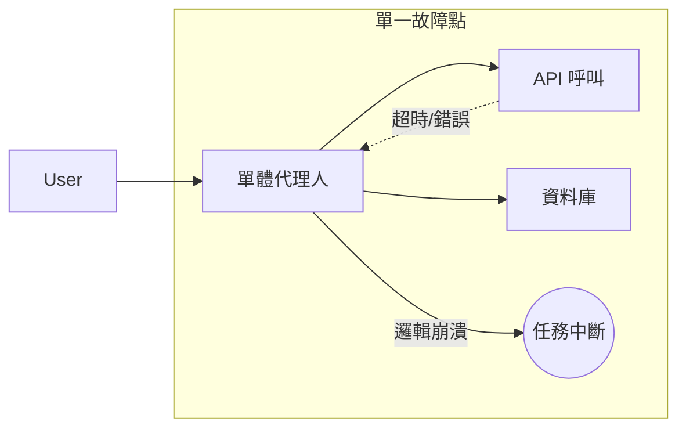
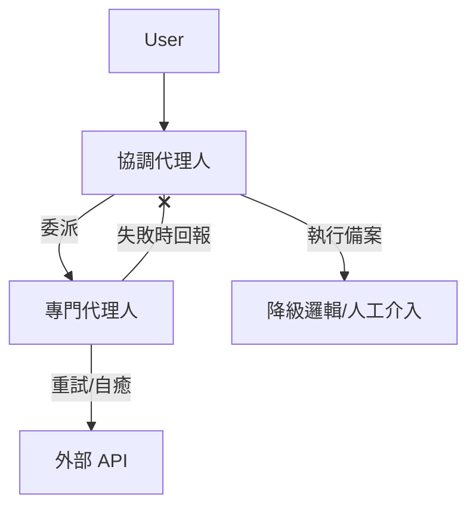

# 單一代理架構的瓶頸 (single_agent_limits)

在軟體工程中，我們常說「過早的優化是萬事之惡」，但在 AI Agent 的設計中，「過度的單體化（Monolithic）」則是隱形的殺手。單一代理系統（Single-agent systems）雖然是開發的起點（如成熟度模型中的 Level 5），但當面對複雜的企業級工作流時，它會迅速撞上認知與維護的邊界。

身為架構師，我們必須識別單體代理人的物理極限，並在系統崩潰前演進至多代理協作架構。

---

### 情境 1：避免建構「萬能代理人」，防止指令漂移與認知過載

開發者常試圖將所有業務規則（如文件驗證、信用評分、合規檢查）塞進同一個 `instruction` 中。這會導致「中間資訊遺失（Lost in the middle）」現象：LLM 傾向於關注 Context 的開頭與結尾，而忽略埋藏在中間的關鍵約束。

#### 核心概念
單一代理人的 **認知負荷（Cognitive Load）** 是有限的。當指令集過於龐大或工具數量超過臨界值（通常為 10 個以上）時，代理人會產生「決策癱瘓」，難以精確選擇工具並維持邏輯一致性。此外，單一提示詞混合多個領域邏輯會導致維護災難：修改 A 規則可能會意外破壞 B 規則。

#### 程式碼範例（Bad vs. Better）

```python
# // **Bad：單體化設計，導致指令漂移與工具選擇困難**
from google.adk.agents import LlmAgent

# 將所有領域邏輯塞在一起，導致模型在長對話中忘記合規約束
monolithic_agent = LlmAgent(
    name="LoanService",
    instructions="""你是萬能貸款專家。
    1. 驗證文件格式（PDF/PNG）。
    2. 調用 credit_api 檢查分數。
    3. 執行風險建模。
    4. 根據 ECOA 法規檢查合規性。
    ... (數百行的業務細節) ...""",
    # 過多的工具會增加幻覺風險
    tools=[doc_tool, credit_tool, risk_tool, compliance_tool, email_tool, db_tool, ...]
)

# // **Better：使用層級化架構實施「職責分離」**
from google.adk.agents import LlmAgent
from google.adk.tools.agent_tool import AgentTool

# 將專家拆分為細粒度的代理人，每個代理人僅持有必要的工具與背景
doc_expert = LlmAgent(name="DocValidator", instructions="專精於文件驗證...", tools=[doc_tool])
risk_expert = LlmAgent(name="RiskAssessor", instructions="專精於風險建模...", tools=[risk_tool])

# 將子代理包裝成工具，由協調器統一指揮
supervisor = LlmAgent(
    name="LoanOrchestrator",
    instructions="作為經理，負責編排以下專家的工作流：",
    sub_agents=[
        AgentTool(agent=doc_expert),
        AgentTool(agent=risk_expert)
    ]
)
```

#### 底層原理探討與權衡
*   **為什麼（Rationale）**：多代理架構實施了 **故障隔離（Fault Isolation）**。如果 `DocValidator` 因為格式錯誤失敗，它不會影響 `RiskAssessor` 的推理邏輯。此外，每個子代理可以選用最合適的模型（如：簡單任務用 Flash，複雜推理用 Pro），優化 Token 成本與延遲。
*   **權衡**：拆分代理人會增加系統的 **編排成本（Orchestration Overhead）** 與通訊延遲。如果任務簡單且不具備領域交叉性，單一代理系統仍然是首選。

---

### 情境 2：消除單一失效點 (Single Point of Failure) 以提升系統健壯性

在單一代理架構中，代理人的推理循環（Reasoning Loop）是脆弱的。一旦外部 API 發生暫時性網路抖動或模型在某一步驟產生邏輯死循環，整個工作流將徹底終止。

#### 核心概念
企業級應用需要 **彈性（Resilience）**。透過將工作流拆分為多個自治代理，我們可以為特定的高風險環節（如呼叫外部徵信接口）配置獨立的重試策略、逾時監控及降級方案。

#### 運作流程圖

單一代理人在面對工具失敗時會導致整個「大腦」停滯：



多代理協作則能有效緩衝異常：



#### 適用場景與拇指法則（Rule of Thumb）
*   **Rule of Thumb**：如果單一代理人的 `System Instructions` 超過一頁 A4 紙，或者其工具列表包含了不同團隊開發的 API，這就是實施「代理人職責拆分」的明確信號。
*   **例外**：在快速原型（PoC）階段，為了驗證核心邏輯是否可行，單體架構是具備成本效益的選擇。

---

### 比較分析：單體 vs. 多代理系統

| 維度 | 單一代理系統 (Level 3/5) | 多代理協作系統 (Level 4/6) |
| :--- | :--- | :--- |
| **維護性** | 困難，Prompt 高度耦合 | 容易，模組化設計 |
| **可靠性** | 低，單一失效點 | 高，故障隔離與補償機制 |
| **準確性** | 易受指令漂移影響 | 領域專家的注意力更集中 |
| **延遲** | 較低（單次模型調用） | 較高（多次 Agent 傳遞） |

---

### 延伸思考

**1️⃣ 問題一**：如何判斷何時該把一個「工具（Tool）」升格為「代理人（Agent）」？

**👆 回答**：這取決於 **決策的模糊性**。如果該功能是確定性的（如：計算貸款利率、執行 SQL 查詢），應維持為工具。如果該功能需要理解語義、展現同理心或進行多步驟判斷（如：與客戶討論貸款被拒的原因），則應將其封裝為具備獨立背景與指令的「子代理人」。

---

**2️⃣ 問題二**：多代理架構是否會導致 Token 成本失控？

**👆 回答**：確實有此風險。每一次代理人間的委派（Delegation）都是一次完整的 LLM 推理往返。架構師應採取 **按需啟動（On-demand Activation）** 策略，並在 Coordinator 端實施嚴格的 `ThinkingConfig` 預算控制，避免無謂的對話循環。

---

**3️⃣ 問題三**：多代理系統如何解決代理人之間的信息同步問題？

**👆 回答**：單一代理人共享同一個 Context，而多代理系統則需要實施 **共享知識記憶（Shared Epistemic Memory）**。透過外部數據店（如 Redis）或 ADK 的 `SessionService`，讓不同的子代理能讀取同一份經過驗證的「事實」，避免信息在傳遞過程中產生語義偏離。