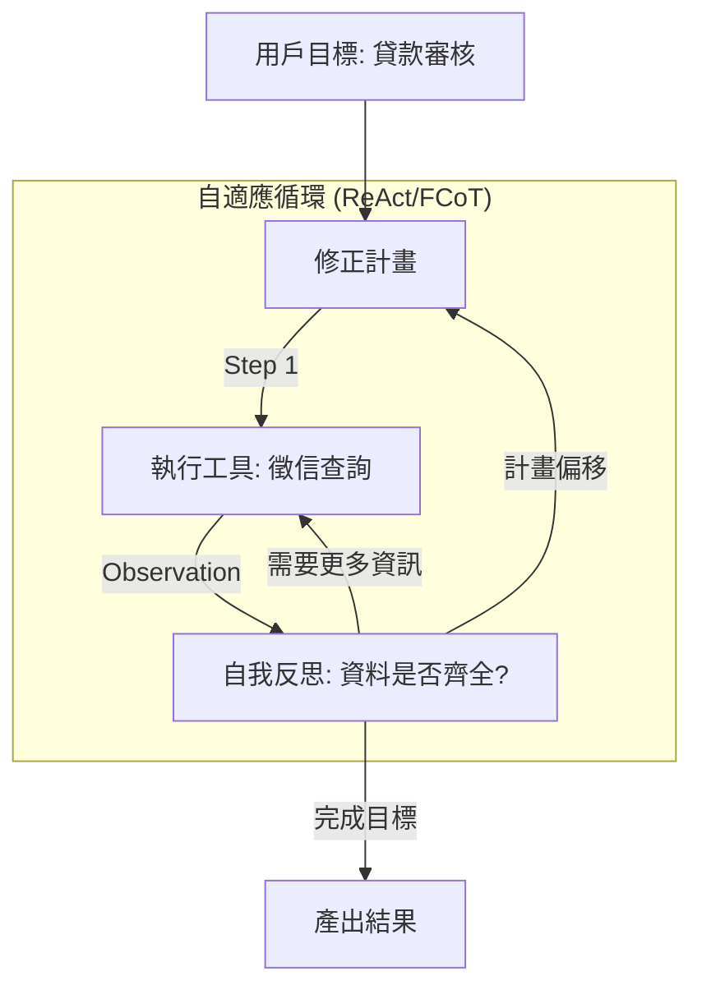

# Agent 規劃能力演進

在軟體架構的領域中，我們習慣於預定義的控制流（Control Flow）。然而，在 AI Agent 的世界裡，**規劃（Planning）** 是區別「自動化腳本」與「自主代理人」的核心指標。從 Level 4 的靜態、拓撲式規劃，演進到 Level 6 的動態自適應規劃，這不僅是技術的堆疊，更是從「決定性（Deterministic）」向「意圖驅動（Intent-driven）」的範式轉移。

---

### 情境 1：優先使用 LLM 計畫器（Planner）而非硬編碼條件分支

在傳統開發中，我們會用大量的 `if-else` 或狀態機來決定下一步。這種做法在面對模糊需求時會顯得極其脆弱，且難以維護。

#### 核心概念
Agent 的「大腦」應具備自主分解目標的能力。透過 ADK 的 `BuiltInPlanner`，我們可以將「做什麼」的決策權交給 LLM，讓它根據目前的狀態（State）和工具反饋動態生成任務序列。

#### 程式碼範例（Bad vs. Better）

```python
# ❌ Bad: 硬編碼工作流，一旦環境變動（如工具返回異常）即崩潰
# 邏輯被鎖死在程式碼中，缺乏靈活性
def traditional_workflow(user_query):
    docs = tool_fetch_docs(user_query)
    if "error" in docs:
        return "無法處理"
    analysis = tool_analyze(docs)
    return tool_summarize(analysis)

# ✅ Better: 使用 ADK `BuiltInPlanner` 實現意圖驅動的動態規劃

from google.adk.agents import LlmAgent
from google.adk.planners import BuiltInPlanner
from google.genai.types import ThinkingConfig

# 賦予 Agent 思考預算，讓它在執行前先規劃步驟
agent = LlmAgent(
    name="SmartPlanner",
    instructions="根據用戶需求，自主規劃並執行必要的工具調用流程。",
    planner=BuiltInPlanner(
        thinking_config=ThinkingConfig(include_thoughts=True) # 啟用觀察性
    ),
    tools=[tool_fetch_docs, tool_analyze, tool_summarize]
)
# Agent 會自動根據 query 判斷是否需要先執行 fetch，或是直接 summarize
```

#### 底層原理探討與權衡
*   **為什麼（Rationale）**：動態規劃允許 Agent 處理「非預期路徑」。例如，當 `tool_fetch_docs` 發現資料不足時，動態 Planner 會自主決定重新搜索，而非直接執行下一步導致失敗。
*   **權衡**：動態規劃增加了 Token 消耗與首字延遲（TTFT）。對於極度穩定、路徑單一的任務（如每日報表匯出），傳統的 `SequentialAgent`（靜態規劃）更具效率。

---

### 情境 2：採用「計畫而後執行」(Plan-and-Execute) 模式防止目標漂移

當任務變得複雜（例如超過 5 個步驟）時，Agent 容易在執行中途迷失方向（Lost in the Middle），忘記最初的限制條件。

#### 核心概念
**計畫而後執行** 模式要求 Agent 在動手前先產出一個完整的任務清單（DAG），並在執行每個步驟後進行自我驗證（Verify），確保行為與原始合約（Instruction Contract）一致。

#### 運作流程圖 (Mermaid)



#### 適用場景與拇指法則 (Rule of Thumb)
*   **Rule of Thumb**：如果任務涉及多個異質資料來源或需要跨組織協作（A2A），必須使用具備「自省（Reflection）」能力的動態規劃架構。
*   **例外**：即時聊天機器人（Chatbot）通常採用無狀態的即時反應，不需要複雜的預先規劃。

---

### 規劃能力等級對照表 (Maturity Mapping)

| 等級              | 規劃模式          | 技術特徵                      | 適用場景                     |
| :---------------- | :---------------- | :---------------------------- | :--------------------------- |
| **Foundational**  | 靜態 (Static)     | `SequentialAgent`, 硬編碼路徑 | 簡單、高頻的固定流程         |
| **Production**    | 反應式 (Reactive) | ReAct, `LoopAgent`            | 具備基本容錯能力的工具調用   |
| **Self-Learning** | 自適應 (Adaptive) | Tree of Thoughts (ToT), FCoT  | 需要探索多路徑方案的戰略決策 |

---

### 延伸思考

**1️⃣ 問題一**：如何在規劃過程中平衡「探索（Exploration）」與「收斂（Exploitation）」？

**👆 回答**：這取決於決策的風險。在科研或創意場景，應給予較高的「思維預算（Thinking Budget）」以支持 **Tree of Thoughts (ToT)**，讓模型平行探索多個可能路徑。但在金融操作中，則需強化 **計畫而後執行**，限制其偏離預定路徑。

---

**2️⃣ 問題二**：當 Agent 在動態規劃中陷入「循環死結（Infinite Loop）」時該如何處理？

**👆 回答**：必須在系統層級實施 **Watchdog Timeout** 或 **Max Iterations** 硬限制。此外，應在規劃指令中加入「自我終止條件（Stop Condition）」，讓 Agent 能夠判斷目前的努力是否已達到邊際效益遞減，主動向人類求助（Agent Calls Human）。

---

**3️⃣ 問題三**：多代理人系統（MAS）中的規劃與單一代理人有何不同？

**👆 回答**：單一 Agent 是「微觀規劃」，關注工具順序；MAS 則是「宏觀編排」。在 MAS 中，Orchestrator Agent 進行 **任務分解（Task Decomposition）**，將子計畫分發給 Specialist Agents。這時規劃的重點在於資料契約（Data Contracts）的傳遞，而非單純的步驟執行。