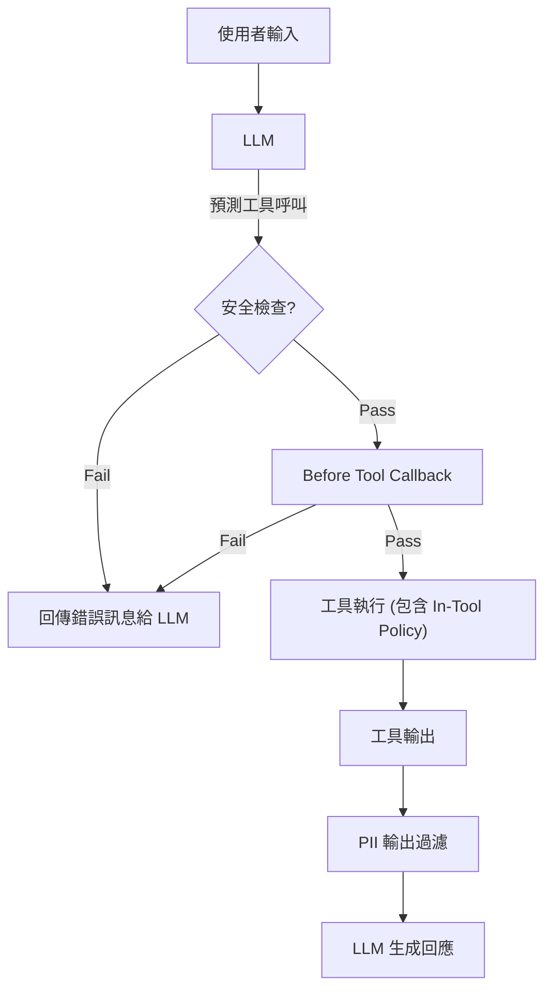

# 工具使用 (Tool Calling) 的核心機制與安全性：LLM 呼叫外部 API 的安全防護

在建構代理 (Agent) 時，賦予 LLM 使用工具 (Tool Use) 的能力是讓其從「聊天機器人」進化為「數位助理」的關鍵。然而，這也打開了潘朵拉的盒子：模型可能會產生幻覺、被提示詞注入 (Prompt Injection) 攻擊，甚至被誘導執行危險操作（如刪除資料庫）。

本篇將深入探討 Tool Calling 的底層機制，並提供實戰級的安全防護策略。

---

### 情境 1：精確定義工具 Schema (schema_generation)

#### 核心概念簡述
LLM 並不會「執行」你的程式碼，它只是「預測」應該呼叫哪個函式以及使用什麼參數。ADK (Agent Development Kit) 的核心機制是自動解析你的函式簽章 (Signature) 與文件字串 (Docstring)，生成 JSON Schema 給 LLM。如果 Schema 描述不清，模型就容易產生錯誤的參數，甚至被誤導。

#### 程式碼範例（Bad vs. Better）

```python
# ❌ Bad: 模糊的定義
# 沒有型別提示，沒有 docstring，參數名稱不直觀。LLM 只能瞎猜。
def get_data(user, date):
    # ... implementation ...
    return {"data": "..."}

# ✅ Better: 強型別與詳細描述
# 使用 Pydantic 定義輸入模型，並在 Docstring 中明確說明每個參數的意義與限制。
# ADK 會自動將這些資訊轉換為 LLM 可理解的 Schema。

from pydantic import BaseModel, Field
from google.adk import Agent

# 1.  定義工具的輸入參數模型，這會幫助 LLM 理解每個參數的意義與限制
class GetWeatherInput(BaseModel):
    city: str = Field(description="城市名稱，例如：台北市")
    unit: str = Field(
        default="celsius",
        pattern="^(celsius|fahrenheit)$",
        description="溫度單位，只能是 celsius 或 fahrenheit"
    )

# 2.  定義工具函式
def get_weather(params: GetWeatherInput) -> str:
    """查詢指定城市的即時天氣狀況。"""
    # 實際開發時，這裡會呼叫外部 API
    return f"{params.city} 目前氣溫為 25 度 {params.unit}。"

# 3.  在 Agent 中註冊工具
agent = Agent(
    model="gemini-1.5-pro",
    tools=[get_weather], # 直接傳入函式，ADK 會解析 GetWeatherInput
    instructions="你是一個氣象助理，請根據用戶需求查詢天氣。"
)

# 4.  執行 Agent，當用戶問「台北現在幾度？」時，LLM 會自動產生符合 GetWeatherInput 結構的參數並呼叫函式
# response = agent.run("幫我查台北的天氣，用攝氏")

```

#### 底層原理探討與權衡
*   **為什麼（Rationale）**：LLM 依賴 Schema 來理解工具。詳細的 Docstring 會被轉換為 System Prompt 的一部分或 Function Declaration。越精確的描述，模型的「對齊 (Alignment)」效果越好。
*   **權衡**：過於冗長的 Docstring 會佔用 Context Window。應保持精簡但關鍵資訊（如格式、限制）不可省略。

---

### 情境 2：區分代理身份與使用者身份 (identity_and_auth)

#### 核心概念簡述
**「你是誰？」** 是安全的核心。預設情況下，工具使用代理運行環境的身份 (Service Account) 執行。這意味著所有使用者都共享相同的權限，極易導致資料越權存取 (IDOR)。必須明確區分 **Agent Auth** (代理機器人身份) 與 **User Auth** (終端使用者身份)。

#### 拇指法則 (Rule of Thumb)
*   **公開資料/唯讀操作**：可使用 Agent Auth。
*   **私人資料/寫入操作**：**必須**使用 User Auth (如 OAuth Token)。

#### 程式碼範例

```python
# ❌ Bad: 隱式信任
# 代理使用自己的高權限 DB 連線，完全依賴 LLM 傳入的 `user_id`。惡意使用者可以叫 LLM 傳入別人的 ID。
# Bad: 任何人都可以透過 Prompt Injection 讓 LLM 查詢別人的資料
def query_balance(user_id: str):
    # 危險：直接使用參數進行查詢，沒有驗證發起人是誰
    return db.execute("SELECT balance FROM accounts WHERE id = ?", user_id)


# ✅ Better: 綁定 Context 驗證
# 透過 ADK 的 `ToolContext` 或 `Session State` 獲取經過驗證的當前使用者 ID，而不是盲目相信 LLM 產生的參數。

from google.adk.tools import ToolContext

def query_balance(tool_context: ToolContext) -> dict:
    """
    查詢當前登入使用者的餘額。
    注意：此工具不需要 user_id 參數，因為它自動從 session context 獲取。
    """
    # 從安全的 Session State 中獲取經認證的 User ID
    # 這是由系統層級注入的，使用者無法透過 Prompt 修改
    current_user_id = tool_context.invocation_context.session.state.get("authenticated_user_id")

    if not current_user_id:
        return {"error": "Unauthorized"}

    # 使用受信任的 ID 進行查詢
    balance = db.execute("SELECT balance FROM accounts WHERE id = ?", current_user_id)
    return {"balance": balance}
```

---

### 情境 3：實施工具內護欄 (in_tool_guardrails)

#### 核心概念簡述
防禦縱深 (Defense in Depth) 的重要一環。即使模型被越獄 (Jailbreak)，工具本身也應具備最後一道防線。這通常透過 `ToolContext` 傳遞「策略 (Policy)」來實現，讓工具的行為受限於當前的業務規則，而非僅受限於 Prompt。

#### 程式碼範例

```python
# ❌ Bad: 依賴 Prompt 進行限制
# 試圖告訴 LLM「不要刪除資料」，但這很容易被繞過。
# Bad: 依賴 System Prompt 說 "你不能執行 DELETE"，但在程式碼層面沒有防護
def execute_sql(query: str):
    return db.execute(query)


# ✅ Better: 程式碼層級的強制策略
# 在工具內部檢查策略物件。
def execute_sql(query: str, tool_context: ToolContext) -> dict:
    # 從 Context 獲取策略
    policy = tool_context.invocation_context.session.state.get("sql_policy", {"allow_write": False})

    # 強制執行策略：唯讀檢查
    if not policy.get("allow_write") and not query.strip().upper().startswith("SELECT"):
        return {"error": "Policy Violation: Only SELECT queries are allowed."}

    # 進一步檢查：限制存取的 Table
    allowed_tables = policy.get("allowed_tables", [])
    # ... (解析 SQL 確保只存取允許的 Table) ...

    return db.execute(query)
```

#### 底層原理探討
*   **為什麼 (Rationale)**：LLM 是機率性的 (Probabilistic)，而程式碼是確定性的 (Deterministic)。安全性必須建立在確定性的基礎上。透過 `ToolContext` 注入策略，可以根據不同使用者動態調整工具權限，而無需修改工具程式碼本身。

---

### 情境 4：使用回呼函數進行輸入驗證 (callbacks_validation)

#### 核心概念簡述
在工具真正執行**之前**，攔截並驗證模型的輸入。ADK 提供了 `before_tool_callback`，這是一個絕佳的 Hook 點，用來阻擋惡意參數、進行 PII (個人識別資訊) 檢查，或確認操作是否符合當前狀態。

#### 程式碼範例

```python
# ❌ Bad: 事後補救
# 工具執行後才發現參數錯誤或危險，可能已經造成副作用（例如已經發送了錯誤的 Email）。

# ✅ Better: Pre-flight Check (執行前檢查)
from typing import Dict, Any, Optional
from google.adk.tools import ToolContext, BaseTool

# 定義 Before Tool Callback
def validate_transfer_params(
    callback_context: Any, # CallbackContext
    tool: BaseTool,
    args: Dict[str, Any],
    tool_context: ToolContext
) -> Optional[Dict]:
    """
    在轉帳工具執行前進行驗證。
    """
    if tool.name == "transfer_money":
        amount = args.get("amount", 0)
        destination = args.get("destination", "")

        # 規則 1：金額上限
        if amount > 10000:
            return {"error": "Transaction limit exceeded. Max 10000."}

        # 規則 2：黑名單帳戶
        if destination in ["banned_account_1", "hacker_wallet"]:
            return {"error": "Transaction blocked: Suspicious destination."}

    # 回傳 None 表示驗證通過，允許執行
    return None

# 在 Agent 初始化時註冊
agent = LlmAgent(
    # ...
    before_tool_callback=validate_transfer_params,
    tools=[transfer_money_tool]
)
```

### 更多說明：安全防護流程圖



---

### 情境 5：沙盒化程式碼執行 (sandboxed_execution)

#### 核心概念簡述
當你的代理需要「寫程式」或「執行數據分析」時，絕對**不要**在你的應用程式伺服器本機執行這些程式碼。這等同於給了駭客一個 Remote Code Execution (RCE) 的後門。

#### 拇指法則
*   **永遠**在隔離的環境中執行生成的程式碼。
*   **網路限制**：沙盒環境應預設斷網，防止資料外洩。

#### 程式碼範例

```python
# ❌ Bad: `exec()` 是萬惡之源
# 極度危險：直接在主程序中執行 LLM 生成的 Python 程式碼
def run_analysis(code: str):
    exec(code) # 駭客可以 import os; os.system('rm -rf /')

# ✅ Better: 使用專用沙盒或 API
# 使用 ADK 的 Code Executor (對接 Vertex AI Code Interpreter) 或 Docker 容器。

# 概念範例：使用 ADK 支援的 Code Execution Tool (通常是 Vertex AI 託管服務)
# 這會在 Google 的安全沙盒中執行，與你的伺服器隔離
from google.adk.code_executors.agent_engine_sandbox_code_executor import AgentEngineSandboxCodeExecutor

agent = LlmAgent(
    # ...
    instruction="您是一個樂於助人的代理，能撰寫並執行程式碼來回答問題並解決問題。",
    code_executor=AgentEngineSandboxCodeExecutor(
        sandbox_resource_name="SANDBOX_RESOURCE_NAME",
    ),
)
```

---

### 延伸思考：安全性檢查清單

**1️⃣ 問題一**：我的工具是否接受了 `sql_query` 或 `shell_command` 作為參數？

**👆 回答**：如果是，這是高風險設計。盡量將工具設計為「語意化」的原子操作（如 `get_user_by_id`），而不是通用的執行器。如果必須支援 SQL，請強制執行唯讀 (Read-Only) 帳號與 Allowlist 驗證。

---

**2️⃣ 問題二**：如果 LLM 反覆嘗試錯誤的參數，我的系統會怎麼辦？

**👆 回答**：應實施 Rate Limiting (速率限制) 和 Anomaly Detection (異常偵測)。如果一個 Session 在短時間內觸發多次工具錯誤或 Callback 攔截，應暫停該 Session 並發出警報。

---

**3️⃣ 問題三**：工具的回傳結果是否包含敏感資訊？

**👆 回答**：LLM 的輸出可能會直接顯示給使用者。務必在工具回傳結果進入 LLM Context 之前，過濾掉 PII (如身分證號、API Keys)。可以使用 ADK 的「PII Redaction 插件」或在 `after_tool_callback` (若有實作) 中進行清洗。

---