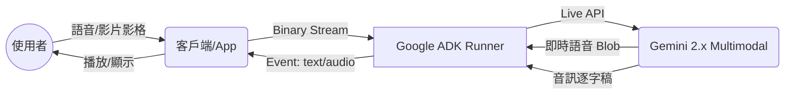

# 多模態感知 (Multimodal Sense)

在生成式 AI 的進化過程中，Agent 的能力邊界已從單純的「文字處理」跨越到「全感官認知」。一個優秀的 Agent 不僅能讀懂文字，更應具備處理圖、文、影、音等多模態數據的能力。Google ADK 透過與 Gemini 多模態模型的深度整合，提供了強大的抽象層，使開發者能優雅地處理這些非結構化數據。

本篇將探討如何讓 Agent 具備「多模態感知」的進階實踐。

---

### 情境 1：處理大型多媒體資源時，優先使用 GCS URI 引用而非 Base64 內嵌

**核心概念簡述**
在傳送圖片、PDF 或長影片給 Agent 時，將數據直接轉為 Base64 字串（`inline_data`）會顯著增加網路酬載負擔，並可能觸發請求大小限制。最佳做法是將資源上傳至 Google Cloud Storage (GCS)，並傳送其 URI。

#### 程式碼範例（Bad vs. Better）

```python
# ❌ Bad: 使用 Base64 傳送大型圖片
# 這種做法會導致記憶體佔用激增，且不適合大檔案或多圖場景
import base64
from google.genai import types

with open("large_scan.png", "rb") as f:
    image_data = f.read()
    base64_image = base64.b64encode(image_data).decode('utf-8')

image_part = types.Part.from_bytes(
    data=base64_image,
    mime_type="image/png"
)
# 發送請求...

# ✅ Better: 使用 GCS URI 引用
# 透過 Cloud Storage 引用，Agent 能直接在雲端高效讀取，減少客戶端頻寬損耗
from google.genai import types

# 假設圖片已上傳至 GCS
image_part = types.Part.from_uri(
    file_uri="gs://my-bucket/documents/large_scan.png",
    mime_type="image/png"
)

# 傳送給 Agent 進行分析
response = await agent.run_async(
    message=["請分析這張圖表中的關鍵趨勢：", image_part]
)
```

**底層原理探討與權衡**
*   **記憶體管理**：`inline_data` 需要將整個檔案載入內存並編碼，對大規模併發系統極不友善。
*   **緩存機制**：多模態模型（如 Gemini）對 GCS 資源有更好的緩存優化，能加速重複查詢的處理速度。
*   **權衡**：對於極小（如 < 50KB）的動態生成圖片，`inline_data` 的延遲可能略低於 GCS 的冷啟動，但「拇指法則」仍建議優先考慮 URI。

---

### 情境 2：在即時視覺監控場景，利用 `send_realtime` 進行低頻率影格串流

**核心概念簡述**
當 Agent 需要「看見」動態環境（如監控畫面或桌面分享）時，不應發送完整影片檔案，而是透過 `LiveRequestQueue` 持續發送 JPEG 影格。

#### 程式碼範例（Bad vs. Better）

```python
# ❌ Bad: 等待影片錄製完成後才發送
# 這種做法缺乏即時性，無法實現即時對話或警報
async def process_video(video_path):
    video_part = types.Part.from_uri(file_uri=f"gs://bucket/{video_path}", mime_type="video/mp4")
    await agent.run_async(message=["影片中是否有可疑活動？", video_part])

# ✅ Better: 使用 send_realtime 進行影格串流 (1 FPS)
# 透過串流 Blob 實現即時感知，Agent 能隨時中斷並回應
from google.genai import types

async def monitor_vision(queue: LiveRequestQueue):
    while camera.is_active():
        frame_data = camera.get_jpeg_frame() # 獲取 JPEG 影格

        # 封裝為 Blob 並發送
        image_blob = types.Blob(
            mime_type="image/jpeg",
            data=frame_data
        )
        queue.send_realtime(image_blob)

        await asyncio.sleep(1.0) # 建議頻率：1 FPS
```

**適用場景與拇指法則**
*   **Rule of Thumb**：影片串流建議最高不超過 1 FPS，以平衡理解精確度與 Token 消耗。
*   **例外**：若需精確捕捉微小動作，可提升至 2-5 FPS，但需注意會話的上下文長度（Context Window）會快速耗盡。

---

### 情境 3：音訊串流中，嚴格遵循雙向通訊規範以確保低延遲感知

**核心概念簡述**
多模態 Live API 對音訊格式有極其嚴格的要求。不正確的採樣率或編碼會導致模型無法解讀或產生嚴重的幻覺。

#### 技術規格對照表

| 屬性 | 輸入規格 (Client to Agent) | 輸出規格 (Agent to Client) |
| :--- | :--- | :--- |
| **編碼格式** | 16-bit PCM | 16-bit PCM |
| **採樣率** | **16,000 Hz** (16kHz) | **24,000 Hz** (24kHz) |
| **聲道** | 單聲道 (Mono) | 單聲道 (Mono) |
| **MIME 類型** | `audio/pcm;rate=16000` | `audio/pcm;rate=24000` |

---

### 更多說明：多模態數據流向



---

### 延伸思考

**1️⃣ 問題一**：如果我的應用程式需要同時支援文字與音訊回應，該如何設定？

**👆 回答**：在 `RunConfig` 中設定 `response_modalities=["AUDIO"]`。即使選擇音訊模式，只要啟用 `output_audio_transcription=True`，Agent 仍會同時回傳音訊 Blob 與對應的文字逐字稿，這對於 UI 顯示與記錄非常重要。

---

**2️⃣ 問題二**：多模態 Agent 的安全防護（Safety）與純文字有何不同？

**👆 回答**：多模態場景需額外考量「視覺越獄」與「隱私內容」。Google ADK 整合了 Vertex AI 的內容過濾器，會自動掃描傳入的 `Part` 內容。開發者應在系統指令（System Instruction）中明確定義對敏感圖像（如 PII 資訊）的處理規範。

---

**3️⃣ 問題三**：為什麼建議在音訊串流時，客戶端要手動將音訊轉換為 16kHz PCM？

**👆 回答**：雖然伺服器端可以做轉碼，但這會增加額外的處理延遲。在客戶端（如瀏覽器的 AudioWorklet）直接採集符合規格的原始位元組，能確保最低的 End-to-End 延遲，這對於建立自然對話的「節奏感」至關重要。
