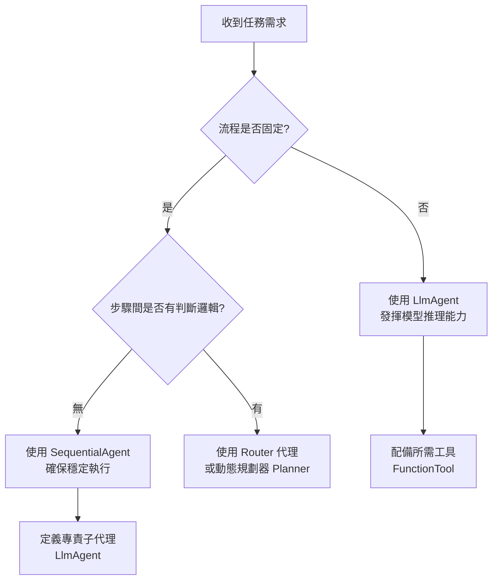

# Agent 與自動化工作流 (Automated Workflows) 的區別：釐清主動決策與被動執行之差異 (agent_vs_workflow)

在生成式 AI 的應用架構中，開發者常面臨一個根本性的抉擇：我應該使用一個具備自主推理能力的 **Agent (代理)**，還是建立一個結構嚴謹的 **Workflow (工作流)**？這不只是實作技術的選擇，更關乎軟體架構對於「不確定性」的容忍程度。

正如 Scott Meyers 在處理 C++ 資源管理時強調的「明確性」，在 Google ADK (Agent Development Kit) 中，理解 `LlmAgent` 與 `WorkflowAgent` 的邊界，是構建健壯 AI 系統的第一步。

---

### 情境 1：對於具備固定邏輯的任務，優先使用 Workflow 而非單一 Agent 推理

當任務的處理流程是確定且不可變的（例如：先抓取網頁，再進行摘要），將流程控制權交給 LLM 推理會引入不必要的隨機性與失效風險。我們應該將「流程控制」與「內容生成」分離。

#### 核心概念簡述
*   **Workflow (被動執行)**：如 `SequentialAgent`，它像是一個工廠流水線，嚴格按照預定義的順序執行任務，不具備修改流程的權力。
*   **Agent (主動決策)**：如 `LlmAgent`，它像是一個具備判斷力的專案經理，根據當前狀況決定下一步該做什麼、使用什麼工具。

#### 程式碼範例 (Bad vs. Better)

```python
# ❌ Bad: 讓單一 Agent 負責所有邏輯判斷
# 這種做法容易導致 Agent 在第一步失敗時，嘗試進行無意義的「幻想」步驟，
# 或是在複雜流程中跳過關鍵的資料獲取步驟。
full_task_agent = LlmAgent(
    model="gemini-2.0-flash",
    name="overloaded_agent",
    instruction="""
    當收到網址時，請先執行 get_page_content，
    拿到內容後，再執行 summarize_content。
    """,
    tools=[get_page_content, summarize_content]
)

# ✅ Better: 使用 SequentialAgent 編排流程，確保執行順序
# 將確定性的流程交給 WorkflowAgent，將智慧型任務交給個別的 LlmAgent。
# 流程控制權在框架手中，而非模型手中。
from google.adk.agents import LlmAgent, SequentialAgent

fetcher = LlmAgent(
    name="fetcher",
    model="gemini-2.0-flash",
    instruction="使用工具獲取網頁內容。",
    tools=[get_page_content],
    output_key="raw_content"
)

summarizer = LlmAgent(
    name="summarizer",
    model="gemini-2.0-flash",
    instruction="根據 {raw_content} 生成簡短摘要。"
)

# 確定性的執行路徑：1. fetcher -> 2. summarizer
workflow_agent = SequentialAgent(
    sub_agents=[fetcher, summarizer]
)
```

---

### 底層原理探討與權衡

#### 1. 確定性 (Determinism) vs. 靈活性 (Flexibility)
Workflow 提供了 **100% 的路徑確定性**。在 `SequentialAgent` 中，子代理 A 沒執行完，絕對不會跳到子代理 B。這對於需要合規審查、嚴格數據依賴的系統至關重要。反之，`LlmAgent` 雖然具備處理非預期狀況的靈活性，但在處理線性任務時，這種靈活性往往成為「不穩定因素」。

#### 2. 狀態管理與數據依賴
在 ADK 中，`WorkflowAgent` 會共享 `InvocationContext`。這意味著透過 `output_key` 儲存在會話狀態中的數據，可以精確地傳遞給下一個步驟。這種顯式的數據流動比 LLM 在 Prompt 中隱式記住所有上下文更為強健。

#### 3. 容錯機制
當 Workflow 中的某個步驟失敗時，開發者可以輕易定義重試策略（如 `reflect-and-retry` 插件）。但在單一 Agent 內部，若模型在推理鏈中出錯，很難進行細粒度的狀態恢復。

---

### 更多說明

#### Agent 與 Workflow 的屬性對比表格

| 特性 | LLM 代理 (LlmAgent) | 工作流代理 (Workflow Agent) |
| :--- | :--- | :--- |
| **核心驅動** | 大型語言模型 (LLM) | 預定義邏輯 (Code-defined) |
| **執行行為** | 非確定性（動態路徑） | 確定性（固定路徑） |
| **擅長場景** | 創意生成、動態決策、工具選用 | 結構化流程、資料處理管線、合規檢查 |
| **資源消耗** | 較高（多次 LLM 推理） | 較低（僅在子代理調用時消耗） |
| **可觀測性** | 較難追蹤推理動機 | 流程分支清晰，易於監控 |

#### 執行決策流程圖



---

### 適用場景 (Rule of Thumb)

*   **優先選擇 Workflow**: 當你的任務可以被畫成清晰的流程圖，且步驟間的轉換不依賴語義理解時。例如：ETL 流程、定時報告生成。
*   **優先選擇 Agent**: 當你的輸入極其多樣化，且無法窮舉所有可能的執行路徑時。例如：一般性的客戶諮詢助理、具備高度自由度的研究助理。
*   **例外情況**: 有時雖然流程固定，但每個步驟的「成功定義」非常主觀，此時可能需要嵌入具備審查能力的 `LlmAgent` 作為 Workflow 的一部分，而非單純的程式碼判斷。

---

### 延伸思考

**1️⃣ 問題一**：在 `SequentialAgent` 中，如果其中一個子代理失敗了，後續步驟會如何處理？

**👆 回答**：預設情況下，`SequentialAgent` 遵循短路原則，任何一個子代理拋出未處理的異常，整個工作流都會停止。但在 ADK 中，你可以透過配置 `plugins`（如反射重試插件）或自定義 `BaseAgent` 來實作錯誤緩衝邏輯。

---

**2️⃣ 問題二**：能不能在 `SequentialAgent` 中放入另一個 `ParallelAgent`？

**👆 回答**：絕對可以。這正是 ADK 的強大之處——**遞歸組合性**。所有代理都繼承自 `BaseAgent`，這意味著你可以構建「順序 -> 平行 -> 順序」這種複雜的巢狀架構。這符合軟體工程中「封裝」與「組合」的原則，讓你能夠將複雜系統拆解為細小的執行單元。

---

**3️⃣ 問題三**：什麼時候應該從 `Workflow` 升級到 `LlmAgent` 的 `Planner` 模式？

**👆 回答**：當「執行順序」本身需要根據輸入內容動態調整，且調整的組合數過多導致程式碼難以維護時。例如，一個旅遊規劃代理，需要根據天氣、預算、使用者偏好動態決定是先訂機票還是先選景點，這時 `BuiltInPlanner` 會比手寫複雜的 Workflow 判斷邏輯更有效率。
