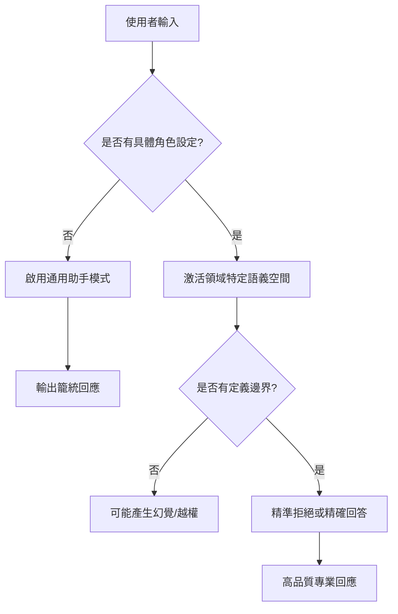

# 角色扮演 (Role-playing) 與背景故事的作用

在構建 GenAI Agent 時，開發者常犯的錯誤是將其視為一個單純的「API 接口」。事實上，Agent 的行為高度取決於我們為其設定的 **Persona (人格)** 與 **Context (背景故事)**。這不僅僅是為了趣味性，更是為了在機率性的 LLM 世界中，透過「角色坍縮」來精準控制輸出的邊界與語調。

---

### 情境 1：優先使用具體職業身份而非模糊的「助手」描述

當你告訴 Agent「你是一個樂於助人的助手」時，你實際上是將其推入了 LLM 訓練資料中最平庸、最通用的機率分佈中。對於需要專業準確性的任務，這通常會導致輸出過於籠統。

**核心概念簡述**
賦予 Agent 一個具體的「職業身份」與「多年經驗背景」，能強迫模型從其龐大的知識庫中激活特定領域的子集（Domain-specific subset），進而提升建議的深度。

#### 程式碼範例 (Bad vs. Better)

```python
# ❌ Bad: 模糊的身份定義
# 模型會給出通用的程式碼建議，缺乏對系統架構的深層考量
generic_agent = LlmAgent(
    model="gemini-2.5-flash",
    name="code_helper",
    instruction="你是一個樂於助人的助手，請幫我審查這份 Python 程式碼並給出建議。"
)

# ✅ Better: 具體的架構師角色 (基於 Google ADK 範例)
# 模型會激活性能優化、並發處理與健壯性相關的知識
architect_agent = LlmAgent(
    model="gemini-2.5-flash",
    name="senior_architect",
    instruction="""你是一位擁有 20 年經驗的雲端架構師，風格深受 Scott Meyers 的《Effective》系列影響。
    你的目標是針對使用者的程式碼進行深度評審，並專注於：
    1. 資源利用效率（CPU/Memory）。
    2. 例外處理的健壯性。
    3. 程式碼的可維護性。

    請以專業、嚴謹且具備指導性的語氣回應。
    """
)
```

---

### 情境 2：明確定義行為邊界與「不該做什麼」

一個優秀的資深工程師知道何時該拒絕任務，Agent 亦然。角色扮演的核心不僅在於「我是誰」，更在於「我不是誰」。

**核心概念簡述**
透過「負向約束 (Negative Constraints)」與「專業邊界」，防止 Agent 在面對未知或不確定的領域時產生幻覺（Hallucination）。

#### 程式碼範例 (Bad vs. Better)

```python
# ❌ Bad: 缺乏邊界限制
# 面對法律或醫療問題，Agent 可能會嘗試給出錯誤的「專業」建議
financial_agent = LlmAgent(
    model="gemini-2.5-flash",
    name="money_bot",
    instruction="你是一個財務諮詢專家，請回答使用者的財務問題。"
)

# ✅ Better: 定義行為守則與邊界
# 透過角色設定明確界定服務範圍，提升安全性
secure_finance_agent = LlmAgent(
    model="gemini-2.5-flash",
    name="tax_advisor",
    instruction="""你是一位專精於個人所得稅的稅務顧問。
    你的行為準則如下：
    1. 僅提供稅務申報相關的建議。
    2. 如果問題涉及法律訴訟或醫療健康，你必須明確表示「這超出了我的專業範圍」。
    3. 嚴禁對未來的股市表現做出具體預測，僅能分析歷史數據。
    4. 輸出必須包含具體的稅務法規條文參考（如果適用）。
    """
)
```

---

### 情境 3：利用背景故事強化工具調用的正確性

在 Google ADK 中，Agent 的 `tools` 雖然有描述，但在複雜的工作流中，Agent 往往不知道何時該「主動」使用工具。背景故事能提供「場景觸發點」。

**核心概念簡述**
將工具的使用邏輯編織進背景故事中，讓 Agent 理解工具不是「選項」，而是執行角色職責的「必要手段」。

#### 程式碼範例 (Bad vs. Better)

```python
# ❌ Bad: 只是列出工具
# Agent 可能只會回答天氣，而忽略了與任務的關聯
travel_agent = LlmAgent(
    model="gemini-2.5-flash",
    name="tour_guide",
    tools=[get_weather],
    instruction="你可以使用 get_weather 工具來回答天氣問題。"
)

# ✅ Better: 將工具融入角色目標
# 背景故事賦予了工具調用的「優先級」與「邏輯關聯」
concierge_agent = LlmAgent(
    model="gemini-2.5-flash",
    name="travel_concierge",
    tools=[get_weather],
    instruction="""你是一位高端旅行社的私人管家。
    當使用者詢問某地的旅遊計畫時，你的標準作業流程如下：
    1. 主動調用 `get_weather` 檢查目的地的天氣預報。
    2. 背景思考：如果預報顯示降雨機率 > 50%，你必須優先推薦室內文化活動（如博物館）。
    3. 背景思考：如果天氣晴朗，則推薦戶外探索路徑。
    4. 回應語氣應保持優雅，並展現對氣候細節的體貼關懷。
    """
)
```

---

### 底層原理探討與權衡

角色扮演的有效性源於 LLM 的 **Attention Mechanism (注意力機制)**。當 Prompt 中包含強烈的角色特徵時，模型在生成權杖 (Token) 時，會給予與該角色高度相關的語義空間更高的權重。

*   **權衡 (Trade-offs)**：
    *   **擬人化 vs. 效率**：過於冗長的背景故事會消耗過多的 Input Tokens，可能增加延遲與成本。
    *   **角色一致性 (Consistency)**：在長對話中，模型可能會出現「角色漂移」。此時需要透過 `include_contents='default'` 確保上下文歷史被正確帶入。

### 更多說明

#### 角色引導決策流程圖



#### 指令類型對比表

| 指令維度 | 傳統 Prompt (Low Quality) | 角色化 Prompt (Effective) | 預期效果 |
| :--- | :--- | :--- | :--- |
| **語調** | 中立、機械化 | 專業人士（如：資深審計師） | 提升信任度與可讀性 |
| **邊界** | 開放式回答 | 負向約束（不要做 X） | 減少安全風險與幻覺 |
| **工具觸發** | 被動觸發（問才用） | 主動整合（為了職責而用） | 提升自動化程度 |
| **範例提供** | 無 | 包含 Few-shot 範例 | 確保輸出格式符合預期 |

---

### 延伸思考

**1️⃣ 問題一：如果我設定了一個「極度挑剔的評論家」角色，這是否會導致 Agent 忽略程式碼中正確的部分？**

**👆 回答**：這正是「拇指法則」發揮作用的地方。你需要透過指令平衡其偏見。例如：「你是一個嚴格的評論家，但在指出錯誤的同時，必須保留並確認現有的正確邏輯。」這能防止角色過於極端而失去實用性。

---

**2️⃣ 問題二：在多代理系統 (Multi-Agent System) 中，每個 Agent 都有不同角色，會不會導致對話混亂？**

**👆 回答**：這就是 Google ADK `name` 與 `description` 參數的重要性。架構師應該為每個 Agent 設定互補的角色。例如：由一個「創意產生者」產生想法，再由另一個「合規性檢查員」進行審核。透過明確的角色分工，可以將混亂轉化為結構化的編排。

---

**3️⃣ 問題三：背景故事需要寫多長才算「足夠」？**

**👆 回答**：遵循 Meyers 的「最小必要原則」。只需提供足以區分行為的關鍵特徵即可。通常 3-5 行的核心行為定義，比兩頁的虛構傳記更有效。過多的雜訊反而會干擾模型的注意力核心。
