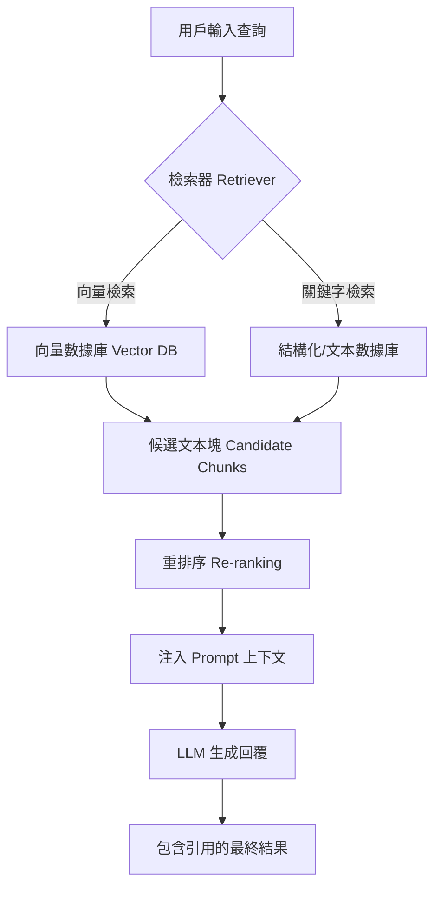

# 基礎 RAG

檢索增強生成（Retrieval-Augmented Generation, RAG）並非單一技術，而是一套將大型語言模型（LLM）從「封閉知識系統」轉化為「開放動態系統」的架構模式。身為架構師，我們深知 LLM 的「世界知識」存在時效性限制（Knowledge Cutoff）且無法接觸企業私有數據。RAG 的核心價值在於透過實時注入外部查驗過的資訊，減少模型因知識斷層產生的「幻覺（Hallucinations）」，並提供具備可追蹤性的引用來源。

---

### 情境 1：將非結構化數據轉化為具備「語義感知」的索引
**核心概念簡述**：
傳統的全文檢索依賴關鍵字匹配，但在 GenAI 領域，我們追求的是「萬物皆向量」。索引流程（Indexing Pipeline）是 RAG 的地基，涉及將文件解析、清洗、並切分為具備資訊密度的「塊（Chunks）」。透過 Embedding 模型將文本轉化為高維向量，我們能將語義相近的內容在向量空間中聚集，從而打破「關鍵字必須完全相同」的限制。

**程式碼範例（Bad vs. Better）**：

*   **❌ Bad：將整個大型 PDF 文件內容直接塞入 Prompt**
    > **Rationale**: 這會迅速導致 Token 溢出，且 LLM 在處理超長上下文時容易產生「迷失在中間（Lost in the Middle）」的問題，導致忽略核心細節。

*   **✅ Better：利用 ADK 或 LlamaIndex 進行智慧切片與向量化**
```python
# 使用 Google ADK 或類似框架進行處理 (參考源 1631, 1654)
# 將文件切分為固定大小且帶有重疊區域的 Chunk，以保持語義連貫性
document = Document(text=raw_text, metadata={"source": "manual_v1.pdf"})
splitter = SentenceSplitter(chunk_size=1024, chunk_overlap=20)
nodes = splitter.get_nodes_from_documents([document])

# 生成向量索引 (Vector Indexing)
# 確保檢索端與索引端使用完全相同的模型版本以維持一致性
vector_index = VectorStoreIndex(nodes)
```

**底層原理探討與權衡**：
「垃圾進，垃圾出（GIGO）」在 RAG 中極為關鍵。切片（Chunking）的大小是一個平衡點：切片太小會丟失上下文；切片太大則會混入雜訊，稀釋語義向量的準確度。架構設計上必須確保 Embedding 模型的一致性，若索引與檢索時使用的模型版本不同，將導致檢索失效。

---

### 情境 2：結合語義相似度與關鍵字匹配進行混合檢索
**核心概念簡述**：
「相似度並不等於相關性」。僅依賴向量檢索有時會忽略特定專有名詞或零件編號（例如：零件 ID 為 `XYZ-123`）。因此，成熟的架構會採用混合搜尋（Hybrid Search），結合 BM25 關鍵字演算法與向量相似度評分，確保檢索結果既具備廣泛的語義關聯，又能精準鎖定特定實體。

**程式碼範例（Bad vs. Better）**：

*   **❌ Bad：單純依賴 Vector Search 檢索具體技術 ID**
    > **Rationale**: 向量表示法是語義壓縮，對於隨機生成的 ID 序列（如 `CUST-98765`）其相似度特徵不明顯，極易導致檢索失敗。

*   **✅ Better：配置混合檢索器 (Hybrid Retriever)**
```python
# 配置支援混合搜尋的檢索服務 (參考源 1032)
# alpha=0.5 代表權重均分，結合 BM25 (關鍵字) 與 Vector (語義)
retriever = vector_store.as_retriever(
    vector_store_query_mode="hybrid",
    alpha=0.5
)

# 檢索與用戶查詢最相關的 top-k 個結果
relevant_chunks = retriever.retrieve("如何處理隔膜破裂的設備？")
```

**底層原理探討與權衡**：
混合搜尋涉及多路召回（Multi-way Recall）後的結果融合（Re-ranking）。這雖然提升了精確度，但會增加檢索階段的延遲與運算成本。在企業級應用中，利用 Metadata 進行預過濾（Pre-filtering）是優化效能的關鍵手段，例如先過濾年份或權限標籤，再進行相似度運算。

---

### 情境 3：利用檢索內容對 LLM 進行精確錨定（Generation & Grounding）
**核心概念簡述**：
生成階段（Generation）是 RAG 的最後一哩路。其關鍵在於將檢索到的事實塊作為「上下文（Context）」注入 Prompt，並指示 LLM 僅根據這些內容回答問題。這稱為「錨定（Grounding）」，它將 LLM 從單純的「生成器」轉變為「資訊綜合者」，顯著提升回覆的可信度與可解釋性。

**程式碼範例（Bad vs. Better）**：

*   **❌ Bad：將檢索結果直接拼接至用戶問題後，無明確指令控制**
    > **Rationale**: 缺乏明確指令會導致 LLM 混合使用自身的 Parametric Knowledge（預訓練知識），在兩份資訊衝突時可能優先採信過時的舊知識。

*   **✅ Better：使用具備引用追蹤的系統指令 (System Instructions)**
```python
# 定義具備 Grounding 約束的 Agent 指令 (參考源 1656)
grounding_instructions = """
你是一位專業的金融分析師。
請僅根據下方提供的資料來回答用戶問題。
如果資料中沒有相關資訊，請誠實告知你不知道，切勿編造。
回覆時必須在句子末尾標註引用來源 ID。

Context 資料:
{context_str}
"""

# Agent 接收檢索後的資料進行最終合成 (參考源 1655)
agent = LlmAgent(instruction=grounding_instructions)
response = agent.run("BetaTech 的供應鏈風險有哪些？")
```

**更多說明 (流程 & 比較表)**：

#### RAG 核心運作流程


#### RAG 效能影響表
| 維度         | 基礎 RAG (Naive)      | 進階 RAG (Advanced/Agentic)        |
| :----------- | :-------------------- | :--------------------------------- |
| **數據來源** | 單一、靜態知識庫      | 多元、實體關聯 (GraphRAG/Agentic)  |
| **幻覺防護** | 低，僅依賴 Top-K 檢索 | 高，具備自我修正 (Self-RAG) 與驗證 |
| **引用能力** | 簡單來源鏈接          | 句子級/Token 級精確歸因            |
| **系統延遲** | 較低                  | 較高 (因涉及多次 LLM 判定與重排序) |

---

### 適用場景與拇指法則
*   ** Rule of Thumb**：當你的業務邏輯依賴「非公開數據」或「變動頻繁的數據」時，RAG 是成本效益最高的選擇，優先於微調（Fine-tuning）。
*   **例外情況**：如果文件體量極小（例如小於 500 頁），利用現代模型（如 Gemini 3 Pro）的高達兩百萬 Token 上下文視窗直接全量處理，往往比建立複雜的 RAG 索引更精確且易於維護。

---

### 延伸思考

**1️⃣ 問題一**：為什麼 RAG 系統中「切片（Chunking）」策略的失效，會導致 LLM 產生幻覺？

**👆 回答**：這通常源於語義斷裂。例如一條醫療規則「藥物 A，劑量 500mg」被切分到兩個不同的 Chunk 中。當檢索器僅召回包含「藥物 A」的 Chunk 而漏掉劑量資訊時，LLM 為了完成對話，可能會基於預訓練的機率分佈「猜測」出一個錯誤劑量，從而產生具備誤導性的幻覺。

---

**2️⃣ 問題二**：在實戰中，如何解決「相似但不相關」的檢索噪音問題？

**👆 回答**：標準的向量檢索只看語義距離，不看邏輯關係。例如查詢「哪裡可以洗澡？」可能檢索到「歐舒丹（L'Occitane）」，因為兩者都與沐浴語義相近，但後者只賣肥皂而不提供洗澡空間。解決方案是引入「GraphRAG」，透過遍歷知識圖譜中的實體關係（如：`淋浴間` -> `屬於` -> `家庭盥洗室`），排除無效的分支，只保留功能相關的背景資訊。