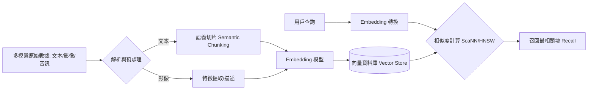

# 語義索引

作為一名架構師，在設計 RAG（檢索增強生成）系統時，我們必須從「處理字串（Strings）」的思維轉向「處理實體與含義（Things/Meanings）」。語義索引（Semantic Indexing）利用大型語言模型（LLM）的向量化能力，將異質數據映射到一個高維度的連續向量空間，使含義相近的內容在數學上的距離也彼此接近。這不僅解決了關鍵字檢索無法處理的同義詞與多義詞問題，更是實現多模態（Multimodal）數據對齊的技術基石。

---

### 情境 1：優先採用「語義向量」取代「字面關鍵字」進行索引
**核心概念簡述**：
傳統的關鍵字檢索（如 BM25）依賴精確的字元匹配，在面對「AI」與「Artificial Intelligence」這類同義詞，或「CHF」（可能指心臟衰竭或瑞士法郎）這類多義詞時，其檢索效能會大幅下降。語義索引透過 Embedding 模型將文本壓縮為高維向量，捕捉其「概念」而非「字元順序」，從而提升召回率（Recall）。

**程式碼範例（Bad vs. Better）**：

*   **❌ Bad：僅依賴關鍵字匹配 (如 BM25)**
    > **Rationale**: 這種做法無法處理語義上的聯繫。如果用戶查詢「terminology ambiguity」，但文檔寫的是「misinterpret abbreviations」，關鍵字檢索將會徹底遺漏該結果。

*   **✅ Better：利用 BigQuery ML 執行大規模語義向量化**
```sql
-- 使用 BigQuery ML 將原始文本轉換為語義向量
CREATE OR REPLACE TABLE `project.dataset.embedded_chunks` AS
SELECT
  chunk_content,
  metadata,
  ml_generate_embedding_result AS embedding
FROM
  ML.GENERATE_EMBEDDING(
    MODEL `project.dataset.embedding_model`,
    (SELECT text_content AS content FROM `project.dataset.raw_chunks`),
    STRUCT('RETRIEVAL_DOCUMENT' AS task_type)
  );
```

**底層原理探討與權衡**：
Embedding 模型將文本映射到高維空間（如 768 或 1536 維），這是一個「資訊瓶頸（Information Bottleneck）」過程。雖然它能跨越詞彙障礙，但其表示能力受限於向量維度。架構設計時必須注意：檢索端與索引端必須使用**完全相同**的模型版本與維度，否則向量空間會發生偏移，導致檢索失效。

---

### 情境 2：執行「佈局感知（Layout-Aware）」的數據預處理
**核心概念簡述**：
直接將 PDF 或表格轉換為純文本會破壞數據的結構含義。例如，表格中的數據若被攤平為字串，模型會失去行列之間的邏輯關聯，導致「幻覺」產生。語義索引的成功，往往取決於索引前的「結構還原」。

**程式碼範例（Bad vs. Better）**：

*   **❌ Bad：將 PDF 表格直接讀取為亂序文本**
    > **Rationale**: 傳統解析器常將表格中的兩列數據交叉讀取，導致 LLM 在檢索時接收到錯誤的上下文邏輯。

*   **✅ Better：利用 Document AI 進行結構化提取與分塊**
```python
# 透過 Google Cloud Document AI 提取具備布局感知的信息
# 這能將表格轉換為結構化的 JSON 格式，保留行與列的語義關係
def process_document_with_layout(gcs_uri):
    # 此處調用 Document AI 或 BigQuery 的 ML.PROCESS_DOCUMENT
    # 並將結果解析為帶有 Metadata 的語義塊 (Nodes)
    structured_json = document_ai_client.process(gcs_uri)
    return structured_json
```

**底層原理探討與權衡**：
增加佈局感知層會提高索引階段的運算成本，但在處理財務報表、合約或技術手冊時，這是確保生成精確度的唯一手段。

---

### 情境 3：整合「多模態向量化」以對齊異質數據空間
**核心概念簡述**：
現代基礎模型（如 Gemini 3）原生支持多模態（Multimodality），這意味著圖像、音訊和文本可以被投影到同一個共享的語義空間中。這允許系統實現「以文搜圖」或根據影片內容回答問題，而不需要中間的翻譯模型。

**更多說明 (流程 & 比較表)**：

#### 語義索引處理流程


#### 傳統索引 vs. 語義索引比較
| 維度 | 關鍵字索引 (Keyword) | 語義索引 (Semantic) |
| :--- | :--- | :--- |
| **匹配機制** | 字元字串精確匹配 | 數學向量餘弦相似度 |
| **靈活性** | 脆弱，受制於用詞一致性 | 強大，具備語義聯想能力 |
| **跨語言支持** | 幾乎無法支持 | 支持（依賴模型預訓練） |
| **數據模態** | 僅限文本 | 文本、影像、影片、音訊 |
| **維護成本** | 需手動維護同義詞庫 | 依賴模型更新與 re-indexing |

---

### 適用場景與拇指法則
*   **Rule of Thumb**：若數據包含大量專業術語、模糊指令或需要跨語言檢索，應優先使用語義索引。
*   **例外情況**：如果業務邏輯極度依賴「精確編號」（如 SKU：`XYZ-12345`），語義相似度可能會回傳錯誤編號。此時應採用「混合檢索（Hybrid Search）」，結合關鍵字與向量檢索。

---

### 延伸思考

**1️⃣ 問題一**：為什麼「模型一致性」是語義索引中的首要風險？

**👆 回答**：因為 Embedding 是由特定模型生成的數字特徵。如果索引時使用模型 A (v1)，而檢索時使用模型 B (v2)，即便兩者輸入相同的文字，產生的向量坐標也會完全不同，導致系統回傳毫無關聯的結果。

---

**2️⃣ 問題二**：如何克服語義索引在處理「表格細節」時的瓶頸？

**👆 回答**：單純的向量檢索會導致細節丟失。更好的架構是採用「上下文檢索（Contextual Retrieval）」，在 Embedding 之前，利用 LLM 對每個表格塊（Chunk）自動生成解釋性的背景描述（Prepend Context），這能將檢索失敗率降低高達 67%。