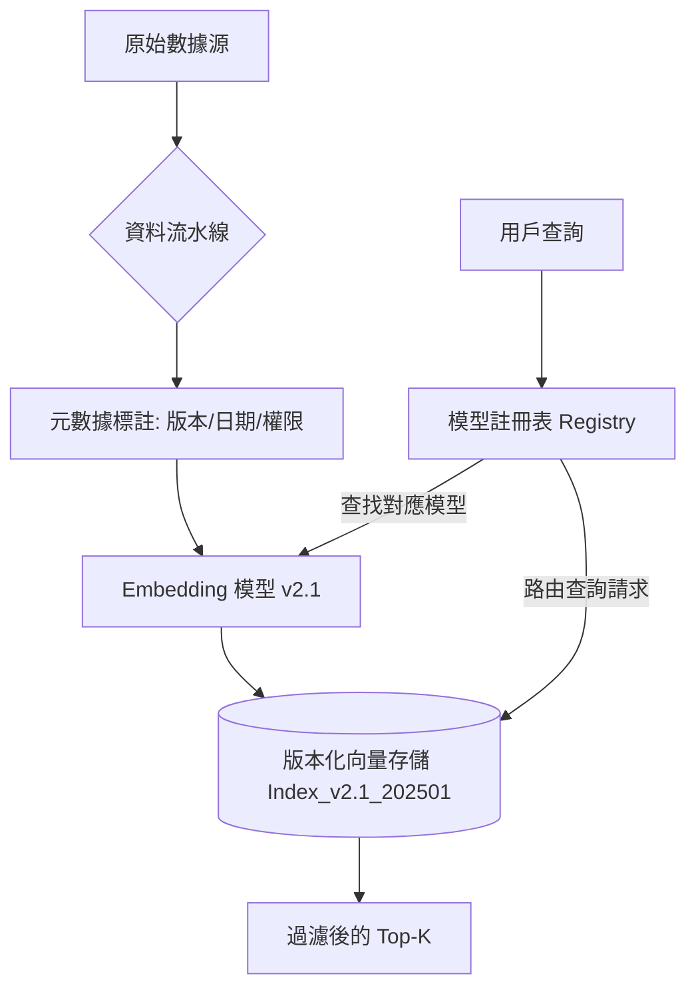

# 規模化索引管理

在 RAG 系統從原型（PoC）走向生產環境的過程中，最大的挑戰往往不是演算法，而是**數據的過時與複雜性**。身為架構師，我們必須體認到：知識庫是動態的，且巨量資料下必然存在矛盾。規模化索引（Indexing at Scale）的核心任務，就是透過元數據（Metadata）管理、時間加權與嚴格的版本控制，解決資料過時與 Embedding 模型遷移的「技術債」問題。

---

### 情境 1：優先使用「檢索前過濾 (Pre-filtering)」而非「檢索後篩選」
**核心概念簡述**：
當索引規模達到百萬甚至億級時，單純的向量相似度搜尋會產生極高的噪音。例如，搜尋「技術手冊」可能回傳 2010 年與 2025 年的衝突指令。透過元數據進行「檢索前過濾」，能強制縮小搜尋空間，確保 LLM 僅在具備時效性或特定標籤的資料子集內進行運算。

**程式碼範例（Bad vs. Better）**：

*   **❌ Bad：在檢索後的 Top-K 結果中過濾日期**
    > **Rationale**: 向量資料庫可能已經將「過時但語義極其接近」的內容排在最前面，導致正確的當前資訊根本沒進入 Top-K，事後過濾只會導致無資料可用的窘境。

*   **✅ Better：利用元數據 WHERE 子句進行精準限制**
```python
# 使用 ChromaDB 或類似向量資料庫進行 Pre-filtering
# 確保僅檢索 2024 年以後且來源為 'official_docs' 的資料
results = collection.query(
    query_embeddings=[query_vector],
    n_results=5,
    where={
        "$and": [
            {"year": {"$gte": 2024}},
            {"source": "official_docs"}
        ]
    }
)
```

**底層原理探討與權衡**：
Pre-filtering 依賴於索引結構對標籤的支持。雖然這能顯著提升精確度，但過於複雜的過濾條件會增加查詢延遲。架構設計時，應針對高頻過濾欄位建立硬體加速的標籤索引（如 HNSW 組合索引）。

---

### 情境 2：處理知識衝突的「時間衰減 (Temporal Weighting)」策略
**核心概念簡述**：
企業數據常有「修訂」情況（如 CDC 防疫指南的不斷更新）。當資料庫中同時存在新舊指令時，我們不能簡單刪除舊數據（因為新數據可能依賴舊背景），而是應採用時間加權算法。這確保了新資訊在排名中獲得優先權，同時保留歷史脈絡。

**程式碼範例（Bad vs. Better）**：

*   **❌ Bad：直接覆蓋 (Overwrite) 舊版本的資料區塊**
    > **Rationale**: 覆蓋會破壞數據譜系（Lineage），一旦新版本出錯，系統將失去回溯與對比的能力，且會導致正在進行的長對話 Session 產生狀態不一致。

*   **✅ Better：實施帶有時間戳記的重排序 (Reranking)**
```python
# 邏輯示意：結合語義得分與時間權重
def temporal_rerank(chunks):
    for chunk in chunks:
        # 計算時間衰減係數：越新權重越高
        # 權重 = 原始得分 * (0.5 ^ (當前年份 - 資料年份))
        chunk.score = chunk.semantic_score * (0.8 ** chunk.age_years)
    return sorted(chunks, key=lambda x: x.score, reverse=True)
```

**底層原理探討與權衡**：
這屬於「檢索後處理」的一環。其權衡點在於：如果時間權重過大，可能會漏掉雖然老舊但依然正確的「基礎原理」資料。建議針對「事實性數據」調高時間權重，針對「原理性數據」調低加權。

---

### 情境 3：模型生命週期中的「不可變索引 (Immutable Indexing)」與版本控制
**核心概念簡述**：
Embedding 模型版本更新是災難性的。因為 Embedding A (v1) 生成的空間與 Embedding A (v2) 完全不相容，一旦模型升級，所有歷史資料必須重新索引（Re-indexing）。架構師必須建立「模型-索引」的映射契約，並使用不可變快照來管理這些資產。

**更多說明 (流程 & 比較表)**：

#### 規模化索引與版本管理流程


#### 規模化管理維度比較表
| 策略維度     | 初階 RAG (Naive) | 規模化索引 (At Scale)        | Rationale (為什麼這樣做)          |
| :----------- | :--------------- | :--------------------------- | :-------------------------------- |
| **數據更新** | 全量覆蓋         | 增量快照 (Snapshots)         | 支援數據審計與快速回滾            |
| **矛盾處理** | 無 (隨機召回)    | 時間加權/來源評分            | 確保決策基於最新權威發布          |
| **模型升級** | 停機重刷         | 多版本並行測試 (Shadow Mode) | 避免升級期間服務中斷 (Pattern 27) |
| **元數據**   | 僅儲存 URL       | 多維度語義標籤               | 實現複雜的業務邏輯隔離            |

---

### 適用場景與拇指法則
*   **Rule of Thumb**：當數據量超過 10 萬個 Chunk 或數據更新頻率高於每週一次時，必須強制實施「元數據版本化」與「Embedding 模型鎖定」。
*   **例外情況**：對於極短週期的臨時數據（如 24 小時內的即時新聞流），可以使用獨立的快取索引（In-memory Cache）進行處理，無需納入長期的版本控制體系。

---

### 延伸思考

**1️⃣ 問題一**：為什麼「模型一致性」在 RAG 規模化管理中被稱為「沉默的殺手」？

**👆 回答**：這與向量空間的本質有關。即便你只是將 Embedding 模型從 `v1.0.0` 小幅升級到 `v1.0.1`，其輸出的高維坐標也會發生偏移。如果檢索端用了新模型，但索引端還是舊向量，檢索回傳的結果將會是語義完全無關的亂碼，這在生產環境中往往難以即時察覺，直到用戶投訴回答品質大幅下降。

---

**2️⃣ 問題二**：在巨量資料下，如何防止知識庫被惡意或錯誤的資訊「污染」？

**👆 回答**：應採用「來源權威性評分（Source Authority Scoring）」。在索引階段，針對不同來源設定權重（如官方文件 = 1.0, 社群討論 = 0.2）。當出現衝突時，系統應優先採信高分權威來源。此外，實施「Causal Dependency Graph（因果依賴圖）」可以追蹤每個生成回覆所依賴的數據源，一旦發現錯誤資訊，能立即定位並剪除受污染的索引區塊。