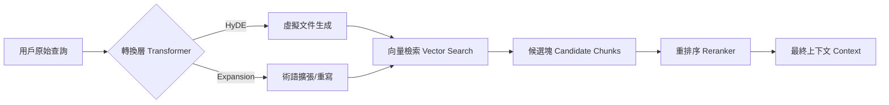

# 檢索感知優化

在構建檢索增強生成（RAG）系統時，架構師常面臨一個「雞生蛋」的語義悖論：如果用戶的提問與知識庫中的解答在字面上完全不重疊（例如：提問使用大眾語彙，而文件使用專業術語），傳統的向量相似度檢索往往會失效。這稱為「相似性不等於相關性」問題。檢索感知優化（Index-Aware Retrieval）的核心在於利用 LLM 的預測能力，在檢索發生**之前**對查詢進行轉換，透過 HyDE（虛擬文件嵌入）或查詢擴張（Query Expansion）來提升命中精確度。

---

### 情境 1：實施 HyDE 以彌合「查詢-文件」間的語義鴻溝
**核心概念簡述**：
虛擬文件嵌入（Hypothetical Document Embedding, HyDE）並非直接檢索用戶的「問題」，而是先讓 LLM 根據自身知識生成一個「虛擬答案」，再利用這個虛擬答案去搜尋知識庫。這種做法能將檢索空間從「問題對答案」轉化為更穩定的「答案對答案」，有效解決提問與文件間語義不對稱的問題。

**程式碼範例（Bad vs. Better）**：

*   **❌ Bad：直接將模糊的用戶提問進行向量化檢索**
    > **Rationale**: 用戶提問如「歷史景點火車 2 小時」可能在知識庫中完全找不到關鍵字，因為文件描述的是具體地名（如：托萊多）或技術細節（如：高速鐵路網），而非用戶的篩選條件。

*   **✅ Better：先生成預測性答案再執行檢索**
```python
# 步驟 1：使用基礎模型生成虛擬答案 (HyDE)
prompt = "請寫一段關於馬德里附近歷史景點及其火車交通的介紹，作為檢索參考。"
hypothetical_answer = model.generate_content(prompt) # 參考源

# 步驟 2：利用該虛擬答案進行語義匹配
# 虛擬答案包含的關鍵字與描述更貼近知識庫中的文件風格
relevant_nodes = vector_index.as_retriever().retrieve(hypothetical_answer)
```

**底層原理探討與權衡**：
HyDE 的本質是「預測性校準」。雖然 LLM 生成的虛擬答案可能包含幻覺（例如：虛構某個不存在的城市），但其語義模式通常與知識庫中的真實文件極其相似。這是一種「以偏概全」的策略：我們不在乎虛擬答案的細節是否正確，我們只利用它的「語義特徵」來定位真實的知識塊。

---

### 情境 2：透過「查詢擴張」消除專業術語與大眾用語的隔閡
**核心概念簡述**：
用戶往往不具備與知識庫一致的術語體系（例如：用戶搜「穆斯林宮殿」，知識庫寫「納斯里德堡壘」）。查詢擴張透過 LLM 將原始提問重寫為包含同義詞、上位詞或補充背景的複合查詢，確保檢索器能觸及到隱藏在專業術語下的相關內容。

**程式碼範例（Bad vs. Better）**：

*   **❌ Bad：依賴單一關鍵字進行精確匹配**
    > **Rationale**: 如果用戶使用了錯誤的專業術語或過於口語，傳統檢索會遺漏掉僅使用專業詞彙的高質量文件。

*   **✅ Better：利用 LLM 執行語義擴張與轉譯**
```python
# 步驟 1：定義擴張指令
expansion_prompt = """
將用戶查詢擴展為更專業且包含多種表達方式的版本。
原始查詢：{query}
擴展目標：包含潛在的專業學名、地利位置背景與技術關聯詞。
"""

# 步驟 2：執行檢索 (參考源)
expanded_query = model.generate_content(expansion_prompt.format(query="波斯王如何戰鬥？"))
# expanded_query 可能包含：帕提亞戰術、馬其頓對決、重裝騎兵等專業術語
results = hybrid_retriever.retrieve(expanded_query)
```

**底層原理探討與權衡**：
查詢擴張是一種「提升召回率（Recall）」的手段。它的副作用是可能引入雜訊（Noise），導致檢索到不相關的內容。因此，這類優化通常需要配合「重排序（Reranking）」來過濾掉擴張後產生的離群值。

---

### 更多說明 (流程 & 比較表)

#### 檢索感知優化流程


#### 檢索策略對比表
| 維度         | 基礎語義檢索 (Basic) | HyDE                     | 查詢擴張 (Expansion)     |
| :----------- | :------------------- | :----------------------- | :----------------------- |
| **核心假設** | 問題與答案語義相近   | 虛擬答案與真答案語義相近 | 術語重疊是關鍵           |
| **適用場景** | FAQ、簡單事實查詢    | 複雜邏輯、問題不完整     | 跨領域術語障礙、口語提問 |
| **優點**     | 低延遲、零額外成本   | 強大的跨語義定位能力     | 提高術語命中率           |
| **缺點**     | 易受提問語法影響     | 幻覺可能引導至錯誤區域   | 容易引入非相關噪音       |

---

### 適用場景與拇指法則
*   **Rule of Thumb**：如果你的知識庫是極度專業的技術文檔（如醫療或法律），**查詢擴張**是首選，因為大眾用語與術語的隔閡是主要矛盾。
*   **例外情況**：如果用戶提問包含大量具體實體編號（如：零件 ID `XYZ-100`），不要使用 HyDE，因為 LLM 很有可能生成錯誤的虛擬 ID，進而干擾精確檢索。

---

### 延伸思考

**1️⃣ 問題一**：為什麼說 HyDE 能解決「不同視角」引發的檢索衝突？

**👆 回答**：在爭議性話題（如公共衛生政策）中，知識庫可能同時存在支持與反對的文件。HyDE 可以被引導生成不同視角的虛擬答案（例如：「生成一份支持 A 政策的論點」與「生成一份反對 A 政策的論點」），系統再根據這兩個不同的虛擬文件分別檢索，確保 LLM 在生成回覆時能接收到平衡的上下文，避免單一來源偏見。

---

**2️⃣ 問題二**：查詢擴張（Query Expansion）是否會加劇「迷失在中間（Lost in the Middle）」的問題？

**👆 回答**：是的。擴張後的查詢往往會召回更多的資訊塊，如果全部塞入 Prompt，會稀釋核心答案的權重。在架構上，建議將擴張後的查詢結果傳遞給「節點後處理器（Node Postprocessing）」，進行「上下文壓縮（Contextual Compression）」或「重排序」，只保留前 3-5 個最具解釋力的片段，而非全量輸出。