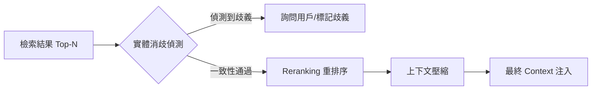

# 節點後處理

在 RAG 的世界裡，檢索（Retrieval）只是第一步。作為架構師，我們必須明白一個殘酷的事實：**語義相似度（Similarity）不等於相關性（Relevance）**。一個與查詢相似度極高的文本塊（Chunk），可能只是包含了大量重複關鍵字的目錄或無意義的標題。節點後處理（Node Postprocessing）是 RAG 系統的過濾器，透過重排序（Reranking）與上下文壓縮（Contextual Compression），我們能過濾噪音、消除歧義，並確保注入 LLM 的每一字 Token 都是精確且具備高資訊價值的。

---

### 情境 1：在檢索與生成之間插入 Reranking 層
**核心概念簡述**：
Embedding 模型為了性能，將數千字元的文本壓縮成一個固定維度的向量，這本身就是一種「有損壓縮」，容易導致檢索結果出現相似但不相關的噪音。Reranking 層則是採用「Cross-Encoder」模型，直接將查詢與候選文本塊進行逐字交叉比對，輸出一個 0 到 1 之間的精確相關性評分。雖然它比向量檢索慢，但在 Top-K 的小範圍內運行，能大幅提升準確度。

**程式碼範例（Bad vs. Better）**：

*   **❌ Bad：直接將檢索到的 Top-K 節點餵給 LLM**
    > **Rationale**: 如果檢索器回傳了 4 個節點，其中前 2 個只是目錄或無關背景，LLM 在生成時容易受到雜訊干擾，甚至產生「迷失在中間（Lost in the Middle）」的現象。

*   **✅ Better：使用專用的 Reranker（如 BGE）進行二次排序**
```python
# 使用 Pinecone 或類似服務呼叫 BGE 進行重排序
# 首先獲取初步檢索結果
initial_nodes = retriever.retrieve("大峽谷的地址構造是什麼？")

# 呼叫重排序模型，獲取基於相關性的精確評分
reranked_results = pinecone.inference.rerank(
    model="bge-reranker-v2-m3",
    query="大峽谷的地址構造是什麼？",
    documents=[node.text for node in initial_nodes],
    top_n=2  # 僅保留最高分的前 2 個節點
)

# 根據回傳的新評分重新過濾與排序節點
relevant_context = [initial_nodes[res.index] for res in reranked_results.data]
```

**底層原理探討與權衡**：
Reranker 擁有比 Embedding 更好的邏輯感官，因為它不限制向量空間的表達，而是進行深度語義交互比對。這是一場「延遲（Latency）」與「品質（Quality）」的交易。在生產環境中，我們通常先用快速的向量檢索抓取 20~50 個候選節點（Recall 階段），再用 Reranker 挑選出最有價值的 3~5 個（Precision 階段）。

---

### 情境 2：實施上下文壓縮，將 Token 預算花在刀口上
**核心概念簡述**：
即使一個 1024 字元的文本塊包含答案，答案本身可能也只佔其中的 100 字。如果直接將整個塊塞入 Prompt，其餘 900 多字的雜訊會稀釋 LLM 的注意力並增加費用。上下文壓縮技術會掃描文本塊，僅提取與查詢直接相關的句子或片段。

**程式碼範例（Bad vs. Better）**：

*   **❌ Bad：傳遞冗長的完整文本塊作為背景**
    > **Rationale**: 冗餘資訊會增加運算成本，並提高 LLM 因處理無關資訊而導致推理出錯的風險。

*   **✅ Better：利用 LLM 執行結構化提取，僅保留相關部分**
```python
# 核心邏輯：將重排序與壓縮合併為一個步驟以節省成本
compression_prompt = """
你將獲得一個查詢與一段文本。
1. 請為文本分配 0-1 的相關性分數。
2. 僅提取文本中能回答該查詢的關鍵部分，並進行精簡。
查詢：{query}
文本：{node_text}
"""

# 使用結構化輸出 (Grammar Pattern) 確保獲取分數與壓縮後的內容
class CompressedNode(BaseModel):
    relevance_score: float
    compressed_text: str

# 呼叫 LLM 進行處理
response = model.generate_content(
    compression_prompt,
    response_schema=CompressedNode
)
```

**底層原理探討與權衡**：
上下文壓縮實質上是在檢索後進行「摘要化」。這對長文檔 RAG 極為有效，能有效緩解 context window 壓力。然而，過度壓縮可能導致資訊丟失或語義斷裂，因此建議在壓縮後仍保留原始節點的 Metadata（如來源頁碼），以便 LLM 進行精確引用。

---

### 更多說明 (流程 & 比較表)

#### 節點後處理執行流水線


#### 檢索結果對比
| 特性                   | 原始檢索 (Naive)       | 後處理精煉 (Post-processed)        |
| :--------------------- | :--------------------- | :--------------------------------- |
| **精確度 (Precision)** | 中等，易包含大量雜訊   | 高，僅保留高度相關片段             |
| **Token 消耗**         | 高，取決於 Chunk 大小  | 低，僅包含關鍵資訊                 |
| **處理實體衝突**       | 無法處理，可能導致幻覺 | 具備偵測不同實體（如兩地名）的能力 |
| **系統延遲**           | 極低                   | 較高（需額外 LLM/Reranker 呼叫）   |

---

### 適用場景與拇指法則
*   **Rule of Thumb**：當你的 Chunk Size 設定較大（>512 tokens）或知識庫中存在大量相似術語（如不同版本的產品說明）時，**必須**實施 Reranking 與消歧步驟。
*   **例外情況**：如果你的 RAG 系統主要處理極短的 FAQ（每個節點只有一兩句話），則不需要上下文壓縮，直接檢索即可。

---

### 延伸思考

**1️⃣ 問題一**：為什麼說 Reranker 是目前解決 RAG 幻覺最具成本效益的工具？

**👆 回答**：因為它能將 LLM 閱讀的資訊從「可能有用的垃圾山」轉化為「精煉的事實清單」。與其花大錢去微調（Fine-tuning）一個更大的模型來忍受噪音，不如花極小的代價使用 Reranker 提高輸入品質。在 RAG 中，輸入品質的提升往往比模型規模的提升更有感。

---

**2️⃣ 問題二**：實體消歧（Disambiguation）在後處理中扮演什麼角色？

**👆 回答**：它防止「張冠李戴」。來源 提到，查詢「紐卡索（Newcastle）」可能同時檢索到英國與美國的地名。後處理器會偵測到這些候選塊指向不同實體，進而觸發反問邏輯：「請問您是指英國的紐卡索還是美國賓州的紐卡索？」這能從源頭阻斷因資訊混淆產生的錯誤推理。