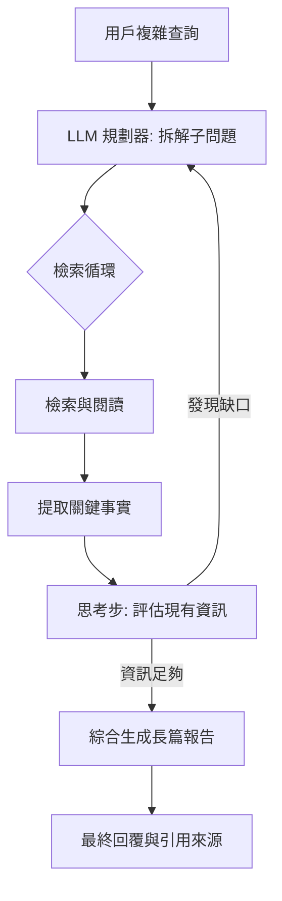

# 深度搜索與多跳推理

作為一名架構師，我們必須體認到：基礎 RAG 在面對簡單的事實查詢時表現優異，但在處理需要跨越多份文件、建立邏輯鏈條的「複雜資訊檢索」時，往往會顯得力不從心。基礎系統受限於固定大小的上下文視窗（Context Window），容易產生資訊碎片化，導致模型無法進行「多跳推理（Multihop Reasoning）」——即必須先從文件 A 找到線索，才能去文件 B 找到答案的過程。深度搜索（Deep Search）模式的核心，在於將原本「單次（One-shot）」的檢索轉化為一個「迭代思考、搜尋與整合」的動態循環。

---

### 情境 1：實施「迭代優化」而非單次 Top-K 檢索
**核心概念簡述**：
面對複雜查詢（例如：比較多國的經濟影響或跨年度技術演進），我們不能指望單次檢索就能抓取所有必要的上下文。深度搜索採用「思考與搜尋」循環：系統先分析問題，執行初步檢索，然後「思考」目前獲得的資訊還有哪些缺口（Gaps），進而產生新的子查詢進行第二次、第三次檢索。

**程式碼範例（Bad vs. Better）**：

*   **❌ Bad：嘗試在單次檢索中塞入所有對比資訊**
    > **Rationale**: 這會導致檢索結果過於分散，模型在生成答案時容易因為 Context Window 限制而丟失中間的關鍵對比細節，最終產生淺層且不完整的回答。

*   **✅ Better：利用 LLM 識別資訊缺口並執行迭代檢索**
```python
# 邏輯示意：深度搜索的迭代控制器
def deep_search_workflow(initial_query):
    state = {"context": "", "current_query": initial_query}
    for iteration in range(MAX_STEPS):
        # 步驟 1: 根據當前狀態檢索 (可能是 Wikipedia 或內部數據)
        retrieved_data = retriever.retrieve(state["current_query"])

        # 步驟 2: 思考並合成初步回答
        state["context"] += retrieved_data
        intermediate_response = model.generate(f"基於以下資訊回答: {state['context']}")

        # 步驟 3: 識別缺口並生成下一個子查詢 (思考步驟)
        # 提示詞範例參考源 1086
        gaps = model.generate(f"目前回答: {intermediate_response}。還有哪些未知資訊？請輸出子查詢。")

        if not gaps or "無" in gaps:
            break
        state["current_query"] = gaps # 更新為下一個搜尋方向
    return intermediate_response
```

**底層原理探討與權衡**：
深度搜索實質上是利用「測試時運算（Test-time Compute）」來換取答案的完整性。它突破了物理 Context Window 的限制，因為它可以在多個回合中處理不同的資訊塊，並將核心洞察累積在狀態（State）中。然而，這帶來了顯著的延遲（Latency）與 Token 成本，因為每一輪迭代都需要額外的 LLM 推論與 API 呼叫。

---

### 情境 2：處理「多跳查詢」中的實體解析與衝突
**核心概念簡述**：
在跨文件推理中，最危險的陷阱是「歧義」與「矛盾」。例如，文件 A 提到的「紐卡索（Newcastle）」可能是指英國的城市，而文件 B 則是指美國的賓州。深度搜索必須包含一個「資訊整合（Information Integration）」階段，用於執行跨文件的實體解析（Entity Resolution）並處理潛在的觀點衝突。

**更多說明 (流程 & 比較表)**：

#### 深度搜索 (Deep Search) 執行架構


#### 基礎 RAG vs. 深度搜索
| 維度 | 基礎 RAG  | 深度搜索  |
| :--- | :--- | :--- |
| **推理深度** | 淺層、基於單次匹配 | 深層、具備邏輯推理鏈 |
| **上下文管理** | 靜態、單一 Context Window | 動態、跨迭代累積知識 |
| **搜尋策略** | 被動、基於相似度 | 主動、由 LLM 驅動子查詢 |
| **適用場景** | FAQ、事實檢索 | 深度研究、策略分析、多跳查詢 |
| **成本/效能** | 低成本、低延遲 | 高成本、高延遲 |

---

### 情境 3：顯式建模「搜尋計畫」與「推理軌跡」
**核心概念簡述**：
在多輪檢索中，模型容易遺忘初始目標或陷入細節（Rabbit Hole）。不要依賴隱性的上下文堆疊（Implicit Context Stacking）；應強制模型輸出結構化的「下一步意圖」與「已知事實」。顯式的狀態管理（State Management）能確保每一步都朝向最終答案收斂，並提供可審計的推理過程。

**程式碼範例（Bad vs. Better）**：

*   **❌ Bad：僅依賴對話歷史進行隱式推理**
    > **Rationale**: 隨著檢索內容增加，噪聲會干擾模型的注意力，導致其「忘記」原本要解決的子問題，或重複檢索已知的資訊。

    ```python
    # ❌ Bad: 簡單的對話堆疊
    messages = [{"role": "user", "content": "分析 A 公司與 B 公司的財務差異"}]
    for _ in range(3):
        response = model.generate(messages)
        if "Final Answer" in response: break

        search_result = search(response) # 模型直接輸出查詢關鍵字
        messages.append({"role": "assistant", "content": response})
        messages.append({"role": "tool", "content": search_result})
    ```

*   **✅ Better：使用結構化物件管理「搜尋計畫」**
    > **Rationale**: 透過維護一個顯式的 `SearchPlan` 物件，我們強迫模型在執行每一步前先進行「自我反思（Self-Reflection）」，確認目前進度與剩餘缺口。

    ```python
    # ✅ Better: 結構化狀態管理 (ADK / Pydantic 風格)
    from pydantic import BaseModel, Field

    class SearchStep(BaseModel):
        thought: str = Field(..., description="思考目前進度與缺口")
        next_query: str = Field(..., description="下一步的具體搜尋關鍵字")
        is_complete: bool = Field(..., description="是否已收集足夠資訊")

    class SearchState(BaseModel):
        original_goal: str
        gathered_facts: list[str] = []
        plan_trace: list[SearchStep] = []

    def execute_deep_search(state: SearchState):
        for _ in range(MAX_STEPS):
            # 將當前狀態 (事實 + 軌跡) 轉為 Prompt
            prompt = format_state_prompt(state)

            # 強制模型輸出結構化決策
            decision: SearchStep = model.generate(prompt, response_format=SearchStep)

            if decision.is_complete:
                break

            # 執行檢索並更新結構化事實 (而非原始文本)
            raw_result = search(decision.next_query)
            fact = extract_fact(raw_result, state.original_goal)

            state.gathered_facts.append(fact)
            state.plan_trace.append(decision)

        return generate_report(state)
    ```

**底層原理探討與權衡**：
這種模式即是 **ReAct (Reasoning + Acting)** 或 **Plan-and-Solve** 的具體實現。顯式建模增加了系統的透明度（Observability），開發者可以檢查 `plan_trace` 來除錯模型為何會走偏。然而，這要求模型具備較強的指令遵循能力（Instruction Following）與結構化輸出能力（JSON Mode / Function Calling），這通常需要使用較高階的模型（如 Gemini 1.5 Pro 或 GPT-4）。

---

### 適用場景與拇指法則
*   **Rule of Thumb**：如果你的問題無法在單一 Google 搜尋結果頁面中找到完整答案，而需要「點進多個鏈接並做筆記」，那麼你的系統就應該採用 **Deep Search** 模式。
*   **例外情況**：對於需要即時反應（Real-time Response）的交互式聊天，深度搜索的延遲是不可接受的。此時應考慮使用 **LtM (Least-to-Most) 提示詞** 作為替代，或將深度搜索放在異步後台任務中執行。

---

### 延伸思考

**1️⃣ 問題一**：在深度搜索的迭代中，如何避免系統陷入「循環搜尋」或過度發散？

**👆 回答**：這需要設定嚴格的「終止機制」。架構上應設定最大迭代次數（例如 N=5）與預算控制（Cost/Token Budget）。此外，在「思考步」中，可以要求 LLM 評估新資訊的「邊際增益」；如果連續兩輪檢索到的內容對回答問題沒有實質貢獻，則強制提前收斂並生成結果。

---

**2️⃣ 問題二**：如何確保深度搜索生成的長篇報告（Deep Research）具備可信度？

**👆 回答**：關鍵在於「來源追蹤」與「事實核查」。系統必須記錄每一跳（Hop）所依賴的文檔 ID 與頁碼。在最終生成階段，應實施「跨源驗證（Cross-source Verification）」，如果文件 A 與文件 B 對同一事實（例如某公司的營收）描述不一，系統應在報告中標註「存在多種觀點或數據衝突」，而非隨機採信一方。