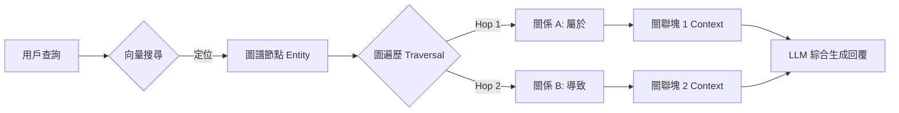

# GraphRAG

在建構生產級的檢索增強生成（RAG）系統時，我們常會遇到一個所謂的「語義悖論」：純向量搜尋雖然擅長捕捉單語彙的「相似性（Similarity）」，卻極度缺乏對資料間「相關性（Relevance）」與邏輯關係的理解。作為架構師，我們必須意識到，向量空間中的數學鄰居不代表邏輯上的正確答案。例如，當用戶詢問「哪裡可以洗澡？」時，向量搜尋可能會因為語義接近而召回「歐舒丹（L'Occitane）」專櫃（因為賣沐浴用品），但實際上用戶需要的是「公共淋浴間」。**知識圖譜（Knowledge Graph, KG）增強** 的核心價值，在於將知識庫從「孤立的字串」轉化為由實體（Nodes）與關係（Edges）構成的「互聯實體」網絡，透過圖譜遍歷（Graph Traversal）來精確定位資訊，補足純向量檢索的邏輯短板。

---

### 情境 1：透過「實體關係遍歷」解決語義偏移問題
**核心概念簡述**：
標準向量搜尋是一種「機率性」的模糊匹配，容易受到詞彙重疊的誤導。標準 RAG 將文件視為獨立的塊，而 GraphRAG 將文件視為實體的集合。透過將查詢先映射到圖譜中的特定節點（實體），再沿著關係鏈（如 `SIMILAR_TO`、`PART_OF` 或 `屬於`）尋找鄰居實體，我們可以透過圖譜節點（實體）與邊（關係）的邏輯連結（例如：`淋浴間` -> `屬於` -> `盥洗設施`），精確過濾功能不符的噪音，排除掉那些語義接近但功能無關的干擾項。這將檢索邏輯從「找相似的文字」提升到「找相關的事實」。

**程式碼範例（Bad vs. Better）**：

*   **❌ Bad：僅依賴 Top-K 向量相似度回傳結果**
    > **Rationale**: 向量模型將「沐浴用品」與「洗澡設施」映射到相近的空間，導致 LLM 在錯誤的上下文基礎上產生幻覺，回覆「您可以去歐舒丹專櫃洗澡」。對於需要精確邏輯關聯的場景（如維修手冊或醫療診斷），它容易引入外觀相似但邏輯錯誤的背景資訊。

*   **✅ Better：利用 GraphStore 進行實體定位與關係檢索**
```python
# 步驟 1：使用 LLM 提取實體與關係
# 將非結構化文本轉化為結構化的圖節點與邊
graph_store = Neo4jGraphStore(url=url, username=user, password=pw)
entity_extractor = GraphIndexCreator(llm=gemini_pro)

# 步驟 2：向量搜尋定位「入口實體」 (Entry Node)
entry_node = vector_index.retrieve("哪裡可以洗澡?") # 召回：公共淋浴間

# 步驟 3：執行圖譜遍歷，尋找鄰居節點的關聯事實
# 系統遍歷路徑：公共淋浴間 -> SIMILAR_TO -> 家庭盥洗室
query = "哪裡可以洗澡？"
graph_context = graph_store.get_rel_map(entry_node, depth=2)
# 此結果將包含排除「歐舒丹」後的精確關聯路徑

# 步驟 4：結合實體關係與文本塊生成回覆
# LLM 現在知道 L'Occitane 是商店，而家庭盥洗室才是目的地
```

**底層原理探討與權衡**：
GraphRAG 將檢索邏輯從「找相似的文字」提升到「找相關的事實」，結合了向量空間的「廣度」與圖論的「深度」。它利用向量搜尋來實現「模糊定位」（定位「入口實體」），再利用圖譜執行「精確推理」（圖遍歷尋找「關聯事實」）。這種「雙模態」檢索解決了所謂的「L'Occitane 問題」，顯著提升了檢索的精確度（Precision）。然而，代價是索引階段需要消耗大量 Token 讓 LLM 提取實體與三元組（Triplets），且圖資料庫（如 Neo4j 或 Spanner Graph）的維護成本極高，涉及到複雜的實體消歧（Entity Disambiguation）與圖資料庫的寫入延遲。

---

### 情境 2：透過「多跳推理 (Multi-hop)」與「層次化摘要 (RAPTOR)」補全碎裂的上下文
**核心概念簡述**：
傳統切片技術（Chunking）會強制將長文檔切斷，經常會將相互關聯的資訊切斷（如：文件 A 提到「零件 X」，文件 B 提到「零件 X 的更換週期」），導致跨章節的細節失去連貫性。GraphRAG 透過在索引階段建立實體間的跨文件連結，允許檢索器在運行時進行「多跳遍歷」，將散落在不同文件的資訊塊重新組合成完整的邏輯鏈。透過建構「樹狀知識索引」（如 RAPTOR 技術），我們可以在索引階段將相關塊聚類並生成「父節點摘要」，檢索時系統能根據問題維度自上而下移動，獲取從「宏觀主旨」到「微觀細節」的完整資訊流。

**程式碼範例（Bad vs. Better）**：

*   **❌ Bad：增加 Chunk Overlap 以補償上下文缺失**
    > **Rationale**: 增加重疊區域（Overlap）會導致冗餘 Token 激增，且依然無法解決跨度較遠（如不同章節）的資訊連結問題。

*   **✅ Better：實施階層式圖譜索引 (RAPTOR 思想)**
```python
# 建立一個層次化的圖結構
# 底層是具體文本塊，上層是實體摘要
index = KnowledgeGraphIndex.from_documents(
    documents,
    max_triplets_per_chunk=5, # 限制每塊提取的關係數以保持品質
    include_embeddings=True    # 結合向量與圖語義
)

# 執行具備推理鏈的檢索
response = index.as_query_engine().query("零件 X 的故障如何影響系統總產出？")
```

**底層原理探討與權衡**：
這類系統（如 RAPTOR 或 GraphRAG）在索引時會進行大量的預計算（Pre-computation），利用 LLM 生成子群組的摘要並建立連結。這雖然讓檢索變得極其強大，能回答「為什麼」類型的複雜問題，但會消耗大量的 Token 用於索引階段，適合資料量中等但邏輯複雜度極高的私有知識庫。

---

### 更多說明 (流程 & 比較表)

#### GraphRAG 檢索執行流程


#### 向量 RAG vs. GraphRAG 比較
| 維度             | 向量 RAG (Vector-only)         | GraphRAG (Knowledge Graph)               |
| :--------------- | :----------------------------- | :--------------------------------------- |
| **檢索基礎**     | 數學相似度 (相似性)            | 實體拓撲關係 (相關性)                    |
| **回答類型**     | 「什麼是...」(事實檢索)        | 「為什麼... / 如何影響...」(邏輯推理)    |
| **上下文完整性** | 易因切片而斷裂                 | 透過 Edge 跨文件縫合                     |
| **索引成本**     | 較低                           | 極高 (需多次 LLM 提取關係)               |
| **技術棧**       | 向量資料庫 (AlloyDB, BigQuery) | 圖資料庫 + 向量庫 (Neo4j, Spanner Graph) |
| **適用資料**     | 純文字、分散式事實             | 高度結構化、具備嚴密邏輯的文檔           |

---

### 適用場景與拇指法則
*   **Rule of Thumb**：如果你的知識庫涉及大量「零件-整體」關係（如工業維護）、複雜因果鏈結（如法律判例或法律法規鏈接）、或需要回答「這對 X 有什麼連帶影響」、需要跨越多個文件才能湊齊答案的問題，應優先考慮（**必須**使用）**GraphRAG**。
*   **例外情況**：對於單純的 FAQ 匹配、非結構化的創意寫作建議、大眾科普、或對延遲極度敏感的簡單問答或事實檢索，傳統的向量檢索配合重排序（Reranking）通常更具成本效益。

---

### 延伸思考

**1️⃣ 問題一**：為什麼 GraphRAG 被認為是解決「L'Occitane 問題」的最佳方案？

**👆 回答**：因為向量搜尋本質上是「近義詞搜尋」。它能理解「肥皂」和「洗澡」在語境中常一起出現，但無法區分「販售肥皂的地方」與「提供洗澡設施的地方」。知識圖譜透過明確的標籤（如 `Is_Facility` vs `Is_Store`）與邏輯連結路徑賦予了檢索物理意義上的約束，從而打破了純數學相似性的盲區。

---

**2️⃣ 問題二**：為什麼說 GraphRAG 是處理「多跳推理 (Multi-hop)」的最佳方案？

**👆 回答**：因為多跳問題需要系統從 A 找到 B，再從 B 找到 C。在純向量檢索中，C 與初始查詢 A 的語義距離可能非常遙遠，導致無法召回。知識圖譜透過明確的連結路徑（A -> B -> C）消除了這種距離障礙，讓檢索器能沿著邏輯鏈條「爬行」到正確的知識節點，將散落在不同文件的資訊重新組合成完整的邏輯鏈。

---

**3️⃣ 問題三**：在實務中，如何防止圖譜變得過於龐大且充滿雜訊？

**👆 回答**：這需要實施「實體過濾」策略。在索引階段，利用 LLM 提取關係時必須設定嚴格的 Schema（例如僅提取 `影響`、`構成`、`修復` 等關鍵動詞）。此外，在檢索時應限制「跳數（Max Hops）」，通常 2-3 跳已足以涵蓋大多數邏輯，過多的跳數會導致「關係爆炸」，引入完全不相關的上下文，反而干擾 LLM 的判斷。

---

**4️⃣ 問題四**：如何解決「關係爆炸（Relationship Explosion）」導致的無關資訊干擾？

**👆 回答**：這是 GraphRAG 的主要挑戰。架構上應實施「元數據預過濾」與「跳數限制（Max Hops）」雙重策略。在檢索時，應利用 LLM 先解析查詢中的「關鍵實體」，並限制遍歷深度（通常 2-3 跳最為理想）。同時，可結合「源權威性評分（Source Authority Scoring）」來排除來自非權威來源的邊緣關係，或透過設定關係類型的優先級（如 `PART_OF` 優先於 `MENTIONED_IN`）來控制檢索範圍。