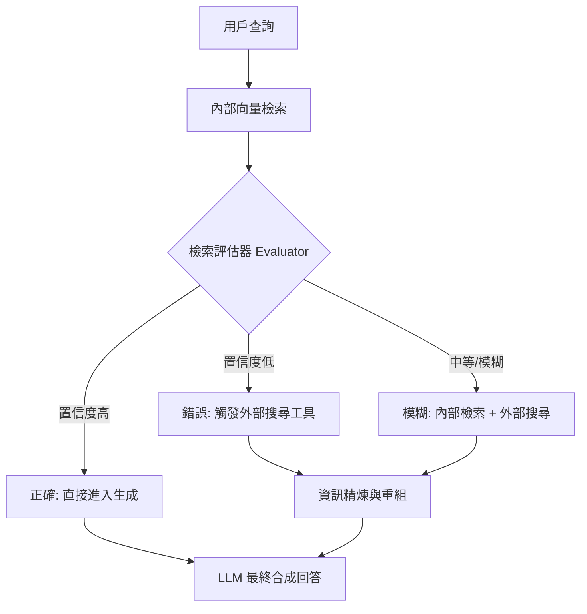

# 糾錯 RAG

作為架構師，我們必須面對一個嚴酷的現實：傳統的 Naive RAG 是一個「開環系統（Open-loop System）」，它盲目地相信檢索器的結果。當檢索到的文檔與查詢不相關時，LLM 會被迫在錯誤的基礎上進行推理，最終導致「自信的幻覺」。糾錯 RAG (CRAG) 的核心思想是引入一個「檢索評估器（Retrieval Evaluator）」，在生成階段之前對檢索品質進行量化評估，並在內部知識不足時，動態觸發外部搜尋（如 Google Search）來填補知識鴻溝。

---

### 情境 1：加入「檢索評估器」作為品質閘道
**核心概念簡述**：
不要直接將檢索結果餵給生成器。CRAG 在中間插入了一個評估步驟，將檢索結果分類為：**正確（Correct）**、**錯誤（Incorrect）** 或 **模糊（Ambiguous）**。這就像在生產線上加入一道自動化質檢，只有合格的原料才能進入下一道工序。

**程式碼範例（Bad vs. Better）**：

*   **❌ Bad：直接將 Top-K 結果拼接至 Prompt**
    > **Rationale**: 向量相似度僅代表「數學距離」，不代表「邏輯相關性」。如果 Top-K 的分數都很低，模型仍會嘗試解釋這些雜訊，產生錯誤結論。

*   **✅ Better：根據評估器分數執行邏輯分支控制**
```python
# 邏輯示意：引入評估器進行決策分支
retrieved_documents = retriever.retrieve(query)
# 調用評估器 (Evaluator) 進行置信度評分
confidence_score = evaluator.evaluate(query, retrieved_documents)

if confidence_score > 0.9:
    # 分支 A: 檢索結果準確，執行「正確」流程
    action = "USE_INTERNAL_DATA"
elif confidence_score < 0.4:
    # 分支 B: 檢索結果完全不相關，觸發「錯誤」流程，改用外部搜尋
    action = "TRIGGER_EXTERNAL_SEARCH"
else:
    # 分支 C: 結果模糊，執行「增強」流程，結合內部與外部資訊
    action = "HYBRID_AUGMENTATION"
```

**底層原理探討與權衡**：
這是一個「基於置信度的觸發機制」。評估器通常由一個更小、更專精的模型（如 fine-tuned T5 或 SLM）擔任，以降低延遲。雖然這增加了首字回應時間（TTFT），但它從根源上攔截了低品質資訊對 LLM 推理過程的污染。

---

### 情境 2：當內部知識不足時自動觸發網路搜尋
**核心概念簡述**：
CRAG 最強大的功能在於其「自愈能力」。當內部的 Vector Store 無法提供滿意答案時（即判定為 Incorrect 或 Ambiguous），系統會調用外部工具（如 Google Search API）來獲取即時、公開的資訊。

**程式碼範例（Bad vs. Better）**：

*   **❌ Bad：僅依賴靜態的企業數據庫**
    > **Rationale**: 企業數據庫存在「知識截斷點」或覆蓋面限制。對於涉及最新時事或外部法規的查詢，靜態 RAG 會因無資料可用而產生幻覺。

*   **✅ Better：利用 Tool Calling 模式執行糾錯搜尋**
```python
# 當內部檢索失敗時，動態調用 Web Search 工具
if action == "TRIGGER_EXTERNAL_SEARCH":
    # 使用 Google Search 工具補全缺失知識
    external_evidence = google_search_tool.run(query)
    # 將外部證據與原始查詢重新打包
    context = assemble_context(external_evidence)
    # 進行最終生成
    response = model.generate(query, context)
```

**底層原理探討與權衡**：
外部搜尋雖然能補足資訊，但也引入了新的風險：網路資訊可能包含誤導性內容。因此，CRAG 通常會配合「分解-重組（Decompose-then-Recompose）」策略，對獲取的外部網頁進行過濾，僅提取最核心的關鍵事實片段。

---

### 情境 3：實施「精煉過濾」以移除檢索塊中的干擾雜訊
**核心概念簡述**：
即便檢索到的 Document 是相關的，其中可能也只有 20% 的文字包含答案。CRAG 提倡在生成前對這些塊進行「精煉」，過濾掉不相關的背景噪音，讓 LLM 能專注於高價值的關鍵字。

**更多說明 (流程 & 比較表)**：

#### CRAG 決策流向圖


#### Naive RAG vs. CRAG 比較表
| 特性         | Naive RAG               | Corrective RAG (CRAG)                |
| :----------- | :---------------------- | :----------------------------------- |
| **數據來源** | 僅限內部向量數據庫      | 內部數據 + 即時外部搜尋              |
| **品質控制** | 無（盲目信任檢索分數）  | 顯式檢索評估與置信度閾值             |
| **幻覺防禦** | 低，易受無關 Chunk 干擾 | 高，主動攔截不相關資訊               |
| **處理場景** | 簡單、已知的事實查詢    | 複雜、動態、知識庫外的查詢           |
| **延遲成本** | 低延遲                  | 較高（因涉及二次判斷與外部網路請求） |

---

### 適用場景與拇指法則
*   **Rule of Thumb**：如果你的知識庫是**高度動態**的（如股市分析）或**存在明確邊界**的（如僅限特定產品手冊），應強制實施 CRAG。
*   **例外情況**：如果系統處於「內網隔離（Air-gapped）」環境，無法連接外部網路，則 CRAG 的外部搜尋功能將失效。此時應退而求其次使用「Self-RAG」，即僅在內部多個模型間進行互相評估與反思。

---

### 延伸思考

**1️⃣ 問題一**：CRAG 雖然能減少幻覺，但頻繁觸發外部搜尋是否會導致 API 成本失控？

**👆 回答**：是的。這需要實施「Tokenomics (代幣經濟學)」控制。架構上應設定每個 Session 的外部搜尋次數上限。此外，可以緩存（Prompt Caching）外部搜尋的結果，避免針對相似問題重複付費請求外部 API。

---

**2️⃣ 問題二**：如何防止外部搜尋引入的「偽科學」或「誤導性資訊」污染回答？

**👆 回答**：應引入「來源權威性評分（Source Authority Scoring）」。在外部搜尋結果返回後，不應直接使用，而是由評估器再次根據來源域名（如 `.gov`, `.edu` 或官方新聞稿）進行過濾，並採用「衝突檢測（Contradiction Detection）」機制，若外部資訊與內部核心政策矛盾，應優先採信內部政策並標註差異。