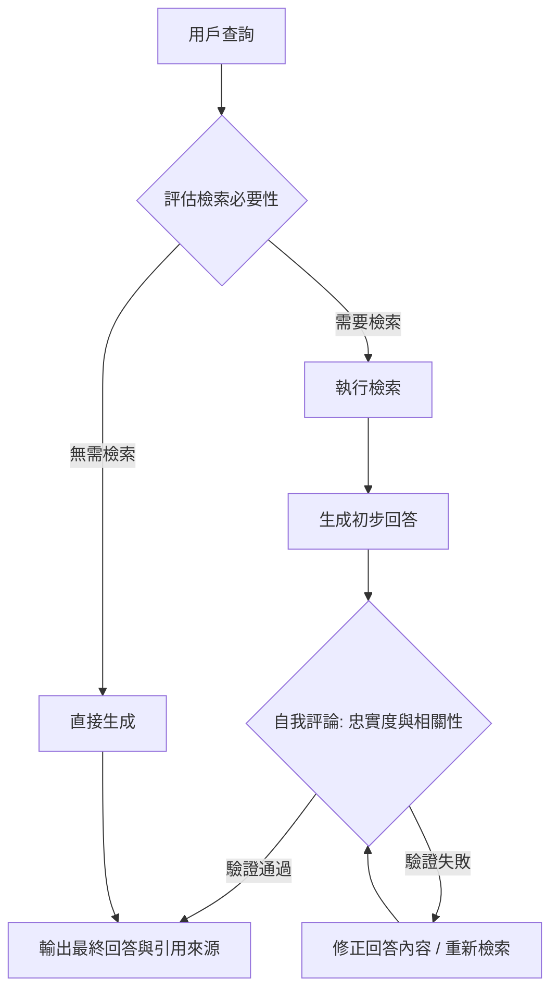

# Self-RAG：生成過程的自我反思

作為架構師，我們必須承認一個事實：傳統的 RAG 是「被動且盲目」的。它假定每次檢索到的 Top-K 內容都是黃金法則，並強迫模型以此為據。這導致了兩大問題：一是無謂的效能損耗（當模型已有足夠知識時仍去檢索），二是「忠實度幻覺」（當檢索內容與用戶問題無關時，模型仍嘗試強行解釋）。

**Self-RAG (Self-Reflective RAG)** 則是一種進階的代理（Agentic）技術，它將模型從「文字生成器」升級為「評論者」。模型在生成時會主動進行三項反思：我是否需要檢索？這些資訊相關嗎？我的回答真的忠於來源嗎？

---

### 情境 1：實施「主動式檢索判斷」而非「盲目全量檢索」
**核心概念簡述**：
在生產環境中，每一毫秒與每一枚 Token 都代表成本。Self-RAG 允許模型評估自身知識的置信度。當用戶問的是通用知識時，模型應依賴自身的「參數化知識（Parametric Knowledge）」；只有在偵測到知識缺口時，才觸發「非參數化知識」的檢索流程。

**程式碼範例（Bad vs. Better）**：

*   **❌ Bad：無論問題為何，一律進行向量檢索並拼接上下文**
    > **Rationale**: 這會造成冗餘的 API 延遲與 Token 浪費，且可能引入無關資訊干擾模型的原始正確判斷。

*   **✅ Better：利用「思考預算」與自我評估觸發檢索**
```python
# 模擬 Self-RAG 的主動檢索邏輯
# 模型先進行初步內部判斷 (Reflection Step)
initial_assessment = model.generate(f"判斷此問題是否需要外部知識庫支持: {query}")

if "NEED_RETRIEVAL" in initial_assessment:
    # 僅在必要時啟動 RAG 引擎
    context = retriever.retrieve(query)
    response = model.generate(query, context)
else:
    # 依賴模型內部訓練知識以節省延遲
    response = model.generate(query)
```

**底層原理探討與權衡**：
這是一種「門戶機制（Gating Mechanism）」。它平衡了**生成速度 (Latency)** 與**事實準確度 (Factuality)**。然而，這需要底座模型具備極強的自我認知能力（Calibrated Confidence），否則模型可能會在不該自信時過度自信，導致幻覺。

---

### 情境 2：在生成後執行「三維度自我評論 (Critique)」
**核心概念簡述**：
Self-RAG 的靈魂在於「生成、評論、修正」的循環。它不只是輸出答案，還會根據三個指標評估自身輸出：**檢索必要性 (IS_REL)**、**忠實度 (IS_SUPP)** 及**有用性 (IS_USE)**。這確保了最終回覆不僅僅是從檢索塊中拼湊出的文字，而是經過邏輯驗證的實事。

**程式碼範例（Bad vs. Better）**：

*   **❌ Bad：直接回傳生成結果，不做後續驗證**
    > **Rationale**: 檢索內容可能包含噪音或過時資訊（Data Drift），盲信檢索內容會導致錯誤的「事實」被自信地傳遞給用戶。

*   **✅ Better：實施反思與修正循環**
```python
# 實施多層次反思 (Multilevel Reflection)
draft = model.generate(query, context)

# 自我評論步驟：評估忠實度 (Faithfulness)
# 進行「策略性反思」與「工具輸出反思」
critique = model.generate(f"檢查此回答是否完全由提供的資料支持？\n回答：{draft}\n資料：{context}")

if "存在幻覺" in critique:
    # 進行修正 (Pattern 18: Reflection)
    final_response = model.generate(f"根據評論修正回答：{critique}")
else:
    final_response = draft
```

**底層原理探討與權衡**：
這實質上是在推理階段增加了「測試時運算（Test-time Compute）」。透過增加 1-2 次額外的 LLM 呼叫來確保品質，這比重新訓練模型更具成本效益。但這會增加**首字延遲 (TTFT)**，因此通常適用於對準確性極度敏感的場景（如法律或醫療）。

---

### 更多說明 (流程 & 比較表)

#### Self-RAG 核心反思循環


#### RAG 模式演進對比
| 特性         | Naive RAG        | Corrective RAG (CRAG)    | Self-RAG (Reflective)      |
| :----------- | :--------------- | :----------------------- | :------------------------- |
| **檢索決策** | 盲目執行檢索     | 根據檢索結果品質過濾     | 模型自主判斷是否需檢索     |
| **品質控制** | 無（盲信 Top-K） | 生成前過濾無關內容       | 生成後反思內容是否忠於原文 |
| **推理深度** | 單向流水線       | 具備自動補全（外部搜尋） | 遞歸修正與自我批判         |
| **核心優勢** | 低延遲、簡單     | 減少垃圾資訊干擾生成     | 最大化減少幻覺、精準引用   |

---

### 適用場景與拇指法則
*   **Rule of Thumb**：如果你的應用場景容錯率極低（如技術手冊、醫療建議），且你不希望模型為了回覆而強行解釋無關內容，請實施 **Self-RAG**。
*   **例外情況**：如果任務是開放式創意寫作或非事實性對話，Self-RAG 的嚴格校驗機制可能會扼殺模型的創造力，且額外的呼叫延遲會損害互動體驗。

---

### 延伸思考

**1️⃣ 問題一**：Self-RAG 提到的「反思令牌 (Reflection Tokens)」在實務上如何運作？

**👆 回答**：在某些研究架構中，模型被訓練輸出特定的標籤（如 `[Is_Rel]`, `[Is_Supp]`）。這允許系統在生成流（Streaming）中即時解析這些令牌。如果看到 `[No_Supp]` 標籤，後端可以立即中斷生成並觸發「修正路徑」，而不必等整個句子跑完，這是在架構設計上優化延遲的關鍵手段。

---

**2️⃣ 問題二**：比起單純的 Reflection（模式 18），Self-RAG 獨特之處在哪？

**👆 回答**：傳統 Reflection 通常是「端到端」的檢查；而 Self-RAG 是將反思深度整合進「檢索」與「生成」的**細粒度交會點**。它不僅檢查答案，還檢查「檢索回來的資料到底有沒有被用到」。這種「細粒度相關性評估」能大幅降低因檢索到相似但不相關（The L'Occitane Problem）資料而產生的誤導。