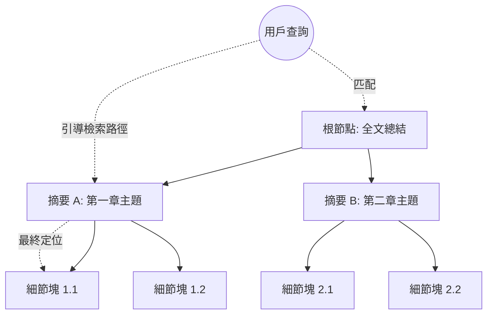

# 分層切片技術

在建構生產級的 RAG 系統時，架構師面臨的最大權衡之一就是「切片大小（Chunk Size）」。切片太小，會因遺漏上下文而導致語義斷裂；切片太大，則會因為資訊過於稀疏而產生語義稀釋（Information Dilution），降低檢索精度。分層切片（Hierarchical Chunking），亦被稱為 RAPTOR 技術，透過建構樹狀結構的知識索引，實現了從「宏觀摘要」到「微觀細節」的全方位覆蓋，有效解決了傳統 RAG 難以處理長文本與全局問題的痛點。

---

### 情境 1：建構樹狀結構以解決「見樹不見林」的困境
**核心概念簡述**：
傳統切片是平鋪式（Flat）的，將文檔視為一系列獨立的塊。分層切片則採用「遞歸摘要處理」（Recursive Abstractive Processing），將文檔切分為細小的葉子節點（Leaf Nodes），然後將相近的塊進行聚類並生成摘要，形成上一層節點，遞歸直至根節點。這讓檢索器能根據問題的維度，動態選擇最合適的層級進行資訊抓取。

**程式碼範例（Bad vs. Better）**：

*   **❌ Bad：固定的長度切片 (Fixed-length Chunking)**
    > **Rationale**: 僅根據字數硬性切斷，會導致段落中的核心語義被硬生生切開，檢索時若僅取 Top-K， LLM 將因缺乏上下文而產生「事實性錯誤」。

*   **✅ Better：層次化索引架構 (RAPTOR 思想)**
```python
# 核心邏輯：將文檔轉換為具備層次感的節點樹
# 底層：原始文本細分塊 (Leaf Chunks)
# 中層：聚類後的語義摘要 (Clustered Summaries)
# 頂層：全局主題概述 (Root Summary)

# 使用 LlamaIndex 或類似架構實施
documents = [Document(text=full_content)]
# 建立層次化索引，自動執行遞歸摘要與聚類
hierarchical_index = RecursiveAbstractiveIndex.from_documents(
    documents,
    level=3,           # 定義層級深度
    summary_model=model # 指定用於生成摘要的 LLM
)
```

**底層原理探討與權衡**：
分層切片的本質是「預計算的語義對齊」。它在索引階段就利用 LLM 對底層數據進行了概括處理。**優點**在於它能同時回答事實型（Fact-based）與全局型（Global-level）問題。**權衡**則是索引成本劇增：每一層摘要的生成都需要額外的 LLM 呼叫與 Embedding 運算，且對圖形資料庫或高性能向量資料庫的存儲壓力較大。

---

### 情境 2：透過「樹遍歷（Tree Walk）」實現多粒度檢索
**核心概念簡述**：
在檢索階段，系統不再是單純計算餘弦相似度，而是先從樹的頂層（高層摘要）開始匹配，識別出最相關的子樹區域，再逐步向下探索至最具體的文本塊。這確保了檢索到的內容不僅僅是關鍵字相近，而且在邏輯主題上也完全符合查詢意圖。

**程式碼範例（Bad vs. Better）**：

*   **❌ Bad：僅依賴單層向量餘弦相似度檢索**
    > **Rationale**: 對於長達數百頁的文檔，多個不相干的部分可能因共用術語而具有相似向量，導致召回結果充滿雜訊，稀釋了真正答案的權重。

*   **✅ Better：實施遞歸檢索 (Recursive Retrieval)**
```python
# 檢索邏輯：自上而下的精確定位
# 1. 匹配頂層摘要，縮小問題範圍
# 2. 深入子區域，獲取細節塊
query_engine = hierarchical_index.as_query_engine(
    retrieval_mode="recursive", # 啟動樹遍歷模式
    top_k_leaf=5,               # 最終返回的具體塊數量
    top_k_summary=2             # 每一層啟用的摘要路徑數量
)

# 執行查詢：系統會結合摘要背景與細節塊回覆
response = query_engine.query("分析本報告中對於未來五年的供應鏈策略規劃。")
```

**底層原理探討與權衡**：
這種「由粗到細」的檢索方式能有效過濾掉相似但無關的干擾項（L'Occitane Problem）。它透過摘要節點為葉子節點提供了「宏觀邊界」。這對於處理「比較 A 與 B 的優劣」這類需要跨區域資訊的查詢極其有效。

---

### 更多說明 (流程 & 比較表)

#### 分層切片（RAPTOR）結構示意圖


#### 平鋪切片 vs. 分層切片比較表
| 維度             | 平鋪切片 (Flat Chunking)       | 分層切片 (Hierarchical/RAPTOR)   |
| :--------------- | :----------------------------- | :------------------------------- |
| **上下文保留**   | 差，容易在邊界斷裂             | 強，透過層次摘要鎖定背景         |
| **檢索效率**     | 高 (單次相似度運算)            | 中 (涉及多層遞歸比對)            |
| **全局問題回答** | 難以回答（如「這本書的主旨」） | 擅長回答                         |
| **索引成本**     | 低                             | 高 (需消耗大量 Token 生成摘要)   |
| **適用場景**     | FAQ、簡單事實查詢              | 合約分析、學術論文、長篇技術手冊 |

---

### 適用場景與拇指法則
*   **Rule of Thumb**：如果你的文檔結構層次分明（如帶有章節號的 PDF），或者查詢經常涉及「總結」、「對比」或「跨章節關聯」，請務必使用分層切片。
*   **例外情況**：對於短文本（如單封電子郵件）或極度零碎的數據（如單筆交易記錄），建立層次結構只會增加不必要的計算開銷與延遲。

---

### 延伸思考

**1️⃣ 問題一**：分層切片如何緩解 LLM 的「迷失在中間（Lost in the Middle）」問題？

**👆 回答**：傳統 RAG 為了涵蓋更多背景，常強行塞入多個長塊，導致關鍵資訊淹沒在 Prompt 中間。分層切片透過提供「精煉後的摘要」作為上下文，極大地縮減了非必要 Token 的數量。這讓 LLM 能夠在更小的上下文視窗內獲取更精確的全局背景，從而提升推理的忠誠度。

---

**2️⃣ 問題二**：在實戰中，如何設定摘要層級的深度？

**👆 回答**：這取決於文檔的總體積。根據經驗，每層的壓縮率（Compression Ratio）建議在 5:1 到 10:1 之間。對於一萬字左右的文檔，2 層結構（塊與全局摘要）通常足夠；對於百萬字級別的知識庫，則需要 3 到 4 層。若層級過深，摘要將變得過於空泛；若過淺，則失去了減少 Token 負擔的初衷。