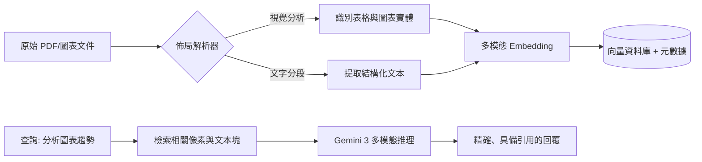

# 多模態 RAG 佈局解析

在構建企業級 RAG 系統時，開發者常犯的致命錯誤是將 PDF 或技術文件視為單純的「字串集合」。對於包含複雜表格、統計圖表或非線性佈局的文件，傳統的文本提取會導致資訊「碎裂化」與「去語義化」。佈局感知解析（Layout-aware Parsing）的核心目標是保留文件的「空間語義」，確保 RAG 系統不僅讀得到文字，還能理解文字與圖表之間的邏輯關聯。

---

### 情境 1：優先使用「佈局感知解析」而非「純文本提取」
**核心概念簡述**：
傳統解析器常將 PDF 表格按行掃描並攤平為亂序字串，導致行與列的邏輯對應關係徹底丟失。佈局感知解析則透過電腦視覺或結構化解析工具（如 Document AI），將文件轉換為具備語義標籤的 JSON 或 Markdown，保留表格的維度與標題資訊。

**程式碼範例（Bad vs. Better）**：

*   **❌ Bad：直接將 PDF 讀取為無結構字串**
    > **Rationale**: 如下方的右側圖示，表格數據被混雜在一起。模型無法判斷某個數值究竟屬於哪一列，極易引發「數字幻覺」。

*   **✅ Better：利用 BigQuery 的 `ML.PROCESS_DOCUMENT` 進行結構化提取**
```sql
-- 使用 BigQuery ML 調用 Document AI 的佈局感知能力
SELECT
  *
FROM
  ML.PROCESS_DOCUMENT(
    MODEL `my_project.my_dataset.docai_model`,
    (SELECT content AS document_bytes FROM `my_project.my_dataset.files`),
    STRUCT('layout_aware_parsing' AS process_mode) -- 啟用佈局感知模式
  );
-- 回傳結果為結構化的 JSON，保留了表格的行與列關聯
```

**底層原理探討與權衡**：
這是一種從「字串（Strings）」到「實體（Entities）」的範式轉換。雖然引入專用的解析層（如 Document AI）會增加運算成本與管線複雜度，但在處理保單、財務報表或合約時，這是確保生成精確度的唯一手段。

---

### 情境 2：實施「上下文檢索」以補全圖表碎片的語義缺失
**核心概念簡述**：
當文件被切分為多個 Chunk（塊）時，圖表的標題可能在 Chunk A，而圖表數據卻在 Chunk B。這種「語義斷裂」會導致檢索器雖然找到了圖表，卻不知道圖表在描述什麼。上下文檢索（Contextual Retrieval）要求在向量化之前，利用 LLM 對每個碎片生成「全域背景描述」，將其附著在 Chunk 上。

**程式碼範例（Bad vs. Better）**：

*   **❌ Bad：將表格 Chunk 單獨向量化，無背景資訊**
    > **Rationale**: 檢索器回傳一個充滿數字的表格塊，LLM 卻無法得知這是「2025 年第二季」還是「2010 年」的財務報告。

*   **✅ Better：為每個 Chunk 注入全域上下文**
```python
# 核心邏輯：在 Embedding 前先注入 Context
instruction = f"""
這裡有一份文件的全文：{{WHOLE_DOCUMENT}}
請為下方的 Chunk 提供一段簡短的背景描述，以便於檢索：
{{CHUNK_CONTENT}}
"""
# 產出的 contextualized_chunk 會包含「這是某某公司 2025 年盈餘表的第三行...」等資訊
```

**底層原理探討與權衡**：
根據實驗，這種「情境化（Situate）」處理能將錯誤檢索率降低達 67%。這對於多模態 RAG 尤為重要，因為圖片本身能承載的語義資訊往往受限於其周邊的文字描述。

---

### 情境 3：利用原生多模態模型執行「端到端」圖表推理
**核心概念簡述**：
過去的系統依賴「OCR + 文本 LLM」，這在解析複雜統計圖（如趨勢線、餅圖）時表現脆弱。現代 RAG 架構應優先使用具備原生視覺感知能力的多模態模型（MMM，如 Gemini 3），直接處理圖表的原始像素與座標，以獲取更深層的空間推理。

**更多說明 (流程 & 比較表)**：

#### 佈局感知 RAG 解析流程


#### 傳統 RAG 解析 vs. 佈局感知解析比較
| 特性 | 傳統解析 (Naive) | 佈局感知解析 (Layout-Aware) |
| :--- | :--- | :--- |
| **數據形式** | 純文本字串 | 結構化數據 (JSON/Markdown) |
| **圖表處理** | 忽略或轉化為亂序文本 | 保留座標與行列邏輯 |
| **檢索精度** | 低，易受關鍵字重疊干擾 | 高，基於空間關係與實體 |
| **幻覺風險** | 高 (因數值失去對應標題) | 低 (具備完整的數據上下文) |

---

### 適用場景與拇指法則
*   **Rule of Thumb**：如果你的文件「表格多於三行」或「包含非文字圖表」，則**必須**實施佈局感知解析，而非傳統的 RAG。
*   **例外情況**：對於純文字敘述的小型手冊，直接使用大上下文視窗模型（Long Context Model）往往比構建複雜的解析管線更有效。

---

### 延伸思考

**1️⃣ 問題一**：為什麼「嵌入模型的一致性（Embedding Consistency）」在佈局解析中是隱形炸彈？

**👆 回答**：這是一個架構設計的基石。如果你在索引階段使用了模型 v1 對結構化後的表格進行向量化，但檢索時用了模型 v2，系統將無法回傳任何結果。在生產環境中，必須對解析後的 Chunk、Metadata 以及 Embedding Model 進行同步的版本管理。

---

**2️⃣ 問題二**：如何解決圖表解析中的「L'Occitane 問題（相似但功能無關）」？

**👆 回答**：這是向量檢索的侷限。解決方案是引入「GraphRAG」模式。系統不應只搜尋語義相似的 Chunk，而應遍歷知識圖譜中的關聯實體（例如：`圖表 A` -> `屬於` -> `2024 年報` -> `排除` -> `非目標公司`），這能精準過濾掉那些「看起來很像但數據無關」的視覺干擾項。