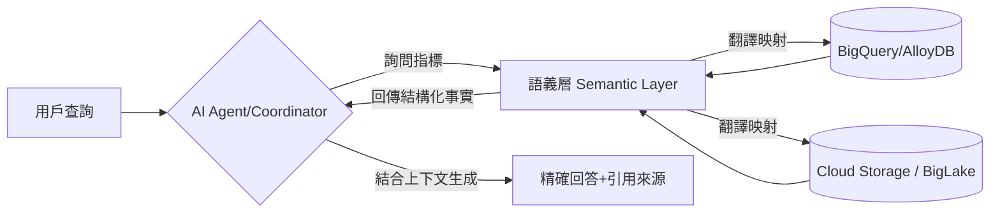

# 語義層應用

在建構企業級代理式 AI (Agentic AI) 的架構中，開發者常犯的致命錯誤是讓大型語言模型 (LLM) 直接面對原始、未經處理的數據庫模式 (Schema)。結構化數據（如 SQL 數據庫）對機器友好，但對 AI 而言充滿了語義陷阱。**語義層 (Semantic Layer)** 扮演著中繼資料 (Metadata) 翻譯的角色，它在技術存儲層（數據倉庫或湖泊）與 AI 代理之間建立一道防火牆，將生冷的「資料表/欄位名」映射為人類與 AI 都能精確理解的「商業術語」。

作為架構師，我們不應僅將其視為一個翻譯器，而應將其視為企業邏輯的「單一事實來源 (Single Source of Truth)」，確保 Agent 在執行任務時，不會因為數據格式的微小差異而產生災難性的推理錯誤。

---

### 情境 1：透過語義映射消除「欄位歧義」導致的邏輯崩潰
**核心概念簡述**：
當 Agent 嘗試讀取多個數據源時，常會遇到「同名異義」或「同義異名」的問題。例如，房貸數據庫中的「利率」存儲為浮點數 (5.5)，而信用卡數據庫則存儲為帶百分比的字串 ('5.5%')。若無語義層介入，Agent 會將兩者視為原始數值進行計算，導致財務建議完全錯誤。語義層透過預定義的邏輯，將技術欄位轉換為統一的商業指標。

**對比範例**：

*   **❌ Bad：讓 Agent 直接生成 SQL 存取複雜的原始模式**
    > **Rationale**: Agent 必須具備數據工程師等級的知識才能分辨 `mortgage.int_rate` (float) 與 `cc.rate_str` (string) 的差異。這會大幅增加 Prompt 的複雜度且極易出錯。

*   **✅ Better：Agent 透過語義層調用統一的「年度利率 (Annual_Interest_Rate)」術語**
```python
# 語義層定義示例 (概念模型)
semantic_layer = {
    "Annual_Interest_Rate": {
        "description": "統一的年度百分比利率，範圍 0-100",
        "mapping": {
            "mortgage_db": "SELECT int_rate FROM loans",
            "credit_card_db": "SELECT CAST(REPLACE(rate_str, '%', '') AS FLOAT) FROM cards"
        }
    }
}

# Agent 只需詢問： "找出所有利率高於 5% 的帳戶"
# 系統自動轉譯為正確的跨表 SQL。
```

**底層原理探討與權衡**：
語義層將「數據結構 (Structure)」與「業務含義 (Meaning)」解耦。它的權衡在於開發初期的「數據地圖」繪製成本較高，但它能消除 90% 以上因數據語義偏移 (Semantic Drift) 導致的 AI 幻覺，這在金融與醫療等高風險行業中是不可或缺的。

---

### 情境 2：實施「基於語義」的中心化治理與安全性
**核心概念簡述**：
傳統的安全規則通常鎖定在資料表或欄位層級，這在管理數百個 Agent 時會變得極其難以維護。語義層允許管理員在「商業術語」層級應用存取規則。例如，與其在 20 個不同的資料表中分別限制「毛利 (Gross Revenue)」欄位的讀取權限，不如直接在語義層定義：「僅有經理職級可以查看『毛利』指標」。

**對比範例**：

*   **❌ Bad：在每個資料庫查詢工具中手動撰寫過濾邏輯**
    > **Rationale**: 這會導致權限碎片化。一旦合規政策改變，開發者必須修改所有 Agent 的工具定義，且難以進行合規審計。

*   **✅ Better：利用 Dataplex 或類似工具實施中心化策略管理**
```sql
-- 在語義層應用策略標籤
-- 只有具備 'FINANCE_MANAGER' 權限的 Identity 才能解開此術語的遮罩
CREATE OR REPLACE TABLE semantic_layer.business_metrics AS
SELECT
  revenue_raw AS Gross_Revenue POLICY TAG (tags.finance_sensitive),
  ...
```

---

### 情境 3：作為 Agentic RAG 的結構化導航橋樑
**核心概念簡述**：
在進階的 RAG 架構中，Agent 不僅需要檢索非結構化文檔（如 PDF），還需要查閱結構化數據以驗證事實。語義層提供了一種「參數化查詢 (Parameterized Queries)」模式，讓協調代理 (Coordinator Agent) 能精確地委派任務給特定的數據代理，而不會產生注入攻擊風險。

**更多說明 (架構流程)**：

#### 語義層在 Agent 數據流中的地位


#### 語義層與傳統模式對照表
| 維度 | 原始數據模式 (Raw Schema) | 語義層 (Semantic Layer) | 價值體現 |
| :--- | :--- | :--- | :--- |
| **可讀性** | 技術導向 (如 `v_ord_01_final`) | 業務導向 (如 `訂單總額`) | 降低 Agent 理解錯誤的機率 |
| **邏輯變更** | 需改動 SQL 或程式碼 | 僅需更新元數據定義 | 提升系統敏捷性與維護性 |
| **存取控制** | 鎖定在欄位 (脆弱) | 鎖定在商業術語 (嚴謹) | 簡化大規模合規審計 |
| **數據一致性** | 依賴各部門手動對齊 | 中央定義，強制一致 | 避免「同一個問題、兩個答案」 |

---

### 適用場景與拇指法則
*   **Rule of Thumb**：如果你的數據架構包含多個資料源，或者需要處理跨部門的關鍵績效指標 (KPI)，**必須**建立語義層。
*   **例外情況**：對於單一、結構極其簡單且欄位命名嚴謹的小型單機數據庫應用，語義層可能引入不必要的間接開銷。

---

### 延伸思考

**1️⃣ 問題一**：為什麼說語義層是實現「Transformational (轉型期)」AI 成熟度的關鍵？

**👆 回答**：在 AI 成熟度的轉型階段，數據品質不再由人工手動清理，而是由代理自主管理。語義層提供了機器可理解的規範，使得「數據品質代理 (Data Quality Agents)」能自動檢測、標記並修復與標準術語不符的異常數據，實現系統的自我優化。

---

**2️⃣ 問題二**：語義層如何防止「Prompt 注入攻擊」？

**👆 回答**：語義層提倡使用「參數化查詢」而非讓 LLM 生成隨意的 SQL 字串。當 Agent 想要存取數據時，它只能呼叫語義層暴露出的、預先定義好的「唯讀接口」，這有效地限制了 LLM 操縱數據庫底層結構的能力，構建了第一道安全屏障。