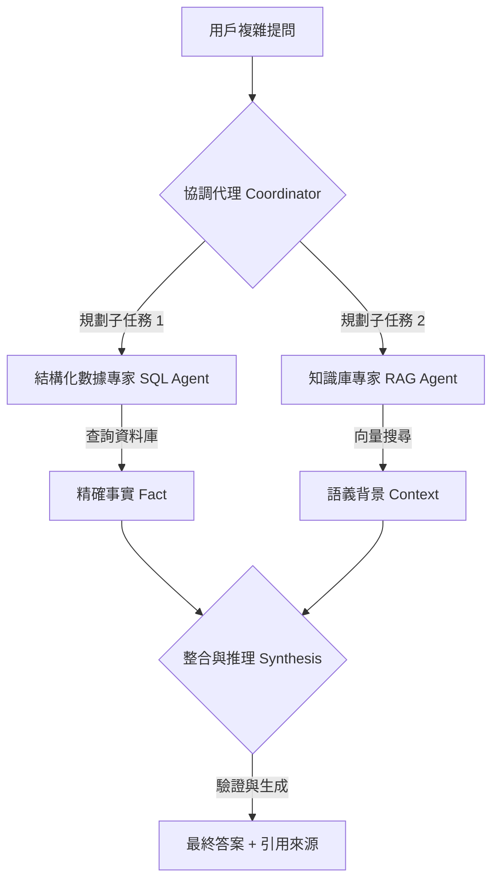

# Agentic RAG

在進階的 AI 架構中，我們正見證從「被動資料檢索」到「自主代理協調」的典範轉移。基礎 RAG (Naive RAG) 往往將檢索視為一種線性的、一次性的靜態過程；然而，面對企業級的複雜需求，檢索必須演變為一種具備**推理意圖**的動態行為。

Agentic RAG 的核心在於將大型語言模型 (LLM) 定義為「大腦」，並透過「工具調用 (Tool Calling)」與「多代理協調 (Multi-agent Collaboration)」讓它能主動判斷資訊缺口、選擇最適數據源，並在必要時執行自我修正。

---

### 情境 1：從「被動資料拼接」轉向「自主規劃」架構
**核心概念簡述**：
傳統 RAG 盲目地將 Top-K 結果塞入 Context，這在處理需要整合多方資訊的複雜查詢（如：同時分析財報與市場新聞）時會造成「認知過載」。Agentic RAG 則引入「規劃者 (Planner)」角色，先將複雜目標拆解為子任務，再決定檢索順序。

**程式碼範例（Bad vs. Better）**：

*   **❌ Bad：將所有文件一次性嵌入並檢索**
    > **Rationale**: 這種做法忽視了數據間的邏輯順序，容易導致模型在處理長上下文時發生「迷失在中間 (Lost in the Middle)」的問題，且無法處理不同來源（如 SQL 與 PDF）的衝突。

*   **✅ Better：利用 ADK 構建具備「專家代理」的協調層**
```python
# 定義具備專業職責的 Specialist Agents
doc_validator = LlmAgent(name="文件驗證專家", instructions="負責檢查合規性與語義邊界")
financial_analyst = LlmAgent(name="財報分析專家", instructions="專精於 10-K 表格與數值推理")

# 構建協調者 (Coordinator/Supervisor)
coordinator = LlmAgent(
    name="RAG 協調中心",
    instructions="根據用戶需求，規劃任務流程並指派給合適的專家代理",
    sub_agents=[doc_validator, financial_analyst] # 建立父子層級關係
)

# 代理自主決定調用 knowledge_lookup 工具
response = coordinator.run("分析 BetaTech 的供應鏈風險並對比去年的合規報告")
```

**底層原理探討與權衡**：
這是一種**職責分離 (Separation of Concerns)** 的實踐。透過將單一龐大的 Prompt 拆解為多個專用的小型模型/代理，能有效降低單一模型的認知負擔，並提升系統的維護性。權衡之處在於，多層次的代理調用會增加首字延遲 (TTFT) 與 Token 成本。

---

### 情境 2：透過「多代理路由」處理異構數據源
**核心概念簡述**：
企業資料分散在結構化資料庫（SQL）、非結構化文件（PDF）與外部 API 中。Agentic RAG 透過「語義路由 (Semantic Routing)」確保查詢被正確引導至最適切的提取路徑，例如：精確的訂單數據走 SQL 工具，而政策解讀走向量檢索。

**更多說明 (執行流程圖)**：

#### Agentic RAG 協調工作流


**適用場景表**
| 特性 | Naive RAG | Agentic RAG |
| :--- | :--- | :--- |
| **檢索決策** | 固定、線性 | 動態、基於推理 |
| **數據多樣性** | 通常僅限單一向量庫 | 支援多源異構數據 |
| **失敗處理** | 無法處理檢索失敗 | 具備自我修正與重新嘗試能力 |
| **適用場景** | 單純的 FAQ | 高保險、高合規的企業工作流 |

---

### 情境 3：實施「觀察-反思」循環以提升檢索精確度
**核心概念簡述**：
代理在獲取初步檢索結果後，應具備「反思 (Reflection)」能力。如果發現檢索到的資訊不足以回答問題，代理會自主修改查詢語句 (Query Expansion) 或切換數據源，直到滿足「成功準則」。

**程式碼範例（Bad vs. Better）**：

*   **❌ Bad：若初次檢索無果，直接回報「我不知道」**
    > **Rationale**: 這限制了系統的可用性。許多時候問題出在用戶提問過於模糊，系統應具備「主動性」來澄清需求。

*   **✅ Better：利用 FCoT 模式執行「驗證-修正」循環**
```python
# 在代理指令中嵌入 Fractal Chain-of-Thought (FCoT) 結構
agent_instructions = """
1. RECAP: 確認用戶問題的核心實體。
2. REASON: 規劃檢索路徑。
3. ACT: 執行檢索工具。
4. VERIFY: 檢查獲取的資料是否足以支撐論點。
5. 若不足，則修正查詢語法並返回步驟 2。
"""
# 代理在 Iteration 2 若發現數據異常，將觸發自我修正路徑
```

**底層原理探討與權衡**：
這實質上是在推理階段增加了「測試時運算 (Test-time Compute)」。透過 `Iteration N` 的循環機制，系統以延遲換取準確度。架構上必須設定「思考預算 (Thinking Budget)」限制，防止模型陷入無限遞歸或消耗過多 Token。

---

### 適用場景與拇指法則
*   **Rule of Thumb**：當你的任務涉及「跨職能領域」或「多步驟邏輯鏈」（例如：合規審計、臨床診斷）時，**Agentic RAG** 是唯一能保證可靠性的選擇。
*   **例外情況**：如果業務場景僅是簡單的文件查詢且對延遲要求極高（毫秒級），則應使用預定義的「靜態 RAG 流程」以避免代理推理帶來的不可預測性。

---

### 延伸思考

**1️⃣ 問題一**：為什麼說 Agentic RAG 是解決「單一代理認知瓶頸」的最佳方案？

**👆 回答**：即便是最強大的模型，其上下文視窗和參數密度也存在物理上限。當指令集過於龐大（如：同時處理 50 個工具或多種業務規則）時，模型會產生「認知失調」。Agentic RAG 透過將任務委派給具備獨立「腦細胞」（LLM）的小型專業團隊，實現了負載分擔與模型異質化優化。

---

**2️⃣ 問題二**：在分散式代理檢索中，如何保證資訊的一致性與安全性？

**👆 回答**：關鍵在於實施「有限權限 (Limited Powers)」與「可觀測日誌 (Observable Actions)」。代理之間的溝通應基於 A2A 協議以確保身份驗證，且所有工具接口應設計為「唯讀」或「參數化查詢」，防止 Prompt 注入導致的惡意資料篡改。此外，透過「分散式追蹤 (Distributed Tracing)」可建立完整的因果依賴圖，確保決策可被審計。