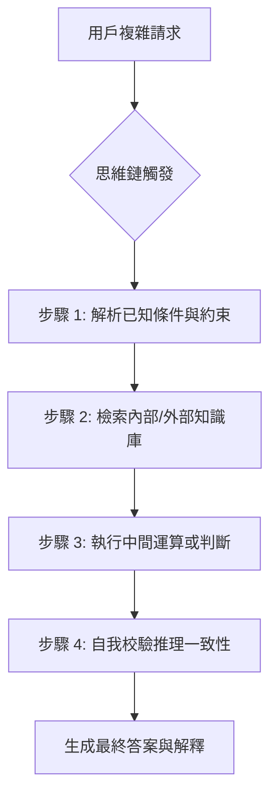

# 思維鏈

在構建企業級 AI 服務時，我們經常會遇到模型「直覺式」給出錯誤答案的情況，這通常是因為模型試圖在單次預測中完成過於複雜的邏輯跳躍。身為架構師，我們追求的是過程的可預測性與結果的健壯性。思維鏈 (Chain of Thought, CoT) 便是將非線性的邏輯拆解為線性推理步驟的關鍵技術，這不僅提升了準確度，更為 AI 的決策提供了寶貴的「審核軌跡 (Audit Trail)」。

---

### 情境 1：優先要求模型「逐步思考」以解鎖隱藏的推理能力 (Zero-shot CoT)

#### 核心概念簡述
許多效能低下的模型行為並非因為「不知道」，而是因為「太懶」。透過在提示詞中加入簡單的引導語（如 "Think step-by-step"），可以強迫 LLM 分配更多的計算資源（Tokens）在中間推理過程中，從而顯著降低多步驟邏輯問題的錯誤率。

#### 程式碼範例（Bad vs. Better）
```python
❌ Bad: 直接詢問複雜問題，模型容易跳過邏輯直接猜測答案
prompt = "如果我有直徑 25 公分的管子和 100 公尺長的軟管，在 7 bar 壓差下，德州甜原油的流量是多少？"

✅ Better: 顯式要求逐步思考，解鎖預訓練的物理公式計算能力
prompt = """
如果我有直徑 25 公分的管子和 100 公尺長的軟管，在 7 bar 壓差下，德州甜原油的流量是多少？
**請逐步思考 (Think about it step-by-step)。**
"""
```
#### 底層原理探討與權衡
*   **為什麼有效 (Rationale)**：LLM 的本質是下一個 Token 的預測器。當我們要求它直接給出答案時，它必須在極短的預測路徑中完成所有邏輯；而 CoT 將問題空間展開，讓模型能利用先前的輸出作為後續推理的上下文（Grounding），從而降低幻覺風險。
*   **權衡**：這會增加輸出 Token 的數量，進而增加延遲 (Latency) 與成本。在非關鍵任務中需謹慎使用。

---

### 情境 2：透過「示範推理模式」而非僅提供結論來處理領域邏輯 (Few-shot CoT)

#### 核心概念簡述
當 Zero-shot CoT 仍無法滿足特定業務邏輯（如複雜的航空公司行李政策）時，我們不應只是給模型更多的資料，而是要給它「釣魚的方法」。Few-shot CoT 透過提供「問題 -> 推理步驟 -> 答案」的範例，讓模型模仿思考的框架，而非僅僅是輸出的格式。

#### 程式碼範例（Bad vs. Better）

```python
# ❌ Bad: 僅提供結果範例，模型無法學會判斷 Layover 與 Final Destination 的差異
examples = """
Q: 目的地是 CDG (法國)。 A: 行李額度為 30kg。
Q: 目的地是 LHR (英國)。 A: 行李額度為 30kg。
"""

# ✅ Better: 在範例中展示推理邏輯，引導模型學會判斷標準
examples = """
範例 1：
Q: 行程為 JFK -> CDG -> SIN，最終目的地是新加坡 (SIN)。
A:
步驟 1：識別最終目的地。目的地 SIN 位於新加坡。
步驟 2：查詢政策。新加坡屬於亞洲區，額度為 35kg。
結論：35kg。

範例 2：
Q: 行程為 JFK -> LHR，最終目的地是英國 (LHR)。
A:
步驟 1：識別最終目的地。目的地 LHR 位於英國。
步驟 2：查詢政策。英國屬於歐洲區，額度為 30kg。
結論：30kg。
"""
```
#### 底層原理探討與權衡
*   **為什麼有效 (Rationale)**：這是一種「上下文工程 (Context Engineering)」。透過示範，模型學會了權重分配，知道哪些關鍵字（如「最終目的地」）在推理鏈中佔據主導地位，這比單純的提示工程更具備對抗模型偏移的健壯性。
*   **適用場景**：適用於需要遵循特定 SOP 或合規性審查的流程（如貸款審核）。

---

### 更多說明

#### CoT 推理流程圖 (Mermaid)



#### CoT 技術對比表

| 特性 | Zero-shot CoT | Few-shot CoT | Auto-CoT |
| :--- | :--- | :--- | :--- |
| **實現難度** | 極低 (僅需引導語) | 中 (需手寫高品質範例) | 高 (需自動化範例庫) |
| **準確度提升** | 中等 | 高 | 極高 |
| **適用場景** | 通用邏輯、簡單數學 | 業務特有規則、複雜合規 | 大規模多變化的推理任務 |
| **主要成本** | 少量輸出 Token | 額外輸入與輸出 Token | 範例檢索與管理成本 |

---

### 延伸思考

**1️⃣ 問題一**：CoT 是否能完全解決模型在數學運算中的幻覺？

**👆 回答**：不能。雖然 CoT 改善了推理邏輯，但 LLM 內質上仍是機率模型而非計算引擎。對於精確數值計算，最佳實踐是將 CoT 與「工具調用 (Tool Calling)」結合（即 ReAct 模式），讓模型在推理鏈中決定何時呼叫計算機 API。

---

**2️⃣ 問題二**：當上下文視窗 (Context Window) 變得極長時，CoT 會失效嗎？

**👆 回答**：會。這被稱為「迷失在中間 (Lost in the middle)」現象，模型會忽略視窗中段的指令。為了對抗這一點，我們建議使用「持久指令錨定 (Persistent Instruction Anchoring)」或「分形思維鏈 (Fractal CoT)」，在推理的每個階段重複核心目標與約束。

---

**3️⃣ 問題三**：如何評估 CoT 是否真的提高了系統的可靠性？

**👆 回答**：應採用「LLM 作為裁判 (LLM-as-Judge)」模式，針對推理過程的「忠實度 (Faithfulness)」與「正確性」設定自定義指標（如 STEPScore），而非僅評估最終答案。只有能量化的改進，才算是成功的架構演進。