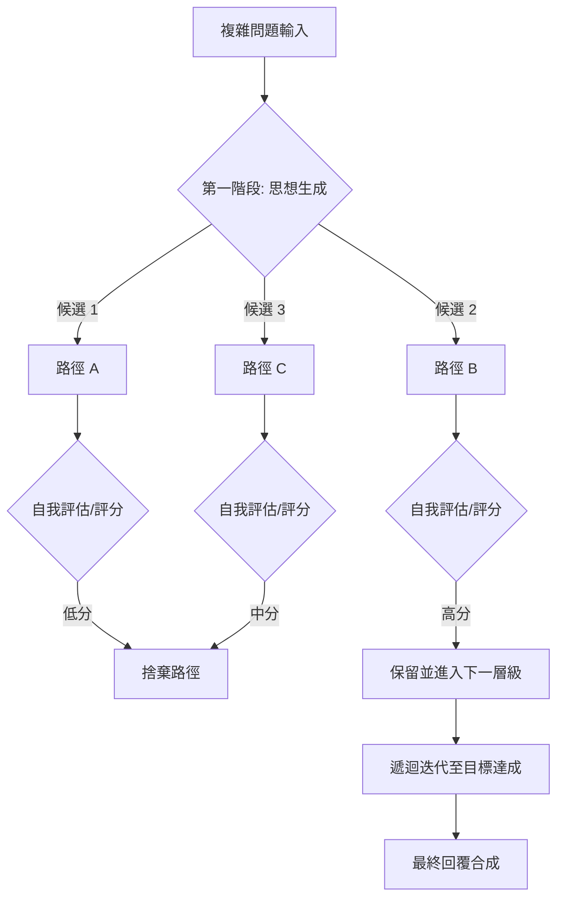

# 思維樹

在解決複雜的軟體架構問題時，資深開發者絕不會只走一條死路。我們會評估方案 A、B、C，並在發現死胡同時及時回頭。**思維樹 (Tree of Thoughts, ToT)** 正是將這種「探索與回溯」的設計模式引入大型語言模型（LLM）的進階技術。當傳統的思維鏈 (CoT) 因線性邏輯而陷入僵局時，ToT 透過樹狀搜尋（如廣度優先或束搜尋）與自我評估，確保模型能從多個可能的推理路徑中擇優執行。

---

### 情境 1：處理需要戰略規劃或多重約束的複雜任務

#### 核心概念簡述
當問題涉及多個不確定的決策點（例如：供應鏈優化、具備嚴格約束的創意寫作）時，線性推理容易發生「模式崩潰」，即模型在初始路徑錯誤後無法修正。ToT 透過將問題拆解為多個「思想節點」，並對每個節點進行評分，從而實現像人類般的反思與導航能力。

#### 程式碼範例（Bad vs. Better）

```python
# ❌ Bad: 使用單一、長篇的思維鏈 (Linear CoT)
# 模型容易在第二段就偏離主題，且無法修正前一段的邏輯錯誤
prompt = """
請寫一篇四段的文章，每段必須分別以這四句話結尾：
1. 生存還是毀滅，這是個問題。
2. 帶我去見你的領導。
3. 凡是有錢的單身漢，總想娶位太太，這是一條公認的真理。
4. 我們唯一需要恐懼的是恐懼本身。
請逐步思考並直接生成全文。
"""

# ✅ Better: 實作思維樹 (ToT) 框架
# 透過生成、評估、篩選三部曲，確保路徑的最優性
def tot_workflow(initial_problem):
    # 1. 思想生成：針對當前狀態生成多個候選方案
    thoughts = llm.generate_thoughts(initial_problem, num_candidates=3)

    # 2. 路徑評估：由 LLM 扮演裁判，對每個方案評分 (0-1)
    scored_thoughts = []
    for t in thoughts:
        score = llm.evaluate_state(t, rubric="邏輯連貫性與約束達成度")
        scored_thoughts.append((t, score))

    # 3. 束搜尋 (Beam Search)：僅保留評分最高的 K 個路徑進入下一輪
    best_paths = sorted(scored_thoughts, key=lambda x: x, reverse=True)[:1]

    # 4. 最終合成：基於最優路徑生成最終答案
    return llm.generate_final_summary(best_paths)
```

#### 底層原理探討與權衡
*   **為什麼有效 (Rationale)**：ToT 引入了「搜尋」與「評估」的解耦。模型不再是單純的文字補全器，而是變成一個在問題空間內進行試錯的智慧體。這能有效解決 CoT 無法回溯（Backtracking）的問題。
*   **權衡 (Trade-offs)**：
    *   **計算成本**：為了找到最優解，可能需要數十次模型調用（API 請求），這會大幅增加延遲與 token 成本。
    *   **組合爆炸**：若樹的深度與廣度控制不當，搜尋空間會迅速失控。
*   **拇指法則 (Rule of Thumb)**：僅在 CoT 無法提供滿意結果，且該任務具備明確的評估標準（例如數學驗證或邏輯查核）時使用。

---

### 更多說明

#### ToT 決策流程圖



#### 推理模式技術對比

| 特性 | 思維鏈 (CoT) | 思維樹 (ToT) | 最少至最多 (LtM) |
| :--- | :--- | :--- | :--- |
| **推理路徑** | 單一線性 | 多重分支 + 回溯 | 階層式分解 |
| **自我評估** | 無 (除非結合 Reflection) | 核心步驟：每步皆評估 | 部分包含 |
| **適用場景** | 簡單數學、循序操作 | 戰略規劃、創意寫作 | 軟體設計、複雜分解 |
| **實作難度** | 低 (單一 Prompt) | 高 (需編排框架) | 中 |

---

### 延伸思考

**1️⃣ 問題一**：如果 LLM 本身就不擅長評估，ToT 是否會失效？

**👆 回答**：會。這稱為「評估偏誤」。最佳實踐是採用 **「異構模型評估」**：使用較強大的模型（如 GPT-4o 或 Gemini Pro）作為「評分者」，去指導較小的模型（如 Gemini Flash）進行「思想生成」，以確保評分的權威性。

---

**2️⃣ 問題二**：ToT 與 OpenAI 的 o1 或 DeepSeek-R1 的「思考模式」有何不同？

**👆 回答**：o1 或 R1 等「推理模型」是將這種搜尋與回溯的邏輯 **內化 (Internalized)** 到模型的訓練權重中（透過大規模強化學習），模型在生成時會自動消耗「思考 Token」進行路徑探索。ToT 則是 **外部化 (Externalized)** 的框架，讓不具備原生思維模式的模型也能具備類似的邏輯能力。

---

**3️⃣ 問題三**：在生產環境中，如何優化 ToT 的高延遲？

**👆 回答**：
1. **並行化 (Parallelization)**：同時對所有分支進行評分，而非循序執行。
2. **剪枝 (Pruning)**：一旦某路徑得分低於閾值，立即停止該分支的後續生成。
3. **快取 (Caching)**：針對常見的決策節點使用快取，減少重複計算。