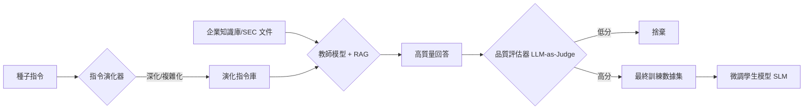

# Evol-Instruct 數據演化

在軟體工程中，我們深知「垃圾進，垃圾出」（Garbage In, Garbage Out）的道理。當我們試圖微調（Fine-tuning）一個模型以處理複雜的企業任務時，高品質、具備足夠複雜度的數據集往往是稀缺資源。**Evol-Instruct** 是一種自動化的數據工程模式，它透過將簡單的種子指令（Seed Instructions）進行「演化」——增加約束、深化概念或引入謬誤——來生成更具挑戰性的訓練樣本。身為架構師，我們不應僅依賴海量的平庸數據，而應追求數據的「演進」，讓小型模型（Small Models）也能展現出媲美旗艦模型的推理深度。

---

### 情境 1：演化指令以增加邏輯深度 (Evolution Strategy)

#### 核心概念簡述
基礎模型通常在簡單任務上表現優異，但在多重約束或複雜邊界條件下會崩潰。Evol-Instruct 的核心在於使用一個強大的模型（如 GPT-4 或 Gemini Pro）作為「提示詞重寫器（Prompt Rewriter）」，將原始指令轉化為更具深度、更具體或更具誤導性的版本。這能有效填補預訓練數據中缺乏的企業級複雜邏輯空隙。

#### 程式碼範例（Bad vs. Better）

```python
# ❌ Bad: 僅使用簡單、重複的指令作為微調數據
# 模型只會學會簡單的對話，無法應對真實企業場景中的複雜限制
raw_instruction = "請寫一段關於公司投資回報率的分析。"

# ✅ Better: 實作 Evol-Instruct 的演化提示詞
# 透過增加約束（Constraint-Adding）與深化（Deepening）提升數據質量
evolve_prompt = f"""
你是一位「提示詞重寫器」。
你的目標是將給定的簡單指令改寫為更複雜的版本，增加邏輯難度。
請採取以下策略之一：
1. 增加具體的約束（如：限定行業別、特定的財務指標）。
2. 引入邏輯複雜度（如：考慮競爭對手動態或不確定的政策因素）。
3. 將一般概念替換為特定專業名詞。

#原始指令#: {raw_instruction}
#改寫後指令#:
"""
# 演化後的結果範例：
# 「考量到競爭對手正投資綠氫項目且政府補貼政策不明，
# 請分析 Air Products 公司在面臨 20% 成本超支時，
# 其碳捕集項目的投資回報率與相應的戰略調整。」
```

#### 底層原理探討與權衡
*   **為什麼有效 (Rationale)**：模型能力的上限往往由訓練數據的複雜度決定。透過演化，我們強迫模型在訓練階段就接觸「困難」的樣本，這能有效對抗模型在面對複雜問題時的「懶惰」行為。
*   **權衡**：演化過程涉及多次 LLM 調用，會顯著增加數據準備階段的成本。然而，高品質的合成數據（Synthetic Data）已被證明能讓參數較小的模型超越未經針對性訓練的大型模型。

---

### 情境 2：採用「教師-學生」模式生成高保真答案 (Teacher-Student Answer Generation)

#### 核心概念簡述
有了演化後的困難指令後，我們需要「完美答案」。在 Evol-Instruct 模式中，我們通常使用具備極強推理能力的「教師模型」來生成答案。為了確保答案的精確度，我們必須結合 **RAG（檢索增強）** 技術，將企業內部的原始文獻（如 SEC 財報或內部操作規範）注入教師模型的上下文。

#### 數據流處理流程 (Mermaid)



---

### 情境 3：實作 LLM-as-Judge 進行數據清洗 (Filtering & Quality Control)

#### 核心概念簡述
合成數據的一個巨大風險在於「幻覺累積」。如果教師模型生成了錯誤或平庸的答案，學生模型會將其視為真理。因此，Evol-Instruct 必須包含一個嚴格的過濾步驟，利用「裁判模型」對（指令, 回答）配對進行多維度評分（如洞察力、準確度、格式），僅保留最高品質的樣本。

#### 比較與整合表：Evol-Instruct 與傳統數據準備

| 特性           | 傳統手動標註        | 簡單合成數據  | Evol-Instruct                   |
| :------------- | :------------------ | :------------ | :------------------------------ |
| **數據多樣性** | 高 (視人類專家而定) | 低 (重複模式) | **極高 (透過演化算法)**         |
| **擴展性**     | 極低 (昂貴且緩慢)   | 極高          | **高 (受限於演化開銷)**         |
| **複雜度覆蓋** | 中等                | 低            | **極高 (專門針對邊界案例設計)** |
| **適用場景**   | 通用任務            | 簡單 FAQ      | **深度領域專家、精密任務**      |

---

### 延伸思考

**1️⃣ 問題一**：如果我只有 100 筆原始數據，可以演化出多少訓練樣本？

**👆 回答**：根據實戰經驗，透過不同的演化策略（Deepening, Concretizing, Adding Constraints），每一筆初始數據通常可以穩定衍生出 10 到 13 倍的變體。這對於需要達到微調門檻（如 1B 模型通常需要約 10,000 筆數據）至關重要。

---

**2️⃣ 問題二**：Evol-Instruct 是否會導致模型喪失通識能力？

**👆 回答**：會，這就是所謂的「災難性遺忘」（Catastrophic Forgetting）。當你針對特定領域任務（如企業戰略分析）進行深度的指令微調時，模型會過度擬合這些特定模式。拇指法則（Rule of Thumb）：這類模型應被視為「專才」組件，放置在多智慧體架構（Multi-agent Architecture）中擔任特定職責，而非作為通用問答系統。

---

**3️⃣ 問題三**：微調時應該選擇全量微調還是 PEFT (LoRA)？

**👆 回答**：對於 Evol-Instruct 生成的數據，因為數據分佈可能與預訓練數據顯著不同（Out of Distribution），建議採用加強版的 **LoRA**，不僅訓練投影層，還要涵蓋 gate_proj、embed_tokens 與 lm_head，以捕獲新的領域詞彙與邏輯模式。