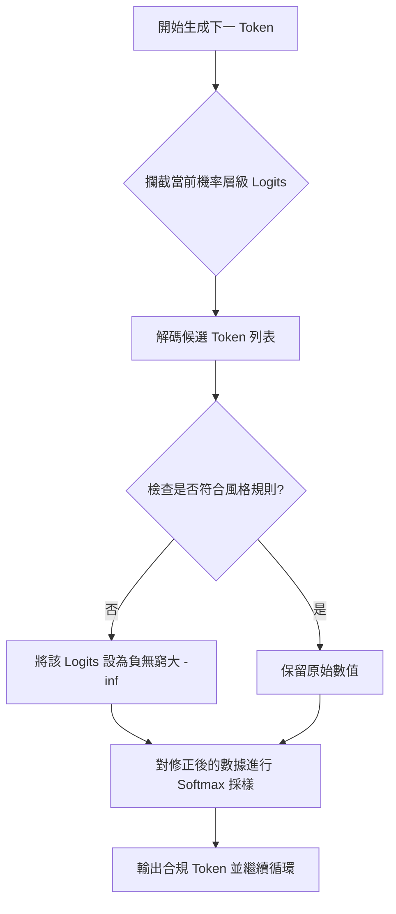

# 輸出機率控制-攔截機率層級以強制遵守風格規則

在構建生產級的 GenAI 應用時，架構師最擔心的不是模型「不會回答」，而是模型「不聽話」。當我們需要模型嚴格遵守品牌用語、法規禁詞或特定的格式規則時，單靠 Prompt Engineering 往往會陷入「機率的博弈」。**Logits Masking (Logits 掩碼)** 是一種強大的介入技術，它在模型決定下一個字（Token）的瞬間進行攔截，將違規選項的機率降為零，從根本上杜絕了不合規內容的產生。

---

### 情境 1：優先使用 Logits 攔截而非「嘗試並重試」迴圈

#### 核心概念簡述
許多開發者會採用一種「事後檢查」的模式：生成全文 -> 檢查合規性 -> 不合規就重新生成。這是一種典型的「抗模式（Antipattern）」，因為它會導致不可預測的尾端延遲（Tail Latency）。如果合規成功率只有 90%，重試次數會呈指數增加，嚴重浪費計算資源。Logits Masking 則是「事前預防」，在採樣階段就修剪（Prune）掉不符合規則的推理路徑。

#### 程式碼範例（Bad vs. Better）

```python
# ❌ Bad: 生成全文後才檢查，導致延遲激增與成本浪費
def generate_product_description(prompt):
    while True:
        response = llm.generate(prompt)
        # 如果包含禁用詞 "award winning"，就整篇砍掉重練
        if "award winning" not in response:
            return response
        print("Detected banned word, retrying...") # 可能陷入無窮迴圈

# ✅ Better: 實作 LogitsProcessor，在生成 Token 時即時過濾
from transformers import LogitsProcessor, LogitsProcessorList

class BannedPhraseProcessor(LogitsProcessor):
    def __init__(self, tokenizer, banned_words):
        self.tokenizer = tokenizer
        self.banned_words = banned_words

    def __call__(self, input_ids, scores):
        # 遍歷所有候選 Token 的 Logits (即未歸一化的機率)
        for token_id in range(len(scores)):
            token_str = self.tokenizer.decode([token_id])
            # 如果該字可能導致違規，將其 Logits 設為負無窮大 (機率變為 0)
            if any(word in token_str.lower() for word in self.banned_words):
                scores[:, token_id] = -float("inf")
        return scores

# 使用時將 Processor 注入模型 pipeline
processors = LogitsProcessorList([BannedPhraseProcessor(tokenizer, ["award winning"])])
output = model.generate(input_ids, logits_processor=processors)
```

#### 底層原理探討與權衡
*   **為什麼有效 (Rationale)**：模型生成是基於 Softmax 函數轉換後的機率分佈。Logits 是這組機率的原始數值，透過將 Logits 設為 $-\infty$，Softmax 後的機率會絕對歸零。這保證了輸出的「絕對合規性」。
*   **權衡 (Trade-offs)**：
    *   **延遲**：攔截採樣需要模型與客戶端頻繁通訊，通常僅適用於本地託管（Local-hosted）或提供 Logits 寫入權限的 API。
    *   **模型幻覺風險**：如果過度限制（過濾掉太多合法 Token），模型可能找不到可用的後續詞，導致輸出混亂或陷入死胡同。

---

### 更多說明：Logits Masking 決策工作流



#### 適用場景與技術限制表

| 特性         | Logits Masking (Pattern 1)   | Grammar 模式 (Pattern 2)             |
| :----------- | :--------------------------- | :----------------------------------- |
| **控制力**   | 極高，可實作複雜動態邏輯     | 高，限於靜態語法架構 (BNF)           |
| **實作位置** | 客戶端攔截 (Transformers 庫) | 伺服器端強制執行 (OpenAI/Gemini API) |
| **適用範圍** | 品牌用語過濾、動態負向約束   | JSON/SQL 格式規範、Schema 限制       |
| **延遲影響** | 中等 (取決於本地或網路往返)  | 低 (伺服器端優化)                    |

---

### 延伸思考

**1️⃣ 問題一**：如果模型提供的候選清單中，所有合法的 Token 機率都很低怎麼辦？

**👆 回答**：這會導致模型輸出的連貫性下降。此時必須配合 **Beam Search (束搜尋)**。當前路徑被堵死時，Logits Masking 應具備「回溯 (Backtracking)」機制，退回上一個節點選擇次優路徑，而非強行在死胡同中採樣。

---

**2️⃣ 問題二**：除了風格控制，Logits Masking 還能解決安全問題嗎？

**👆 回答**：可以。這在 RAG 或工具調用中被稱為「行為掩碼」。例如，可以將所有具有刪除指令（如 `DROP TABLE`）的 SQL Token 機率在生成階段強制歸零，這比事後的正則表達式過濾更加安全，因為它在模型「動念頭」時就阻止了風險。

---

**3️⃣ 問題三**：哪些主流模型支援這種深度的機率層級控制？

**👆 回答**：根據來源，Llama 系列（Open-weights）支援度最高；OpenAI 支援讀取 logprobs，但僅限於部分模型的約束寫入；Gemini 2.0 Flash 開始支援，但 Gemini Pro 則有限制。若業務需求涉及嚴格的法律遵循或廣告過濾，建議優先考慮可本地部署的開源模型，以獲得完整的 Logits 控制權。