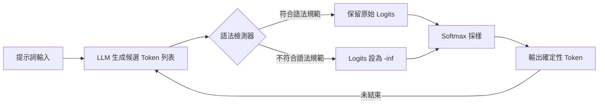
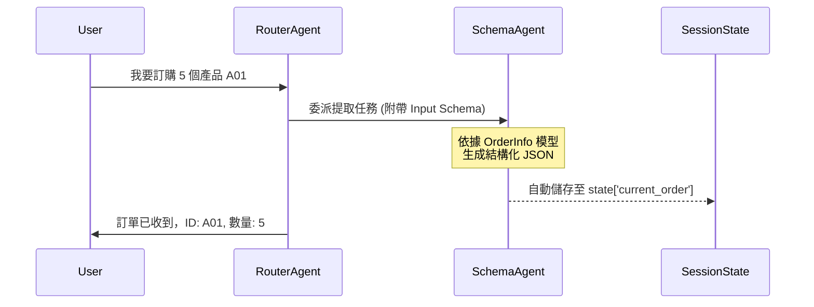

# 語法控制生成

在構建生產級系統時，架構師的口頭禪是「不要期待，要驗證」。對於大型語言模型 (LLM) 而言，最不穩定的環節莫過於產出結構化數據（如 JSON、SQL 或特定領域的 DSL）。**語法控制生成 (Grammar)** 模式並非僅僅在提示詞中「乞求」模型遵守格式，而是從底層解碼算法層級介入，強制模型僅能選擇符合預定義語法（如 BNF 範式或 JSON Schema）的 Token。這將非確定性的文字生成轉化為確定性的結構化輸出。

---

### 情境 1：停止在提示詞中「乞求」JSON，改用強型別 Schema

#### 核心概念簡述
許多開發者習慣在提示詞末尾加上「請務必回傳正確的 JSON 格式」。這在架構上是極度脆弱的，因為模型版本更迭或輸入稍有波動都可能導致解析錯誤。更好的做法是利用模型原生支持的「結構化輸出 (Structured Outputs)」功能，將 Pydantic 模型或 JSON Schema 直接傳遞給 API，讓模型在生成時就受到語法約束。

#### 程式碼範例（Bad vs. Better）

```python
# ❌ Bad: 依賴指令遵循，解析時極易出錯
prompt = "請提取書名和作者，並以 JSON 格式回傳：{'title': '...', 'author': '...'}"
response = llm.generate(prompt)
# 如果模型回傳 "當然，這是你要的 JSON：{...}"，解析將會失敗

# ✅ Better: 使用 Pydantic 定義數據契約，強制執行語法約束
from pydantic import BaseModel

class Book(BaseModel):
    title: str
    author: str

# 呼叫支持 structured_output 的 API (如 OpenAI 或 Gemini)
client = OpenAI()
completion = client.beta.chat.completions.parse(
    model="gpt-4o",
    messages=[{"role": "user", "content": "提取這本書的信息..."}],
    response_format=Book, # 強制遵循 Book 語法
)
book = completion.choices.message.parsed
```

#### 底層原理探討與權衡
*   **為什麼有效 (Rationale)**：語法約束是在解碼階段（Decoding Stage）進行的。當模型準備生成下一個 Token 時，系統會根據當前的語法狀態，將不符合語法的候選 Token 機率（Logits）設為負無窮大。
*   **權衡**：使用模型商提供的服務端（Server-side）約束（如 OpenAI JSON mode）比客戶端（Client-side）自定義 BNF 速度更快且延遲更低。

---

### 情境 2：使用 BNF 範式處理非標準或遺留系統格式

#### 核心概念簡述
當你的系統需要與遺留系統（Legacy System）對接，且該系統要求極其嚴苛的非標準格式（例如特定的 SQL 時間戳記格式或特定字符集的 CSV）時，通用的 JSON 模式可能無法滿足需求。此時，定義一個 **Backus-Naur Form (BNF)** 語法是最終解決方案，它能精確到字符級別地限制模型的輸出。

#### 程式碼範例（Bad vs. Better）

```python
# ❌ Bad: 用文字描述複雜的 SQL 時間戳規則，模型經常遺漏括號或引號
prompt = "請生成一個符合 SQL 標注的 TIMESTAMP 語法，格式必須是 YYYY-MM-DD..."

# ✅ Better: 提供正式的 BNF 語法，確保字符級別的精確度
sql_grammar = """
    ?start: timestamp_literal
    timestamp_literal: "TIMESTAMP '" date_part " " time_part "'"
    date_part: digit{4} "-" digit{2} "-" digit{2}
    time_part: digit{2} ":" digit{2} ":" digit{2}
    digit: "0"..."9"
"""
# 使用 Transformers 庫的 GrammarConstrainedLogitsProcessor
logits_processor = GrammarConstrainedLogitsProcessor(sql_grammar)
pipe = pipeline("text-generation", model="llama-3")
output = pipe(prompt, logits_processor=[logits_processor])
```

#### 底層原理探討與權衡
*   **拇指法則 (Rule of Thumb)**：如果格式可以表示為 Python Dataclass 或 Pydantic，優先使用它，因為配置最簡單；只有當規則包含複雜邏輯（例如：特定的位數限制或非標準符號順序）時，才考慮編寫 BNF 語法。

---

### 更多說明

#### 語法生成控制流程圖



#### 各種約束方式對比表

| 特性         | 提示詞工程 (Prompting) | JSON Mode       | Pydantic / Schema | BNF 語法 (Grammar)      |
| :----------- | :--------------------- | :-------------- | :---------------- | :---------------------- |
| **可靠性**   | 低 (隨機性強)          | 中高            | 高                | **極高 (字符級控制)**   |
| **實現難度** | 極低                   | 低              | 中                | 高 (需編寫語法文件)     |
| **延遲影響** | 無                     | 低 (服務端優化) | 低                | 中高 (客戶端處理)       |
| **典型場景** | 快速原型               | 一般數據交換    | 企業級 API 對接   | 遺留系統、SQL、DSL 生成 |

---

### 情境 3：優先使用 ADK Schema 構建強型別契約，而非依賴手動 JSON 解析 (adk_schema_contract)

#### 核心概念簡述
在多代理人（Multi-agent）系統中，代理人之間的通訊若僅依賴自然語言，就如同在程式中使用全域字串變數一樣危險且難以除錯。Google ADK 提供了 `input_schema` 與 `output_schema` 機制，允許開發者使用 Pydantic 模型來定義代理人的「型別簽章」。這不僅確保了輸出的結構化，還能在工作流（Workflow）中實現自動化的狀態管理與類型檢查。

#### 程式碼範例（Bad vs. Better）

```python
# ❌ Bad: 依賴手動解析字串，缺乏類型保障
from google.adk.agents import LlmAgent
import json

extractor = LlmAgent(
    name="info_extractor",
    model="gemini-2.0-flash",
    instruction="請提取訂單中的 ID 與數量，並回傳 JSON：{'id': '...', 'qty': 123}"
)
# 在 Runner 執行後，開發者必須手動處理可能的解析失敗
# response = runner.run(...)
# try:
#     data = json.loads(response.text)
# except:
#     # 處理幻覺或格式錯誤

# ✅ Better: 使用 ADK Schema 定義明確的契約與自動狀態儲存
from pydantic import BaseModel, Field
from google.adk.agents import LlmAgent

class OrderInfo(BaseModel):
    order_id: str = Field(description="訂單流水號")
    quantity: int = Field(description="訂購數量，必須為正整數")

# 使用 output_schema 強制結構化，並透過 output_key 自動存入 session.state
order_agent = LlmAgent(
    name="order_processor",
    model="gemini-2.0-flash",
    instruction="負責從對話中提取訂單明細。",
    output_schema=OrderInfo,
    output_key="current_order" # 自動將結果存於 state['current_order']
)
```

#### 底層原理探討與權衡
*   **為什麼有效 (Rationale)**：ADK 的 Schema 模式本質上是將 JSON Schema 注入到模型的系統提示中，並在內部結合了受限解碼（Constrained Decoding）技術。更重要的是，它引入了 **自動化狀態管理**：當設置了 `output_key`，框架會自動將解析後的 Pydantic 對象存入 Session，後續代理人可以直接讀取 `state['current_order']` 而非原始文字。
*   **權衡**：如 ADK 文檔所述，**當設定 `output_schema` 時，通常無法有效併用 `tools`**。模型會傾向於一次性生成最終結構，而非進行多輪的工具呼叫。如果需要先查資料再轉格式，應採用多代理架構：一個負責執行工具（Tool Calling），另一個負責結構化（Schema Rendering）。

#### 更多說明

##### ADK 代理人通訊模式對比

| 特性 | 工具模式 (Tool Calling) | 架構模式 (Schema Rendering) |
| :--- | :--- | :--- |
| **主要目的** | 擴展外部能力 (查詢、計算) | 確保資料結構穩定性 (API 串接) |
| **通訊介面** | 自然語言 / 工具參數 | Pydantic / JSON Schema |
| **狀態管理** | 需手動提取文字 | **自動存入 state (透過 output_key)** |
| **模型限制** | 支援多輪思考與工具調用 | 專注於單次結構化輸出 |

##### 代理人間的強型別通訊流程



---

### 延伸思考

**1️⃣ 問題一**：語法控制生成是否能解決 LLM 的「事實性錯誤」？

**👆 回答**：**不能**。語法控制僅能保證「格式正確」（Syntactic Correctness），但不能保證「內容真實」（Semantic Correctness）。例如，模型可以生成一個格式完美的 JSON，但其中的數值卻是幻覺產生的。要解決事實問題，仍需結合 RAG (Pattern 6) 或工具調用 (Pattern 21)。

---

**2️⃣ 問題二**：如果語法定義太過死板，會發生什麼事？

**👆 回答**：如果模型找不到任何符合語法的候選 Token，生成可能會失敗，表現為無窮無盡的空格（模型試圖跳過此處）或是直接中斷生成（Refusal）。建議在定義語法時，為模型保留一個「Unknown」或「None」的出口路徑。

---

**3️⃣ 問題三**：為什麼有些框架（如舊版 LangChain）的結構化輸出仍會失敗？

**👆 回答**：因為許多早期框架並未使用真正意義上的 **Grammar Pattern**（Logits 攔截），而是採用「生成全文 -> 嘗試解析 -> 解析失敗則重試」的後驗方式。這種方式浪費 Token 且無法保證 100% 成功率。現代架構應優先選擇原生支持 Constrained Decoding 的 API 或工具。

---

**4️⃣ 問題四**：在 ADK 中，如果我需要一個代理人既能呼叫工具，又能輸出結構化 JSON，該如何設計？

**👆 回答**：由於 `output_schema` 與 `tools` 在單一代理人身上難以完美並存（模型會感到困惑），最佳實踐是採用 **「工作流拆分」**。建立一個 `ToolAgent` 負責與外界互動並將原始結果存入 Session，再串接一個 `FormatterAgent`（配置 `output_schema`）將 Session 中的數據轉化為最終的 JSON 格式。這符合軟體工程中的「單一職責原則 (Single Responsibility Principle)」。
