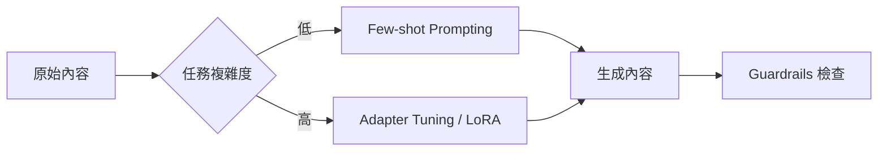

# 風格轉移

在軟體架構中，我們追求系統的確定性。然而，生成式 AI 的輸出本質上是隨機的 (Stochastic)，這使得維護品牌一致性或確保內容符合特定受眾的閱讀水準變得極具挑戰。單純靠提示詞工程 (Prompt Engineering) 往往過於脆弱且不可靠。**風格轉移 (Style Transfer)** 模式透過展示「輸入-輸出對」的範例，教導模型將現有內容轉換為目標語氣，這比單純的文字指令更能捕捉細微的風格特徵。

---

### 情境 1：優先使用「少樣本學習 (Few-shot)」而非「零樣本指令 (Zero-shot)」來定義語氣

#### 核心概念簡述
當你需要模型模仿特定 tone (如將專業筆記轉化為正式郵件) 時，單純告訴模型「語氣要正式」通常不夠，因為每家公司的「正式」定義不同。Few-shot 學習是一種「上下文工程 (Context Engineering)」，透過在提示詞中加入 1 到 10 個轉換範例，引導模型學會模式識別，從而生成更符合預期的結果。

#### 程式碼範例（Bad vs. Better）

```python
# ❌ Bad: 零樣本 (Zero-shot) 指令，過於依賴模型的直覺，結果不穩定且缺乏格式規範
prompt = "請將以下筆記改寫為正式郵件：{notes}" #

# ✅ Better: 少樣本 (Few-shot) 學習，明確展示轉換邏輯與占位符規範
prompt = """
將筆記轉換為正式郵件。
範例 1：
輸入：需要會議紀錄。截止日期明天。
輸出：主旨：請求會議紀錄。您好 {name}，我們需要明天的會議紀錄。謝謝。

範例 2：
輸入：{notes_input}
輸出：
""" #
```

#### 底層原理探討與權衡
*   **為什麼有效 (Rationale)**：模型會優先注意提示詞上下文中的資訊 (即 Priming 效應)。Few-shot 就像是在給模型「釣魚的方法」，讓它學會如何處理語法結構與特殊占位符。
*   **權衡 (Trade-offs)**：增加範例會消耗寶貴的上下文視窗 (Context Window) Token，增加推理延遲與成本。此外，如果範例過多或彼此矛盾，可能會「搞混」模型，導致輸出品質下降。

---

### 情境 2：對於高流量或複雜任務，將風格邏輯封裝至「適配器微調 (Adapter Tuning)」

#### 核心概念簡述
如果轉換邏輯涉及大量的領域術語或細膩的品牌規則 (如將學術論文改寫為行銷手冊)，Few-shot 的上下文空間將難以負荷。此時應採用適配器微調 (通常是 LoRA)，在凍結基礎模型權重的同時，訓練極小的 add-on 層，將「風格」固化在模型參數中。

#### 比較與整合表：風格轉移技術選型

| 特性         | Few-shot Learning      | Adapter Tuning (LoRA)                  |
| :----------- | :--------------------- | :------------------------------------- |
| **資料需求** | 1 - 10 筆範例          | 100 - 10,000 筆範例                    |
| **執行開銷** | 推理時 Token 成本較高  | 模型載入與管理開銷，推理 Token 少      |
| **精準度**   | 中等，受限於提示詞長度 | 高，可學習深層術語對應                 |
| **靈活性**   | 高，隨改隨測           | 較低，需重新訓練與部署                 |
| **適用場景** | 快速原型、簡單語氣切換 | 生產環境、特定品牌風格固化、長文本處理 |

#### 風格轉移處理流程圖



---

### 更多說明：跨模態應用

風格轉移不限於文字。在圖像生成中，我們可以透過「深度圖 (Depth Map)」作為控制影像 (Control Image)，來引導擴散模型 (Stable Diffusion) 在保留空間結構的同時轉移藝術風格。

---

### 延伸思考

**1️⃣ 問題一**：風格轉移是否會導致事實性資訊遺失？

**👆 回答**：會。特別是在過度中性化或過度修飾的情況下，核心資訊可能被淹沒。應考慮結合 **RAG**，確保轉移後的內容依然與原始事實掛鉤，或使用 **LLM-as-Judge** 來驗證事實忠實度。

---

**2️⃣ 問題二**：如何處理「我不知道如何寫範例」的情況？

**👆 回答**：可使用 **逆向中性化 (Reverse Neutralization)**。先讓強大模型將現有的風格化內容轉為「中性表述」，再將此對應關係翻轉，作為微調數據集來訓練你的風格化模型。

---

**3️⃣ 問題三**：大模型與小模型在風格轉移上的表現差異？

**👆 回答**：參數越大的模型越能從少數範例中歸納規律。如果必須使用 **小模型 (SLM)** 進行生產部署，通常建議先利用大模型 (如 GPT-4o 或 Gemini Pro) 產生大量的高品質風格對照數據，再透過 **蒸餾 (Distillation)** 與 **微調** 將能力轉移給小模型。