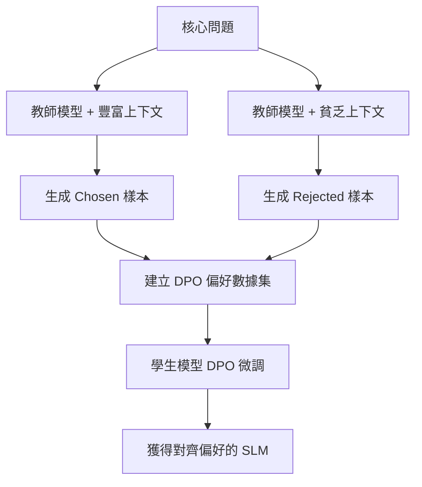

# 內容優化與 DPO 偏好學習

在軟體架構中，我們習慣於定義明確的規則與單元測試。然而，當任務涉及「內容好壞」這類主觀判斷（如行銷文案、教學說明、或是品牌語氣）時，傳統的 if-else 或正則表達式就會顯得力不從心。身為架構師，我們不應試圖去定義「什麼是好風格」，而是應該建立一套**系統化的偏好學習機制**。**內容優化 (Content Optimization)** 模式與 **DPO (直接偏好優化)** 技術，提供了一種「黑盒優化」的方法：透過告訴模型哪一個結果比另一個更好，讓模型自動學習背後複雜且難以描述的偏好權重。

---

### 情境 1：放棄「手動微調提示詞」，改用「偏好三元組」進行對齊

#### 核心概念簡述
傳統的 A/B 測試需要開發者先假設哪些因子（如段落長度、語氣專業度）會影響成效，這非常耗時且容易遺漏關鍵特質。內容優化模式則不關心「為什麼」某段文字更好，它專注於收集 `(提示詞, 選中項, 捨棄項)` 的三元組數據，並透過 DPO 訓練讓模型在權重層級傾向於輸出「選中項」風格的內容。

#### 程式碼範例（Bad vs. Better）

```python
# ❌ Bad: 依賴人工不斷修改提示詞來猜測人類偏好
# 這種方法無法規模化，且模型輸出的隨機性會讓結果難以預測
prompt = "請寫一個廣告，要專業、簡潔、吸引人，段落不要太長..."

# ✅ Better: 定義符合 DPO 格式的訓練數據集結構
# 讓模型從對比中學習，而非從模糊的指令中猜測
dpo_dataset_example = {
    "prompt": "為一款二手自行車編寫 1-3 句的分類廣告。", # 原始指令
    "chosen": "這台 Specialized 山地車保養極佳，僅使用三年，適合追求性能的騎士。現售 $300，意者請私訊細節。", # 優質輸出
    "rejected": "歡迎來到冒險世界！我們有超棒的自行車，這是我們最新的型號，非常耐用且安全..." # 平庸或錯誤風格的輸出
}
```

#### 底層原理探討與權衡
*   **為什麼有效 (Rationale)**：DPO 直接在模型輸出的機率分佈（Logits）上進行優化。當模型預測「選中項」的機率提高、而「捨棄項」的機率降低時，模型便完成了行為對齊。
*   **權衡**：DPO 不需要複雜的獎勵模型（Reward Model）或強化學習（RL）流程，這使其比傳統的 RLHF 更穩定且計算開銷更低。
*   **拇指法則 (Rule of Thumb)**：當你發現無法用文字精確描述「高品質輸出」的規則，但能輕易判斷「哪一個比較好」時，就是使用 DPO 的最佳時機。

---

### 情境 2：利用「合成偏好數據」解決標註成本高昂的瓶頸

#### 核心概念簡述
獲取大量高品質的人工標註數據既慢又貴。我們可以透過「程式化控制變因」來生成合成數據（Synthetic Data）：例如，給模型「豐富的上下文」生成一個答案（預期為好），再給模型「貧乏的上下文」生成另一個答案（預期為壞）。這讓我們能以機器規模自動產生訓練數據集。

#### 數據生產流程圖 (Mermaid)



#### 程式碼範例（Better: 程式化生成偏好對）

```python
# ✅ 利用變因控制自動標註數據
def generate_preference_pair(query, rich_context, poor_context):
    # 用高品質資料生成 Chosen
    chosen_output = teacher_llm.generate(query, context=rich_context)
    # 用低品質資料生成 Rejected
    rejected_output = teacher_llm.generate(query, context=poor_context)

    return {
        "prompt": query,
        "chosen": chosen_output,
        "rejected": rejected_output
    }
```

#### 底層原理探討與權衡
*   **為什麼有效 (Rationale)**：這種方法利用了「資訊不對稱」。由於我們知道輸入的品質差異，因此可以安全地假設輸出的品質也會有對應的優劣關係。
*   **適用場景**：特別適用於 RAG 系統、摘要任務或格式轉換。

---

### 更多說明：內容優化架構對比

| 特性           | 傳統 A/B 測試           | 監督式微調 (SFT)           | DPO 內容優化              |
| :------------- | :---------------------- | :------------------------- | :------------------------ |
| **核心目標**   | 尋找最佳提示詞 (Prompt) | 模仿給定範本的文字         | 對齊人類的偏好選擇        |
| **所需數據**   | 不同 Prompt 的點擊率    | 高品質的示範樣本           | 「好」與「壞」的對照組    |
| **優化靈活性** | 低 (需手動定義因子)     | 中 (受限於範本多樣性)      | **高 (從比較中自動學習)** |
| **實作位置**   | 前端提示詞工程          | 模型後訓練 (Post-training) | 模型權重更新              |

---

### 延伸思考

**1️⃣ 問題一**：DPO 是否會導致模型喪失「創意」或產生「模式崩潰 (Mode Collapse)」？

**👆 回答**：會。如果 DPO 的偏好信號過於單一（例如總是偏好較短的答案），模型可能會過度擬合 (Overfitting)，導致回答變得枯燥或風格單一。架構師應在訓練中加入「多維度評估指標 (Pattern 17)」，並確保 Rejected 樣本不僅是錯誤的，也應包含那些「對但風格不對」的案例。

---

**2️⃣ 問題二**：如何評估 DPO 是否真的「改善」了業務成效？

**👆 回答**：應採用「ROI 測量管線 (ROI Measurement Pipeline)」。這不只是看模型的 Loss 曲線，而是將模型 telemetry（如任務完成率）與外部業務指標（如客服退貨率降低、點擊率提升）結合。只有能量化的業務增長，才能證明偏好對齊的成功。

---

**3️⃣ 問題三**：對於小模型 (SLM)，DPO 的效果是否顯著？

**👆 回答**：非常顯著。透過 Evol-Instruct 生成複雜指令與偏好數據，訓練後的 1B 參數模型在特定任務（如業務戰略分析）上的表現甚至能超越未經特化的旗艦級模型（如 Claude Sonnet）。這證明了「專業化的數據」對小模型的價值遠勝於模型的規模。