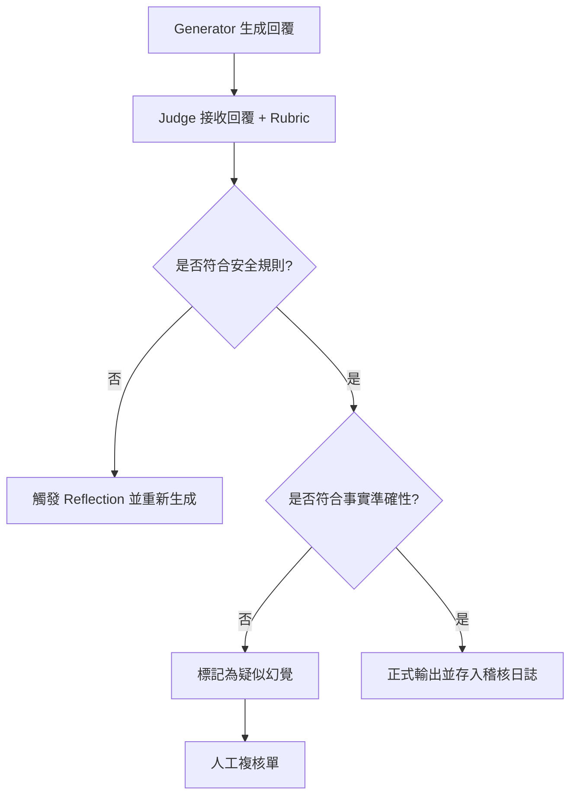

# LLM 作為裁判

在軟體工程中，我們有一句名言：「如果你無法衡量它，你就無法改進它。」對於生成式 AI 而言，傳統的評估指標（如 BLEU 或 ROUGE）僅能測量字詞重疊，卻無法理解邏輯、語氣或業務正確性。作為架構師，我們不能依賴「感覺（Vibe Check）」來部署系統。**LLM-as-Judge** 模式透過將高性能模型（如 GPT-4o 或 Gemini Pro）轉化為自動化質檢員，為非結構化的 AI 產出提供了結構化、可量化的評核標準。

---

### 情境 1：優先定義「多維度評分規準 (Rubric)」而非模糊的整體評價

#### 核心概念簡述
當我們要求 LLM 僅給出「好或壞」的評價時，結果往往極其不穩定且缺乏指導意義。高品質的評估體系應將「質量」拆解為多個獨立維度（如事實準確性、格式遵循、安全性），並為每個維度定義具體的校準標準（Calibration）。這就像從「這份程式碼不錯」轉變為「這份程式碼符合 SOLID 原則，且圈複雜度低於 10」。

#### 程式碼範例（Bad vs. Better）

```python
# ❌ Bad: 模糊的評價，模型容易給出無意義的高分
prompt = "請評價以下客服對話的回覆品質，給 1-10 分並說明原因。"

# ✅ Better: 結構化規準評估 (Rubric-based Evaluation)
# 強制模型針對特定維度進行檢驗
evaluation_rubric = {
    "事實一致性": "1:包含虛假資訊; 5:所有陳述皆有 RAG 文檔支持",
    "專業語氣": "1:過於隨意或冒犯; 5:專業、冷靜且符合品牌形象",
    "解決方案完整度": "1:未回答核心問題; 5:提供了完整的操作步驟"
}

prompt = f"""
你是一位資深品質管理專家。請根據以下規準對客服回覆進行評分：
{evaluation_rubric}

**回覆內容**: {assistant_response}
**參考文檔**: {retrieved_context}

請以 JSON 格式回傳評分與每項得分的具體證據。
"""
```

#### 底層原理探討與權衡
*   **為什麼有效 (Rationale)**：LLM 在處理具體指令時表現更好。明確的規準（Rubric）能減少模型的「寬大效應（Leniency Bias）」，即模型傾向於給出平均偏高的分數。
*   **權衡**：多維度評估會消耗更多 token 且增加延遲。在生產環境監控中，可以採樣 10% 的數據進行深度評估，而非全量評估。

---

### 情境 2：實施「裁判與執行者分離」以消除自我偏差 (Self-Bias)

#### 核心概念簡述
研究表明，LLM 傾向於為自己產生的內容打高分，這稱為「自我偏差（Self-Bias）」。在架構設計上，評估者（Judge）的性能必須優於或至少與執行者（Generator）異構。例如，使用 Gemini Flash 生成內容，但使用 Gemini Pro 或 GPT-4o 作為裁判。

#### 比較與整合表：評估技術選型

| 特性         | 傳統指標 (BLEU/ROUGE) | 人類專家評估         | LLM-as-Judge                    |
| :----------- | :-------------------- | :------------------- | :------------------------------ |
| **可擴展性** | 極高 (毫秒級)         | 極低 (昂貴且慢)      | **高 (可並行自動化)**           |
| **理解深度** | 無 (僅字詞匹配)       | 深 (具備上下文意識)  | **中高 (具備語義理解)**         |
| **一致性**   | 100% (確定性)         | 低 (主觀偏差大)      | **中 (受 Prompt 與 Seed 影響)** |
| **適用場景** | 翻譯、簡單摘要        | 最終驗收、高風險決策 | **CI/CD、回歸測試、模型比對**   |

---

### 情境 3：針對關鍵決策採用「二進位 (Binary) 判定」以提升一致性

#### 核心概念簡述
如果評分刻度太細（如 1-100），裁判的一致性會大幅下降。拇指法則（Rule of Thumb）建議：對於自動化決策（如：是否攔截該輸出），應要求裁判僅給出「YES/NO」或「PASS/FAIL」。

#### 流程圖：自動化質檢工作流



---

### 情境 4：利用 Google ADK Evaluate 實現自動化回歸測試 (google_adk_evaluate)

#### 核心概念簡述
在 Agent 開發生命週期中，最令人頭痛的是「修正一個 Bug 卻引發另外三個 Bug」。Google ADK 提供了一套標準化的評估框架，允許開發者定義 `EvalSet`（包含預期路徑與結果的測試集），並透過 `AgentEvaluator` 進行自動化驗證。這將「LLM 作為裁判」的概念從單純的 Prompt 技巧轉化為 CI/CD 流程中的品質門檻。

#### 程式碼範例（Bad vs. Better）

```python
# ❌ Bad: 依賴人工手動測試 (Vibe Check) 或寫死字串比對
# 這種方式無法檢測工具呼叫順序 (Trajectory) 是否正確
def test_agent_manually():
    response = agent.run("幫我開啟臥室燈")
    assert "已開啟" in response  # 脆弱的斷言，且未檢查底層工具是否真的被呼叫

# ✅ Better: 使用 Google ADK 的 EvalSet 與 AgentEvaluator 進行結構化測試
# 定義測試案例 (evaluation.test.json)
test_case = {
  "eval_id": "light_on_test",
  "conversation": [{
    "user_content": {"parts": [{"text": "關掉臥室的 device_2"}]},
    "final_response": {"parts": [{"text": "我已將 device_2 狀態設置為關閉。"}]},
    "intermediate_data": {
      "tool_uses": [{
        "name": "set_device_info",
        "args": {"location": "Bedroom", "device_id": "device_2", "status": "OFF"}
      }]
    }
  }]
}

# 在 pytest 中執行評估
from google.adk.evaluation.agent_evaluator import AgentEvaluator

@pytest.mark.asyncio
async def test_with_adk_evaluator():
    await AgentEvaluator.evaluate(
        agent_module="home_automation_agent",
        eval_dataset_file_path_or_dir="path/to/evaluation.test.json",
        # 設定評估標準：要求工具軌跡 100% 匹配，回應相似度達 0.8
        config={"criteria": {"tool_trajectory_avg_score": 1.0, "response_match_score": 0.8}}
    )
```

#### 底層原理探討與權衡
*   **為什麼有效 (Rationale)**：ADK 的 `tool_trajectory_avg_score` 解決了 Agent 評估中最核心的問題——**軌跡驗證 (Trajectory Validation)**。它不僅看最終輸出，還檢查 Agent 達成目標的「過程」是否正確（例如：是否先調用了身份驗證工具才進行轉帳）。
*   **權衡**：維護 `EvalSet` 需要額外成本。當 Agent 的工具定義發生劇烈變動時，測試案例也需要同步更新。建議針對「高頻率且高風險」的核心工作流程（Golden Paths）優先建立 `EvalSet`。

#### 更多說明
*   **ADK 評估標準決策指南**

| 評估維度 | 建議指標 | 適用場景 |
| :--- | :--- | :--- |
| **路徑正確性** | `tool_trajectory_avg_score` | 流程驗證、高精度任務、CI/CD |
| **字詞重疊度** | `response_match_score` | 摘要、簡單 QA、回歸測試 |
| **語義等效性** | `final_response_match_v2` | 問答系統（LLM 裁判） |
| **安全與幻覺** | `safety_v1` / `hallucinations_v1` | 對外開放之生產環境服務 |

---

### 拇指法則 (Rule of Thumb)
1.  **溫度設為零**：進行評估時，`temperature` 必須設為 0 以確保評分的可重複性（Repeatability）。
2.  **避免長度偏誤**：LLM 裁判容易偏好較長的回覆。應在規準中加入「簡潔度」指標，或明確指示裁判忽略長度因素。
3.  **異構模型驗證**：若預算允許，採用「LLM 陪審團（LLM-as-Jury）」模式，取三個異構模型的投票結果（如 GPT + Claude + Gemini），能顯著提高穩定性。

---

### 延伸思考

**1️⃣ 問題一**：如果裁判模型本身也會幻覺，該如何信任它？

**👆 回答**：這就是為什麼需要「參考答案（Reference Answer）」或「黃金數據集（Golden Dataset）」。評估時應提供「正確答案」作為參考，讓裁判模型進行對比評分，而非讓它憑空想像標準。同時，定期對裁判的評分結果進行「人機一致性（Human-AI Alignment）」抽檢。

---

**2️⃣ 問題二**：LLM-as-Judge 是否能完全取代人類 QA 團隊？

**👆 回答**：不能。LLM-as-Judge 的定位是「第一線過濾器」與「回歸測試加速器」。它能處理 90% 的常規檢查，但對於涉及複雜道德判斷、新型攻擊向量或極度細微的品牌情感，仍需由人類專家進行基準設定與終端審核。

---

**3️⃣ 問題三**：在 CI/CD 中使用 LLM-as-Judge 成本過高怎麼辦？

**👆 回答**：實施分層評估策略：
1. 第一層：使用正則表達式或傳統小模型（如 BERT）檢索格式錯誤（極低成本）。
2. 第二層：使用小型化模型（SLM, 如 Llama-8B 或 Gemma-2B）進行初步邏輯檢核。
3. 第三層：僅對邊界案例或高風險任務調用高性能模型作為「終審裁判」。