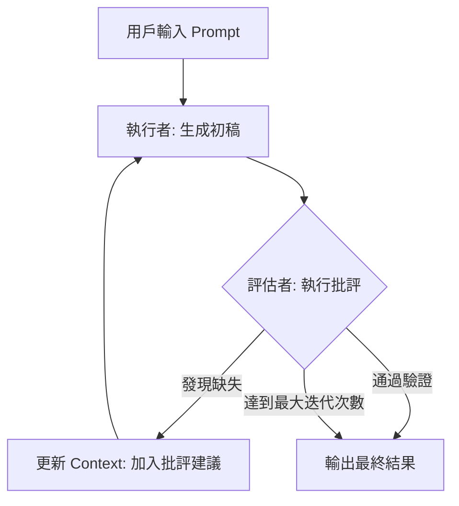

# 反思模式

在傳統的分層架構中，我們依賴單元測試與集成測試來捕捉錯誤。但在生成式 AI 的領域，輸出是隨機且不可預測的 (Stochastic)。一個資深的架構師不應該指望模型在「單次呼叫」中就達到完美。**反思模式 (Reflection)** 是一種代理 (Agentic) 設計模式，它模擬了人類的審核機制：讓系統在回覆用戶之前，先進行「自我批評」與「迭代修正」。這將原本脆弱的單次預測，轉化為具備魯棒性的自我進化流程。

---

### 情境 1：建立「評估-修正」的封閉迴路以提升輸出穩定性

#### 核心概念簡述
當我們透過 API 呼叫模型時，過程通常是無狀態的 (Stateless)。如果模型輸出了錯誤的代碼或不符合規範的格式，系統會直接崩潰。反思模式要求我們不直接返回第一次生成的結果，而是將其交給一個「評估者 (Evaluator)」。評估者不只給分數，更重要的是提供具體的「批評 (Critique)」，解釋哪裡做得不好，並引導模型進行第二次生成。

#### 程式碼範例（Bad vs. Better）

```python
# ❌ Bad: 單次呼叫，風險極高。模型若產生邏輯錯誤或幻覺，系統將直接採用。
def generate_code_bad(task_prompt):
    return llm.call(task_prompt) # 直接返回，缺乏校驗

# ✅ Better: 實作反思迴路。引入 Critique 階段，讓模型針對批評進行修正。
def generate_code_with_reflection(task_prompt, max_iterations=2):
    # 1. 初始生成
    response = llm.call(task_prompt)

    for i in range(max_iterations):
        # 2. 評估與批評 (使用特定的評分規準)
        critique = evaluator_llm.call(f"分析以下輸出的錯誤並提供修正建議：{response}")

        # 檢查是否達到品質門檻 (例如：分數 > 0.9 或 無語法錯誤)
        if is_perfect(critique):
            break

        # 3. 根據批評進行重構 (Apply Criticism)
        response = llm.call(f"原始任務：{task_prompt}\n前回輸出：{response}\n修正建議：{critique}")

    return response
```

#### 底層原理探討與權衡
*   **為什麼有效 (Rationale)**：對於開放性任務，預先規劃所有步驟非常困難。反思模式允許模型「先做一遍，再看哪裡錯了」，這比單純增加提示詞長度更能有效處理複雜邏輯。
*   **權衡 (Trade-offs)**：反思會顯著增加延遲 (Latency) 與 Token 成本。在實戰中，你必須根據業務價值來調整「反思深度」。例如，自動修復生產環境代碼值得進行多次反思，但簡單的聊天機器人則不需要。
*   **拇指法則**：當任務具備「易於驗證、難於生成」的特性（如代碼編寫、邏輯證明）時，反思模式是首選。

---

### 情境 2：實施「異構模型評估」以消除自我偏差 (Self-Bias)

#### 核心概念簡述
研究表明，LLM 傾向於對自己產生的內容給予過高的評價，這稱為「自我偏差」。作為架構師，我們必須確保評估過程的客觀性。最佳實踐是讓一個更強大（或不同廠商）的模型擔任「裁判」，而讓成本較低的模型擔任「執行者」。這不僅能提升品質，還能優化成本結構。

#### 比較與整合表：評估者選型

| 評估者類型 | 優點 | 缺點 | 適用場景 |
| :--- | :--- | :--- | :--- |
| **同質模型 (Self)** | 實作最簡單、速度快 | 容易產生自我偏誤，無法發現深層邏輯錯誤 | 簡單格式檢查、快速原型 |
| **異構模型 (LLM-as-Judge)** | 較客觀，能發現執行者的盲點 | 增加系統複雜度與網路延遲 | 品牌風格一致性審核、創意內容批評 |
| **外部工具 (如 Compiler)** | 100% 確定性，無幻覺 | 僅限於可程式化驗證的領域 | 代碼生成、數學計算、SQL 查詢驗證 |

---

### 更多說明

#### 反思模式工作流圖 (Mermaid)



---

### 情境 3：善用 Google ADK 的「評估-修正」外掛實作自動化修復

#### 核心概念簡述
在分散式的 Agent 系統中，手動實作 `while` 迴圈來進行反思會使程式碼變得臃腫。Google ADK 提供了 `ReflectAndRetryToolPlugin`，這是一種聲明式 (Declarative) 的反思機制。它能自動監控工具調用的狀態，當發現錯誤（如參數幻覺、 API 失敗）時，自動將錯誤訊息回傳給模型，引導其「反思」並重新嘗試。這將反思邏輯從業務流程中抽離，實現了「橫切關注點 (Cross-cutting Concerns)」的自動化處理。

#### 程式碼範例（Bad vs. Better）

```python
# ❌ Bad: 在業務邏輯中手動處理重試與反思，導致邏輯混亂且難以維護。
def call_weather_tool(location):
    for attempt in range(3):
        try:
            result = weather_api(location)
            if result.get("error"):
                raise ValueError(result["error"])
            return result
        except Exception as e:
            # 手動構建反思提示詞
            location = llm.call(f"工具失敗：{e}，請修正參數後重試")
    return "Failed"

# ✅ Better: 使用 ADK 的 ReflectAndRetryToolPlugin。
# 透過外掛程式自動攔截錯誤並引導模型修正，業務邏輯保持純淨。
from google.adk.apps.app import App
from google.adk.plugins import ReflectAndRetryToolPlugin

# 1. 定義具備自我修復能力的 App
app = App(
    name="SmartAssistant",
    root_agent=weather_agent,
    plugins=[
        # 設定最大反思重試次數，ADK 會自動將 Traceback 餵回模型
        ReflectAndRetryToolPlugin(max_retries=3),
    ],
)

# 2. 業務調用只需關注正常路徑
response = app.run("查詢台北的天氣")
```

#### 底層原理探討與權衡
*   **為什麼有效 (Rationale)**：`ReflectAndRetryToolPlugin` 利用了 ADK 的事件總線 (Event Bus) 機制。當工具執行拋出異常時，外掛會攔截該事件，並將「錯誤軌跡 (Error Trajectory)」包裝成一條特殊的系統訊息發送回模型。這比手動編寫 `try-except` 更能保證「上下文的一致性」，因為外掛會確保模型知道是「哪個工具」在「什麼參數」下失敗了。
*   **權衡 (Trade-offs)**：自動重試可能隱藏系統性的 API 錯誤。如果 API 是因為配額耗盡 (Quota Exceeded) 而失敗，模型再怎麼反思也無法解決。因此，建議針對不同類型的錯誤定義自定義的 `extract_error_from_result` 行為。
*   **適用場景**：特別適用於「對工具參數敏感」的場景（如 SQL 查詢、精確 API 呼叫）。

#### 更多說明

| 反思策略 | 實作複雜度 | 靈活性 | 適用範圍 |
| :--- | :--- | :--- | :--- |
| **手動迴圈 (Manual Loop)** | 高 | 極高 | 需要複雜條件判斷的長程任務 |
| **ADK 外掛 (Plugin-based)** | 低 | 中 | 標準工具調用、快速修復參數幻覺 |
| **多 Agent 協作 (Multi-agent)** | 極高 | 高 | 涉及跨領域知識的內容審核 |

---

### 延伸思考

**1️⃣ 問題一**：如果評估者的批評本身就是錯誤的（評估者幻覺），該怎麼辦？

**👆 回答**：這會導致模型陷入「負面循環」。解決方案是實施 **R5 模型中的 "Reference" 原則**：要求評估者在批評時必須引用外部事實或 RAG 文檔。如果評估者無法舉出證據，則不觸發修正迴路。

---

**2️⃣ 問題二**：如何防止反思迴路陷入無限循環？

**👆 回答**：必須設定顯式的「終止條件 (Stopping Criteria)」。除了設定 `max_iterations` 外，架構上應引入「狀態檢測」，如果連續兩次反思的內容差異度極低（Cosine Similarity 過高），則判定為陷入局部最優解，應立即終止並改為「請求人類介入 (Agent Calls Human)」。

---

**3️⃣ 問題三**：在代碼生成場景中，反思模式與傳統的 TDD 有什麼結合點？

**👆 回答**：這就是 **"Code-Then-Execute" 模式**。我們可以讓執行者編寫代碼，評估者不再是 LLM，而是「單元測試運行器」。將編譯錯誤或測試失敗的 Traceback 回傳給 LLM 進行反思修正，這比純文字的自我批評更具備工程嚴謹性。