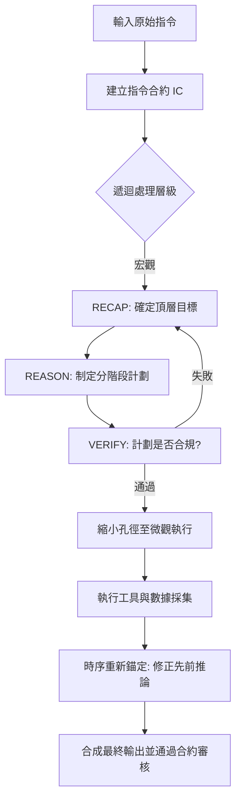

# 分形思維鏈

在軟體工程中，我們知道單一龐大的函數（Monolithic Function）是維護的噩夢。傳統的思維鏈（CoT）就像是這類函數：它試圖在一個長線性路徑中完成所有推理。然而，當任務涉及複雜的多步驟業務流程（如貸款審核）時，CoT 容易產生「目標偏移 (Goal Drift)」與「迷失在中間 (Lost in the Middle)」的現象。身為架構師，我們引入 **分形思維鏈 (Fractal Chain-of-Thought, FCoT)**，這是一種遞迴式的推理框架，將推理節點拆解為可自校正的「微型循環」，確保每一個決策點都經過嚴格的合約校驗。

---

### 情境 1：優先使用「合約化遞迴循環」而非「線性指令堆疊」

#### 核心概念簡述
當模型在執行長任務時，後面的步驟往往會遺忘最初的約束。FCoT 透過定義「指令合約 (Instruction Contract, IC)」與「遞迴循環 (Recursive Loop)」來解決此問題。每個推理節點不只是輸出結果，而是必須遵循 **RECAP（回顧）-> REASON（推理）-> VERIFY（驗證）** 的固定結構。這就像是在代碼中加入強型別檢查與單元測試，確保邏輯不會隨著長度增加而腐化。

#### 程式碼範例（Bad vs. Better）

```python
# ❌ Bad: 線性指令堆疊 (Standard CoT)
# 容易在處理到一半時遺忘「必須檢查收入證明」的硬性約束
prompt = """
你是一位貸款審核員。
請檢查文檔、跑信用報告、評估風險並給出決定。
最後請確保符合貸款條例。
"""

# ✅ Better: 分形思維鏈 (FCoT) 指令結構
# 強制執行三階段遞迴：計劃、執行、驗證
prompt = """
### 1. 指令合約 (INSTRUCTION CONTRACT)
- 任務：自動化貸款申請流程。
- 硬性約束：必須遵循公平借貸法規；拒絕任何推測性數據。

### 2. FCoT 遞迴循環 (N = 3)
每個處理階段必須包含以下步驟：
- RECAP: 重述當前任務目標與已驗證的數據。
- REASON: 針對當前目標進行邏輯推理。
- VERIFY: 根據指令合約進行自我審計，檢查是否有邏輯偏離或約束違反。

Iteration 1 (Planning): 規劃任務的 DAG (有向無環圖) 行動路徑。
Iteration 2 (Execution): 執行工具調用 (信用分、風險評估)。
Iteration 3 (Verification): 總結 SHAP 解釋值，產出可審計的最終報告。
"""
```

#### 底層原理探討與權衡
*   **為什麼有效 (Rationale)**：FCoT 將推理過程「分形化」。每一個節點（Node）都變成一個獨立的推理單元，具備自己的目標與驗證邏輯。這種結構化思維強制模型在「動手」前先「計劃」，並在「結束」前先「審核」，大幅提升了高風險任務的精確度。
*   **權衡**：FCoT 會顯著增加輸出的 Token 數量與延遲，因為模型需要產生大量的「內部對話」。
*   **拇指法則**：當任務步驟超過 3 步，或包含不可違反的法律/品牌約束時，應使用 FCoT。

---

### 情境 2：利用「上下文孔徑 (Context Aperture)」進行多層次顆粒度分析

#### 核心概念簡述
分形思維的精髓在於自相似性。FCoT 允許模型動態地調整其「上下文孔徑」，在宏觀 (Macro)、中觀 (Meso) 與微觀 (Micro) 之間縮放。這在處理長篇研究報告或複雜系統診斷時至關重要，讓模型能夠先看到森林（整體架構），再看到樹木（具體邏輯節點）。

#### 更多說明 (流程與比較)

#### FCoT 內部推理流程圖



#### 技術對比表

| 特性            | 標準思維鏈 (CoT)                      | 分形思維鏈 (FCoT)                  |
| :-------------- | :------------------------------------ | :--------------------------------- |
| **邏輯結構**    | 單向線性路徑                          | 遞迴嵌套循環                       |
| **容錯機制**    | 失敗即終止或重來                      | 節點級別自我修正 (Self-Correction) |
| **約束 recall** | 隨長度增加而衰減 (Lost in the middle) | 透過 Persistent Anchoring 持續存在 |
| **適用場景**    | 簡單數學、簡短問答                    | 貸款審核、法規合規、複雜軟體架構   |
| **資訊回溯**    | 僅能追加資訊                          | 支援「時序重新錨定」修正過去結論   |

---

### 情境 3：利用 Google ADK 的 `LoopAgent` 與 `ReflectAndRetry` 實現硬體級的分形韌性

#### 核心概念簡述
在分散式系統或複雜 Agent 工作流中，單純的 Prompting 往往不足以保證執行成功。FCoT 的「自校正循環」可以透過 Google ADK 的實體組件進行實作。藉由 `LoopAgent` 建立外層推理循環，並配合 `ReflectAndRetryToolPlugin` 在工具呼叫層級進行微觀修正，我們能建構出一個具備「分形韌性」的系統，確保每一層級的失敗都能在當前層級被消化或修正。

#### 程式碼範例（Bad vs. Better）

```python
# ❌ Bad: 依賴單次 LLM 呼叫處理複雜邏輯 (缺乏結構化循環)
# 如果工具呼叫失敗，LLM 可能會產生幻覺或直接崩潰
def process_task():
    response = llm.generate("請分析數據並調用 A 工具，若失敗則嘗試 B")
    # 邏輯脆弱，無法應對多層次的執行錯誤

# ✅ Better: 使用 Google ADK 的 LoopAgent 與 Plugin 實現 FCoT
# 將「反思與重試」內化為系統架構的一部分
from google.adk.apps.app import App
from google.adk.agents import LlmAgent, LoopAgent
from google.adk.plugins import ReflectAndRetryToolPlugin

# 1. 定義具備自我修正能力的插件 (微觀循環)
retry_plugin = ReflectAndRetryToolPlugin(max_retries=3)

# 2. 定義子代理：分別負責執行與審核 (中觀循環)
executor_agent = LlmAgent(name="Executor", tools=[data_analysis_tool])
verifier_agent = LlmAgent(name="Verifier", instructions="審核 Executor 的輸出，若不合規請指出錯誤")

# 3. 使用 LoopAgent 封裝 FCoT 邏輯 (宏觀循環)
f_cot_loop = LoopAgent(
    sub_agents=[executor_agent, verifier_agent],
    max_iterations=3,
    # 當 verifier 認為滿意時，透過工具或標誌終止
)

app = App(
    name="Fractal_Resilient_Agent",
    root_agent=f_cot_loop,
    plugins=[retry_plugin] # 插件作用於所有工具呼叫，提供底層保護
)
```

#### 底層原理探討與權衡
*   **為什麼有效 (Rationale)**：這種做法將 FCoT 從「純 Prompt 技巧」提升到了「架構設計模式」。`ReflectAndRetry` 處理了**工具層級 (Micro)** 的非預期錯誤（如 API 逾時或參數錯誤），而 `LoopAgent` 處理了**邏輯層級 (Macro)** 的不一致性。這形成了一種遞迴的錯誤處理機制，每一層都負責自己的 `VERIFY` 與 `REASON`。
*   **權衡**：過度使用 `LoopAgent` 可能導致「推理死迴圈」或昂貴的計算成本，因此必須嚴格設定 `max_iterations` 與明確的退出條件（Escalation）。
*   **拇指法則**：當你的 Agent 需要操作具有副作用的外部系統（如資料庫寫入、雲端資源部署）時，應強制使用此模式。

#### FCoT 韌性階層表

| 階層 | ADK 實現組件 | FCoT 對應階段 | 職責 |
| :--- | :--- | :--- | :--- |
| **微觀 (Micro)** | `ReflectAndRetryPlugin` | 工具執行驗證 | 處理 API 錯誤、參數修正、連線重試。 |
| **中觀 (Meso)** | `LlmAgent` + Prompt | RECAP / REASON | 執行具體子任務，維護當前步驟的上下文。 |
| **宏觀 (Macro)** | `LoopAgent` | 遞迴循環控制 | 協調多個 Agent，確保全局任務目標不偏離。 |

---

### 延伸思考

**1️⃣ 問題一**：FCoT 中的「時序重新錨定 (Temporal Re-grounding)」具體解決什麼問題？

**👆 回答**：在處理多重資訊來源時（例如多個 Agent 的研究報告），早期的推論可能會因後期新證據的出現而失效。FCoT 允許模型「正式修補」過去的結論（例如：將原有的材料建議修正為因濕度考量而不適用），而不是簡單地在後面疊加補充說明，這確保了最終決策的邏輯連貫性。

---

**2️⃣ 問題二**：如何評估 FCoT 是否真的在運作，而不是模型在「假裝」思考？

**👆 回答**：必須啟用 ADK 或 LangSmith 的 **「Thoughts (內部 monologue)」透明化功能**。透過檢查 `VERIFY` 步驟中模型是否真的抓出了初稿中的漏項（例如遺漏了「人工覆核」的可行性），我們可以量化 FCoT 的實質貢獻。

---

**3️⃣ 問題三**：FCoT 與「反思模式 (Reflection)」有何不同？

**👆 回答**：反思模式通常是「事後」或「全局」的對話層級修正；而 FCoT 是將這種反思能力「內化」到模型生成的**每一個細小推理段落**中。FCoT 更強調推理的原子性和遞迴性。