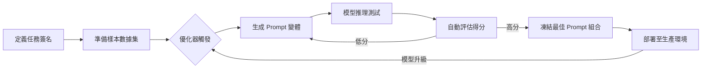
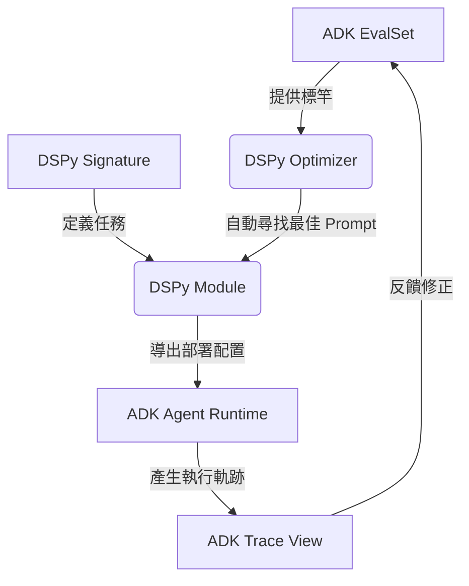

# 提示詞優化

在軟體架構的演進中，我們學到最深刻的一課就是：**硬編碼（Hardcoding）是維護的萬惡之源**。當前的生成式 AI 開發中，許多開發者將長達數頁的提示詞直接寫死在程式碼或配置檔中，這在架構上是極其脆弱的。當底層模型從 GPT-4o 升級到 o1，或從 Gemini Pro 換成 Flash 時，原本精雕細琢的提示詞往往會失效，導致系統行為產生不可預測的偏差。**提示詞優化 (Prompt Optimization)** 模式引入了一個「間接層 (Indirection Layer)」，將提示詞視為可編譯、可優化的程式組件，而非靜態的文字字串。

---

### 情境 1：停止「乞求」模型穩定，改用聲明式簽名定義任務

#### 核心概念簡述
資深工程師在處理複雜系統時，會優先定義介面（Interface）而非實作細節。在 AI 開發中，與其在提示詞中寫滿「請務必回傳 JSON」、「不要加廢話」，不如使用聲明式簽名（Signatures）定義輸入與輸出的結構。透過 DSPy 等框架，我們可以只定義「要做什麼」，而讓優化器去尋找針對特定模型「最有效的說法」。

#### 程式碼範例（Bad vs. Better）

```python
# ❌ Bad: 硬編碼提示詞，與特定模型版本深度耦合
# 如果換了模型，這段長長的描述可能就不適用，且維護困難
def generate_blurb(text):
    prompt = f"你是一個資深行銷，請閱讀以下內容並給出吸引人的摘要，必須包含學習重點，格式要專業...內容如下：{text}"
    return llm.call(prompt)

# ✅ Better: 使用聲明式簽名與優化框架 (以 DSPy 為例)
# 我們定義「任務合約」，提示詞由框架自動生成並優化
import dspy

class BlurbImprovement(dspy.Signature):
    """將書籍初稿轉化為吸引人的行銷文案，提升目標讀者的購買意願。"""
    current_cover = dspy.InputField(desc="書籍的原始介紹內容")
    improved_blurb = dspy.OutputField(desc="優化後、具備行銷張力的文案")
    reasoning = dspy.OutputField(desc="為何這樣改寫的邏輯說明")

# 後續可透過訓練自動尋找最佳 Prompt，而非手動改寫
```

#### 底層原理探討與權衡
*   **為什麼有效 (Rationale)**：這實踐了軟體工程的「間接定理」：所有問題都能透過增加一層間接層來解決。透過將任務邏輯與具體措辭分離，當底層模型升級時，我們只需針對新模型重新運行優化器，系統就能自動生成最適配的新提示詞。
*   **權衡**：初期需要建立評估數據集（Dataset），這比隨手寫一個提示詞更費時。

---

### 情境 2：利用「自動化評估器」驅動提示詞的演進

#### 核心概念簡述
當我們調整代碼時，依賴單元測試；當我們調整提示詞時，卻往往依賴「感覺（Vibe Check）」。提示詞優化模式要求建立一個自動化評估器（Evaluator），針對數據集運作多個提示詞變體，並根據回饋分數挑選最佳者。這將主觀的「微調文字」轉化為客觀的「超參數搜尋 (Hyperparameter Search)」。

#### 比較與整合表：手動調校 vs. 系統化優化

| 特性 | 手動提示詞工程 (Prompt Engineering) | 系統化提示詞優化 (Prompt Optimization) |
| :--- | :--- | :--- |
| **維護成本** | 極高 (模型升級需全面手動重測) | 低 (重新運行優化腳本即可) |
| **可靠性** | 低 (容易因文字微調產生副作用) | 高 (基於數據集的量化結果) |
| **移植性** | 差 (跨模型表現不一) | 強 (自動適配不同 LLM) |
| **開發思維** | 試錯法、文字創意 | 架構設計、數據驅動 |

---

### 更多說明

#### 提示詞優化生命週期



#### 關鍵實踐：Few-shot 自適應優化
不要手寫固定的 Example。優化器可以從樣本庫中動態選擇對目前輸入「最有效」的幾個案例 (Bootstrap Few-shot)，並將其注入提示詞中。這比靜態的 Few-shot 更能應對複雜的輸入分布。

---

### 情境 3：將評估集 (EvalSet) 視為「編譯燃料」而非僅是「測試斷言」

#### 核心概念簡述
在 Google ADK 的架構中，`EvalSet` 通常被視為執行 `adk eval` 時的檢驗標準。但在進階的 Generative AI 開發中，我們應仿效編譯器優化的思維，將這些黃金樣本（Golden Samples）作為優化器的輸入。與其手動調校提示詞直到通過測試，不如讓 DSPy 遍歷 `EvalSet`，自動找出能讓 `tool_trajectory_avg_score` 最大化的提示詞組合。

#### 程式碼範例（Bad vs. Better）

```python
# ❌ Bad: 僅將 EvalSet 用於事後驗證
# 開發者必須不斷手動修改 Prompt 並執行 adk eval，這是一種低效的「人工爬坡」
def manual_iteration():
    prompt = "你是個小助手，請幫我關燈..." # 手動修改
    result = agent.run(prompt)
    # 然後手動執行 adk eval 或 pytest 檢查結果
    # 失敗了再回來改 prompt...

# ✅ Better: 使用 DSPy 將 ADK EvalSet 轉化為訓練數據
import dspy
from google.adk.evaluation import AgentEvaluator

# 1. 載入 ADK 的 EvalSet 作為數據源
eval_set = load_adk_eval_set("home_automation.test.json")
trainset = [dspy.Example(question=e.user_content, answer=e.final_response).with_inputs('question') for e in eval_set]

# 2. 定義優化指標 (對接 ADK 的軌跡評分)
def adk_metric(gold, pred, trace=None):
    # 調用 ADK 內建的軌跡評估邏輯
    score = AgentEvaluator.calculate_trajectory_score(gold.trajectory, pred.trajectory)
    return score > 0.8

# 3. 自動編譯 (優化) Prompt
teleprompter = dspy.teleprompt.BootstrapFewShot(metric=adk_metric)
optimized_app = teleprompter.compile(MyAgentModule(), trainset=trainset)
```

#### 底層原理探討與權衡
*   **為什麼有效 (Rationale)**：這消除了開發者的「提示詞焦慮」。當我們將評估指標與優化過程解耦，開發者的任務從「寫出完美的文字」轉變為「定義高品質的數據與指標」。這符合軟體工程中「數據驅動」的設計準則。
*   **權衡**：自動優化過程可能產生非常冗長的 Few-shot 提示詞，雖然效果好，但會增加 Token 成本與延遲。

---

### 情境 4：封裝推理邏輯於 Module 中，解耦任務意圖與指令措辭

#### 核心概念簡述
物件導向程式設計（OOP）教導我們要「封裝變動性」。在提示詞工程中，最常變動的是「模型的指令措辭」。DSPy 的 `Module` 概念允許我們定義高層次的邏輯流（如 `ChainOfThought` 或 `ReAct`），而將具體的提示詞生成委派給框架。這使得同一個 Agent 邏輯可以無縫切換於 Gemini 1.5 Pro 與 Flash 之間，而不需修改任何一行字串。

#### 比較與整合表：DSPy Module vs. 傳統 Template

| 比較維度 | 傳統 Prompt Template | DSPy Module (聲明式) |
| :--- | :--- | :--- |
| **結構性** | 鬆散的字串拼接 | 強型別的輸入/輸出定義 |
| **可重用性** | 低 (必須針對不同場景複製貼上) | 高 (可組合多個子模組) |
| **跨模型遷移** | 需手動重新調試 (Prompt Engineering) | 自動重新編譯 (Prompt Optimization) |
| **維護性** | 隨著系統複雜度呈指數增長 | 維持線性增長，邏輯清晰 |

#### 更多說明：DSPy 在 ADK 流程中的位置



---

### 延伸思考

**1️⃣ 問題一**：提示詞優化是否意味著我們不再需要了解提示詞技巧（如 CoT 或 Role-playing）？

**👆 回答**：不，正好相反。優化框架（如 DSPy）會將這些技巧作為「編譯模組」來使用。例如，你可以指定一個模組為 `dspy.ChainOfThought`，框架會自動為該步驟尋找最合適的推理步驟模板。你從「手寫模板」轉變為「選擇策略」。

---

**2️⃣ 問題二**：數據集需要多大才能進行有效的優化？

**👆 回答**：根據來源，優化可以在極小規模下開始。甚至只有一個樣本時，也能找到最適合該樣本的 Prompt。對於典型的企業應用，擁有 10 到 50 個高品質的「黃金樣本」就足以讓優化器產生顯著超越手寫 Prompt 的結果。

---

**3️⃣ 問題三**：如果底層模型本身的能力太弱，優化還有用嗎？

**👆 回答**：有用，但有其極限。提示詞優化無法教會模型它原本就不具備的知識（如新的事實），它解決的是「語言對齊」問題。如果小模型無法理解邏輯，優化器可能會傾向於生成極其詳細的 Few-shot 示例來「硬教」模型。對於知識短缺，仍需結合 RAG 模式。

---

**4️⃣ 問題四**：如果我已經有現成的 ADK Agent，轉換到 DSPy 需要重構整個專案嗎？

**👆 回答**：不需要。你可以採取「漸進式重構」。首先將 Agent 中最複雜、最不穩定的提示詞邏輯抽離成 DSPy 的 `Signature`，然後在 ADK 的 `root_agent` 中調用 DSPy 編譯後的結果。這讓你能保留 ADK 強大的工具鏈整合，同時享有 DSPy 的優化能力。
