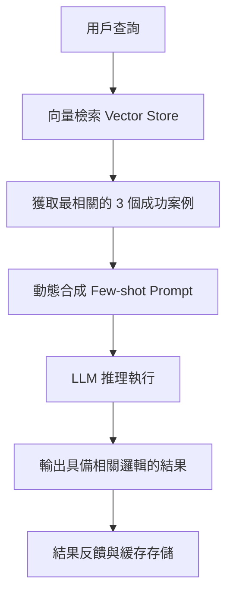

# 少樣本學習

在軟體架構中，我們追求的是「契約（Contract）」與「一致性（Consistency）」。然而，大型語言模型（LLM）本質上是隨機的機率引擎，僅憑單一指令（Zero-shot）往往難以在複雜的業務邏輯中產生精確結果。**少樣本學習（Few-Shot Learning, FSL）** 是一種高效的上下文工程（Context Engineering）技術，透過在提示詞中提供少數幾個（通常為 1 到 10 個）「輸入-輸出對」範例，引導模型識別潛在模式並應用於新任務，而無需修改模型權重。這就像是在開發 API 時提供範例程式碼，讓模型從「模仿」中學會處理邏輯與格式。

---

### 情境 1：利用「少樣本思維鏈」處理具有邏輯偏差的任務 (Few-shot CoT)

#### 核心概念簡述
當模型在處理複雜邏輯（如區分轉機與最終目的地、或特定行業的財務計算）時，簡單的指令容易產生誤判。Few-shot CoT 透過展示「問題 -> 推理步驟 -> 答案」的完整鏈條，教導模型如何執行「思考過程」，而不僅僅是產生最終結果。

#### 程式碼範例（Bad vs. Better）

```python
# ❌ Bad: 僅提供指令，模型容易發生邏輯崩潰，將轉機點誤認為目的地
prompt = "請根據行程判斷行李額度。行程：JFK -> CDG (法國) -> SIN (新加坡)。"

# ✅ Better: 提供 Few-shot 範例展示推理邏輯
# 讓模型學會「識別最後一站」與「查詢對應區域政策」的思維模式
prompt = """
請根據以下範例格式判斷行李額度：

範例 1：
Q: 行程 JFK -> CDG，最終目的地是法國。
A: 步驟 1：識別最終目的地為 CDG (歐洲)。步驟 2：查詢政策，歐洲區額度為 30kg。
結論：30kg

範例 2：
Q: 行程 JFK -> LHR -> SIN，最終目的地是新加坡。
A: 步驟 1：識別最後一站為 SIN (亞洲)。步驟 2：查詢政策，亞洲區額度為 35kg。
結論：35kg

當前任務：
Q: 行程 JFK -> CDG -> SIN，最終目的地是哪裡？行李額度是多少？
A:
"""
```

#### 底層原理探討與權衡
*   **為什麼有效 (Rationale)**：這體現了「給魚吃不如教釣魚」的原則。範例引導模型在生成過程中將注意力集中在關鍵實體上，並建立正確的因果連結。
*   **權衡 (Trade-offs)**：增加範例會消耗寶貴的上下文視窗（Context Window），並增加推理延遲與成本。
*   **拇指法則 (Rule of Thumb)**：如果 Zero-shot 無法解決問題，應優先嘗試加入 3-5 個高品質範例；若超過 10 個範例仍無效，應考慮微調（Fine-tuning）。

---

### 情境 2：強制執行複雜的結構化輸出與佔位符規範

#### 核心概念簡述
在自動化系統中，我們常需要模型輸出特定的 JSON 或帶有佔位符的郵件。少樣本學習能有效統一輸出風格與預留欄位（如 `{name}`），避免模型隨機產生非預期的格式。

#### 程式碼範例（Bad vs. Better）

```python
# ❌ Bad: 乞求式指令 (Begging for compliance)，格式極不穩定
prompt = "請幫我寫一封感謝信給客戶，用 JSON 格式，並包含姓名和日期的佔位符。"

# ✅ Better: 透過範例明確「資料契約 (Data Contract)」
prompt = """
將筆記轉換為正式郵件。
範例 1：
輸入：需要會議紀錄。截止日期明天。
輸出：{"subject": "會議紀錄請求", "body": "您好 {customer_name}，希望能獲得明天的會議紀錄。"}

範例 2：
輸入：購買完成，感謝支持。
輸出：{"subject": "感謝您的購買", "body": "親愛的 {customer_name}，感謝您在 {order_date} 的購買。"}

當前任務：
輸入：{user_input}
輸出：
"""
```

#### 更多說明：技術選型對比表

| 特性           | 零樣本 (Zero-shot) | 少樣本 (Few-shot) | 微調 (Fine-tuning)  |
| :------------- | :----------------- | :---------------- | :------------------ |
| **數據需求**   | 無                 | 1 - 10 筆範例     | 100 - 10,000 筆     |
| **實現速度**   | 極快               | 快                | 慢 (涉及訓練與部署) |
| **邏輯遵循度** | 低                 | 中高              | 極高                |
| **成本/延遲**  | 最低               | 隨範例數量增加    | 單次推理成本低      |

---

### 情境 3：實作動態少樣本學習以處理大規模知識庫 (Dynamic Few-Shot)

#### 核心概念簡述
當業務情境過多，無法在單一提示詞中塞入所有範例時，架構上應採用「動態注入」。先透過向量資料庫檢索出與當前問題最相關的範例，再將其動態插入提示詞中，實現個性化、即時的引導。

#### 處理流程圖



---

### 延伸思考

**1️⃣ 問題一**：少樣本學習是否會造成「過擬合（Overfitting）」？

**👆 回答**：在 FSL 中，風險主要來自於「偏誤（Bias）」而非傳統意義的過擬合。如果範例的格式高度一致（例如範例答案全是「Yes」），模型可能會產生「標籤偏誤」，即使問題不適配也會傾向於回答「Yes」。

---

**2️⃣ 問題二**：當上下文視窗變得極長時，Few-shot 範例會失效嗎？

**👆 回答**：會。這稱為「迷失在中間（Lost in the Middle）」現象。模型對位於提示詞開頭與結尾的範例權重最高。作為架構師，應使用「持久指令錨定 (Persistent Instruction Anchoring)」技術，或將最重要的範例放置在最靠近問題的位置。

---

**3️⃣ 問題三**：如何評估 Few-shot 範例的品質？

**👆 回答**：應採用「黃金數據集（Golden Dataset）」進行自動化回歸測試。透過對比有無範例時模型的「幻覺率」與「任務完成率」指標，數據化地驗證範例對業務邏輯的實質貢獻。只有能量化的改善，才具備工程化的價值。