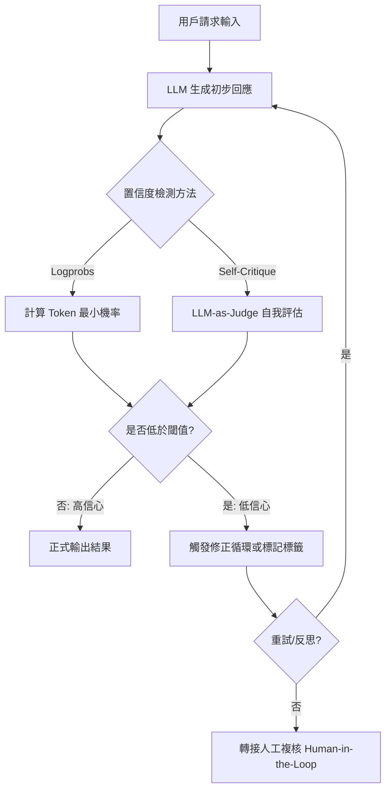

# 自校準 (Self-calibration)

在分散式系統的開發中，我們學到最重要的一課是：**「不要在沒有校驗的情況下傳遞數據」**。對於生成式 AI 而言，最危險的並非模型不知道答案，而是它「充滿自信地胡說八道（Hallucination）」。

**自校準 (Self-calibration)** 是構建高可靠性 AI 服務的防線。它不只是讓模型生成內容，更要求模型具備「元認知（Metacognition）」能力，去量化自身輸出的不確定性並進行自我修正。身為架構師，我們不應盲目信任黑盒輸出，而應在系統中內建「質檢環節」。

---

### 情境 1：優先利用 Token 概率 (Logprobs) 進行客觀置信度評估

#### 核心概念簡述
LLM 本質上是統計規律的機率引擎。當模型對某個 Token 的預測機率極高時，通常代表其訓練數據中有強大支持；反之，若多個候選詞機率相近，模型可能正在「盲猜」。透過讀取底層的 Logprobs，我們可以在不需要額外 LLM 調用的情況下，獲得第一手的置信度指標。

#### 程式碼範例（Bad vs. Better）

```python
# ❌ Bad: 盲目接受模型輸出的所有數值，不論其是否為幻覺
def extract_invoice_amount(image_text):
    # 模型可能會因為圖片模糊而猜測一個數字
    return llm.generate(f"從此文本提取總金額: {image_text}")

# ✅ Better: 實作 Self-Check 模式，檢索關鍵數據點的 Token 概率
def extract_with_confidence(image_text):
    response = llm.generate_with_logprobs(f"提取金額...", logprobs=True)
    # 提取關鍵數值（如：401.08）對應的 Token 概率
    min_confidence = min([t.probability for t in response.key_tokens])

    if min_confidence < 0.6:  # 設定門檻值
        return "LOW_CONFIDENCE_FLAG", response.text
    return "SUCCESS", response.text
```

#### 底層原理探討與權衡
*   **為什麼有效 (Rationale)**：在處理數字、專有名詞等事實性任務時，低機率的 Token 往往是幻覺的早期預兆。這能以極低的成本過濾掉 3%~10% 的數據提取錯誤。
*   **權衡**：並非所有低機率都代表錯誤。語音上的多樣性（例如：名字的不同拼法）也會導致低概率，但這不影響正確性。

---

### 情境 2：實施「生成-評估」分離的自校準循環 (Reflection)

#### 核心概念簡述
這對應到 R⁵ 模型中的 **Reflect（反思）** 原則。與其讓模型在一次對話中給出完美答案，不如讓它先產生草稿，再由「評估者（Judge）」角色針對邏輯連貫性、事實性進行檢查。這種「自我批評」能顯著減少因推理能力不足導致的邏輯崩潰。

#### 程式碼範例（Bad vs. Better）

```python
# ❌ Bad: 單次生成，容易發生「中段迷失」或邏輯偏離
prompt = "請為這份長文寫摘要並進行事實查核。"

# ✅ Better: 實作自校準 Prompt 鏈 (Self-Calibration Prompting)
# 第一步：初步回答
initial_ans = llm.generate("根據 context 回答問題：...")
# 第二步：自校準（Self-Calibration）
calibration_prompt = f"""
請評估以下回答的準確性：
問題：{user_query}
回答：{initial_ans}
請檢查是否有不符合事實之處，並給予 1-5 分的置信度評分。
"""
final_report = llm.generate(calibration_prompt)
```

#### 底層原理探討與權衡
*   **為什麼有效 (Rationale)**：模型在評估他人（或自己的草稿）時，注意力機制（Attention）會重新分配，通常能發現之前被忽略的細微錯誤。
*   **適用場景**：適用於複雜的法律諮詢、醫療建議或 RAG 系統中需要對齊多個事實源的場景。

---

### 更多說明

#### 自校準流程圖 (Mermaid)



#### 置信度評估技術對比表

| 評估維度     | Token 概率 (Logprobs) | 模型自評 (Self-Evaluation) | 樣本一致性 (Self-Consistency) |
| :----------- | :-------------------- | :------------------------- | :---------------------------- |
| **執行成本** | 極低 (單次推理)       | 中 (需額外調用)            | 高 (需生成多個版本)           |
| **透明度**   | 高 (具備數學根據)     | 中 (文字解釋)              | 高 (投票機制)                 |
| **適用範圍** | 數值、實體提取        | 開放性問題、語氣檢查       | 數學、程式碼、邏輯推理        |
| **核心指標** | Perplexity (困惑度)   | G-Eval 分數                | 多數決 (Majority Vote)        |

---

### 情境 3：在 Google ADK / GenAI 框架中利用 Logprobs 強化決策穩定性

#### 核心概念簡述

在使用 Google Agent Development Kit (ADK) 構建代理時，Agent 的穩定性取決於對模型輸出的控制。Logprobs（對數機率）提供了模型生成每個 Token 時的「確信度」原始數據。透過 response_logprobs 參數，開發者可以繞過模型表面的文字敘述，直接觀察背後的統計信心，從而實作自動化的品質門檻（Quality Gate）。

#### 程式碼範例（Bad vs. Better）

```python
# ❌ Bad: 直接信任 Agent 的分類結果，容易受到 prompt 誘導產生誤判
def get_sentiment(text):
    # 模型可能在猶豫，但仍強行給出一個標籤
    response = client.models.generate_content(model="gemini-1.5-flash", contents=text)
    return response.text # 可能是一個信心不足的標籤

# ✅ Better: 檢索 Logprobs 並計算頂部候選詞的機率差
from google.genai.types import GenerateContentConfig

def get_verified_sentiment(text):
    config = GenerateContentConfig(response_logprobs=True, logprobs=3)
    response = client.models.generate_content(
        model="gemini-1.5-flash",
        contents=f"將此評論分類為[正面/負面]: {text}",
        config=config
    )

    # 獲取第一個 Token 的機率分佈
    top_candidate = response.candidates[0].logprobs_result.chosen_candidates[0]
    confidence = top_candidate.probability # 轉換後的百分比機率

    if confidence < 0.8:
        return "NEED_HUMAN_REVIEW", response.text
    return "CONFIRMED", response.text
```

#### 底層原理探討與權衡

* **為什麼有效 (Rationale)**：模型在遇到模糊不清的輸入時，其機率分佈會變得平坦（Entropy 增加）。藉由 logprobs 參數，我們可以觀察到前 N 個候選詞。如果「正面」與「負面」的機率極其接近，則代表該文本具備爭議性，此時 Logprobs 能作為比文字更客觀的「風險指標」。
* **權衡**：Logprobs 反映的是訓練數據的統計規律，而非邏輯真理。有時模型會對錯誤的答案展現出「過度自信」（Overconfidence），因此在涉及高風險邏輯推理時，Logprobs 應搭配自我驗證（Self-Correction）流程使用。

---

### 延伸思考

**1️⃣ 問題一**：自校準是否會讓模型變得過於「保守」，總是說「我不知道」？

**👆 回答**：這取決於你的 **校準門檻 (Threshold)**。架構師應根據業務後果設定閾值。例如：在醫療診斷中，若置信度低於 95%，必須要求自校準；在創意寫作中，過高的自校準反而會抹殺多樣性。

---

**2️⃣ 問題二**：當 Logprobs 與 LLM 的文字描述（「我很確定」）發生衝突時，應信任哪一個？

**👆 回答**：優先信任 **Logprobs**。模型在文字上展現的自信往往是過度擬合（Overconfident）的表現，而概率分布反映了模型底層對預測空間的真實不確定性。

---

**3️⃣ 問題三**：在生產環境中，頻繁的自校準會造成延遲激增嗎？

**👆 回答**：會。這就是為什麼我們建議實施 **分層校準**：第一層使用低成本的 Logprobs 進行快速篩選；僅當 Logprobs 顯示不確定時，才觸發昂貴的 Reflect 或多模型投票機制（Majority Voting）。