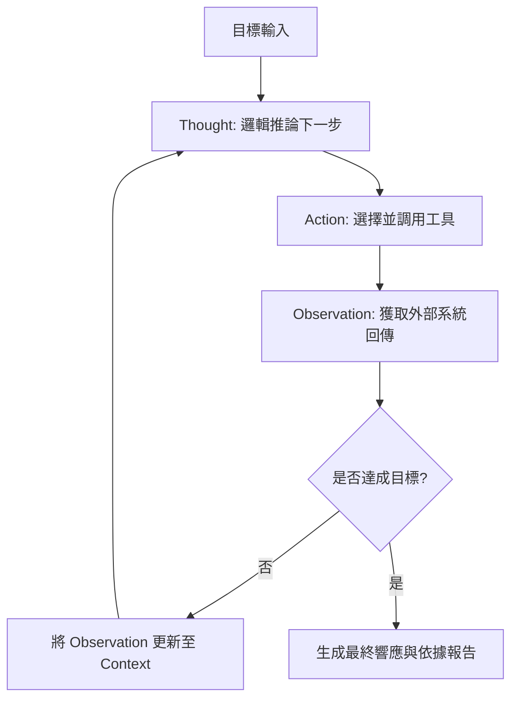

# ReAct 模式

在分散式系統的設計中，我們深知「計劃趕不上變化」。傳統的自動化工作流（Workflows）本質上是決定性的（Deterministic），它們像是一條死板的傳送帶，一旦遇到非預期的輸入就會崩潰。身為架構師，我們引入 **ReAct (Reason + Act)** 範式，旨在將 LLM 的內省推理（Chain of Thought）與外部工具調用（Tool Calling）進行深度解耦與交替執行。這讓 AI 不再只是「空談」的文本生成器，而是能根據真實環境的反饋（Observation）動態修正路徑的「實踐者」。

---

### 情境 1：優先交替執行「推理」與「行動」以應對不確定性

#### 核心概念簡述
許多初學者會試圖讓模型一次性生成所有執行步驟（Plan-Then-Execute），但在複雜任務（如貸款審核或供應鏈調度）中，下一步該做什麼往往取決於上一步工具回傳的具體數據。ReAct 模式強制模型在採取行動前先「思考（Thought）」，並在採取行動（Action）後強制「觀察（Observation）」，將結果餵回模型作為下一輪推理的上下文，這能有效防止邏輯偏移與幻覺。

#### 程式碼範例（Bad vs. Better）

```python
# ❌ Bad: 試圖預設所有步驟 (Monolithic Prompting)
# 模型容易在第一步出錯後，後續步驟全部基於錯誤的假設執行
prompt = """
1. 查詢用戶 A 的信用分數。
2. 根據分數判斷風險。
3. 生成核貸報告。
請直接執行並回傳最終結果。
"""

# ✅ Better: 實作 ReAct 迭代循環 (Iterative Reasoning)
# 每一輪只執行一個動作，並根據 Observation 重新評估
def react_loop(user_goal):
    context = f"Goal: {user_goal}"
    while not task_complete:
        # Step 1: Reason (Thought) - 模型判斷下一步
        thought = llm.generate(f"{context}\nWhat is the next thought and action?")

        # Step 2: Act (Action) - 執行工具調用
        action, params = parse_action(thought)
        observation = execute_tool(action, params)

        # Step 3: Observe (Context Update) - 將工具結果存回上下文
        context += f"\nThought: {thought}\nObservation: {observation}"

        if is_final_answer(thought): break
```

#### 底層原理探討與權衡
*   **為什麼有效 (Rationale)**：ReAct 模擬了人類解決問題的「試錯法」。透過將「推理」與「行動」交替，模型能夠利用外部工具（如資料庫、搜尋引擎）作為其「外部長期記憶」的擴充，彌補其靜態權重中過時或不足的知識。
*   **權衡 (Trade-offs)**：這種模式會產生多次模型往返（Round-trips），顯著增加延遲與 Token 成本。

---

### 情境 2：透過「觀察記錄」實現事實錨定（Grounding）

#### 核心概念簡述
AI 代理最危險的行為是基於虛假的前提進行推理。在 ReAct 模式中，每一次行動後的「觀察（Observation）」階段就是一次強制性的事實檢查。如果工具回傳「查無此人」，模型在下一輪的「思考（Thought）」中就必須承認這個事實，而不能憑空捏造一個虛擬帳號繼續執行。

#### 比較與整合表：CoT vs. ReAct

| 特性 | 思維鏈 (CoT) | ReAct 模式 |
| :--- | :--- | :--- |
| **運作本質** | 純文本內省推理 | 推理 + 外部干預 |
| **知識來源** | 靜態預訓練權重 | 工具回傳的動態數據 |
| **糾錯能力** | 低（傾向於合理化錯誤） | 高（基於外部事實強行校正） |
| **適用場景** | 邏輯難題、創意寫作 | 需操作 API、資料庫的任務 |

---

### 情境 3：利用 `LoopAgent` 實現具備終止條件的確定性 ReAct 循環

#### 核心概念簡述
雖然單一 `Agent` 能自動處理工具調用，但在需要「多輪檢核」或「迭代優化」的場景中，單純依賴模型的自主性往往不可靠（模型可能會提早結束或陷入無謂的重複）。身為架構師，我們應使用 `LoopAgent` 結合 `Escalation` 機制，將 ReAct 模式從「機率性」轉化為「架構級的確定性」，確保流程在達成特定目標或消耗完預算後精確終止。

#### 程式碼範例（Bad vs. Better）

```python
# ❌ Bad: 依賴單一 Agent 的自主循環 (Unpredictable)
# 模型可能在未達成高品質要求時就給出最終答案
agent = Agent(
    instruction="請優化這份報告，直到內容完美為止。",
    tools=[optimize_tool]
)
# 缺點：缺乏明確的外部檢核邏輯，模型可能「自圓其說」

# ✅ Better: 使用 LoopAgent 實作「生成-檢核」確定性 ReAct 循環
from google.adk.agents import Agent, LoopAgent, SequentialAgent
from google.adk.tools import ToolContext

# 1. 定義跳出迴圈的工具 (Escalation)
def exit_loop(tool_context: ToolContext):
    """當內容符合預期時，呼叫此工具結束流程。"""
    tool_context.actions.escalate = True
    return "Process terminated by architect."

# 2. 定義專業化的子代理
critic = Agent(
    name="Critic",
    instruction="審查 current_doc，若有錯誤則列出問題，若無則呼叫 exit_loop。",
    tools=[exit_loop]
)
refiner = Agent(
    name="Refiner",
    instruction="根據 Critic 的評論優化 current_doc，並將結果存回 state['current_doc']。",
    output_key="current_doc"
)

# 3. 封裝確定性的 ReAct 循環
reAct_workflow = LoopAgent(
    name="Reliable_ReAct_Loop",
    max_iterations=5, # 強制思考預算 (Thinking Budget)
    sub_agents=[critic, refiner]
)
```

#### 底層原理探討與權衡
*   **為什麼有效 (Rationale)**：`LoopAgent` 提供了一種「確定性的流控（Control Flow）」。透過將「檢核（Critic）」與「執行（Refiner）」拆分為獨立代理並置於循環中，我們強迫系統在每一輪都必須經過顯式的邏輯路徑。這比讓單一模型同時負責執行與自我監督要健壯得多。
*   **拇指法則 (Rule of Thumb)**：如果任務的成功標準可以被明確定義（例如：程式碼通過測試、數值符合範圍），請優先使用 `LoopAgent` 配合 `escalate=True` 工具，而非單純的 `LlmAgent` 自主對話。

---

### 情境 4：利用「長時間執行工具」處理非同步 Observation

#### 核心概念簡述
ReAct 循環中最常見的效能瓶頸是「阻塞性工具（Blocking Tools）」。如果一個工具需要人工審核或執行數分鐘（如大數據查詢），標準的 ReAct 會掛起。我們應使用 `LongRunningFunctionTool` 將循環轉變為「異步等待」模式，允許代理在等待結果時釋放資源，甚至在獲取結果後「恢復（Resume）」執行。

#### 程式碼範例（Bad vs. Better）

```python
# ❌ Bad: 在工具內進行 Sleep 等待 (Resource Waste)
def wait_for_approval():
    while not approved:
        time.sleep(60) # ❌ 阻塞 Runner 執行緒
    return "Approved"

# ✅ Better: 使用 ADK LongRunningFunctionTool (Event-Driven)
from google.adk.tools import LongRunningFunctionTool

def ask_approval(purpose: str):
    """請求經理批准報帳。"""
    # 僅發送請求並回傳 ticket_id，不等待
    return {"ticket_id": "REQ_001", "status": "pending"}

# 將工具標記為長時間執行
approval_tool = LongRunningFunctionTool(func=ask_approval)

# Runner 在收到此工具回傳後會暫停執行，直到客戶端發送 updated_response
# 模擬客戶端在幾小時後回傳結果：
# runner.run_async(new_message=Content(parts=[Part(function_response=updated_res)]))
```

#### 底層原理探討與權衡
*   **為什麼有效 (Rationale)**：這將同步的思考鏈轉化為分散式系統中的「狀態機」。透過將 `Observation` 的獲取非同步化，ReAct 模式可以擴展到「人在迴路（Human-in-the-loop）」的情境。
*   **比較表格：同步 vs. 長時間執行工具**

| 特性 | 同步工具 (FunctionTool) | 長時間執行工具 (LRT) |
| :--- | :--- | :--- |
| **執行執行緒** | 阻塞 Runner 直到回傳 | 啟動任務後立即交還控制權 |
| **等待時間** | 毫秒至秒級 | 分鐘、小時甚至天級（人工介入） |
| **恢復機制** | 無需恢復 | 需結合 `Resume` 模式恢復上下文 |

---

### 更多說明

#### ReAct 運作生命週期圖



#### 拇指法則 (Rule of Thumb)
*   **工具集限縮**：給予模型的工具不應超過 10 個，過多工具會增加模型在 Action 階段的決策疲勞，導致調用錯誤。
*   **強型別合約**：工具回傳應盡可能使用結構化數據（如 JSON），以便模型能精確解析 Observation 中的關鍵欄位。

---

### 延伸思考

**1️⃣ 問題一**：如果工具回傳的數據極其龐大（如 100 頁的 PDF），會如何影響 ReAct 循環？

**👆 回答**：這會觸發「上下文窗口溢出」或「中段迷失」問題。架構上應結合 **Pass-by-Reference (Pattern 7)**，僅將數據的 ID 或摘要傳回 Observation，而非全文，以保持推理鏈的簡潔。

---

**2️⃣ 問題二**：如何防止 ReAct 模式陷入無限的「思考-行動」死循環？

**👆 回答**：必須實作 **Watchdog Timeout** 或 **思考預算（Thinking Budget）**。ADK 的 `LoopAgent` 可設定 `max_iterations`；若是自定義 Runner，則需在 `while` 循環中設定 N=5 等閾值，一旦超過則啟動 **Delayed Escalation**，將軌跡交給人類處理。

---

**3️⃣ 問題三**：ReAct 模式在安全性上有何隱憂？

**👆 回答**：主要風險是 **間接提示注入（Indirect Prompt Injection）**。如果工具（如網頁爬蟲）抓取到惡意指令，模型可能會在 Observation 階段將其誤認為合法的下一階段任務。應採用 **Dual-LLM 架構**，由一個受信任的「監控代理」審核 Observation 內容。
