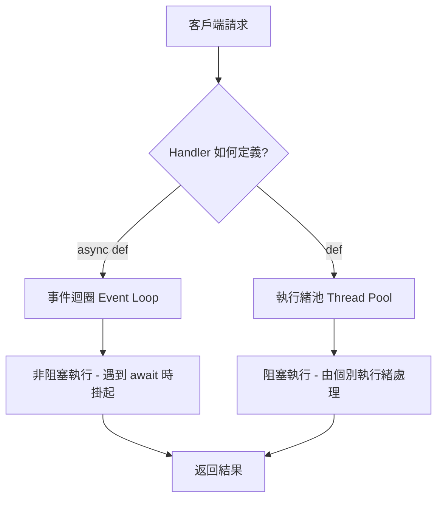

# ASGI 與 FastAPI 高併發架構實戰

在現代高效能 Web 開發中，ASGI（Asynchronous Server Gateway Interface）已成為支撐高併發請求的技術基石。作為資深架構師，我見證了從 WSGI 到 ASGI 的演進過程。FastAPI 正是建立在 ASGI 規範（特別是 Starlette）之上，透過非阻塞 I/O 的機制，極大化了單一執行緒的資源利用率。以下是針對高併發場景的深度技術指導。

---

### 情境 1：從阻塞式 WSGI 遷移至異步 ASGI 架構

**核心概念簡述**
傳統的 WSGI（如 Flask）是同步且阻塞的，每個請求通常需要佔用一個作業系統執行緒。而 ASGI 標準則基於 `coroutine`（協程），允許伺服器在等待 I/O 時（如資料庫查詢、API 調用）釋放控制權，轉而處理其他請求。

**程式碼範例**
下列範例對比了傳統同步邏輯與異步 ASGI 邏輯的效能差異。

```python
# ❌ Bad: 傳統 WSGI 風格，無法使用 await，請求會阻塞執行緒
def wsgi_app(scope, start_response):
    start_response('200 OK', [('Content-Type', 'text/plain')])
    return [b"Hello, WSGI world"]

# ✅ Better: ASGI 標準架構，支援非阻塞式的 send/receive
async def asgi_app(scope, receive, send):
    await send({
        'type': 'http.response.start',
        'status': 200,
        'headers': [[b'content-type', b'text/plain']],
    })
    await send({
        'type': 'http.response.body',
        'body': b"Hello, ASGI world",
    })
```

**底層原理探討與權衡**
WSGI 函數是簡單的 Python 呼叫，缺乏使用 `await` 的切入點。ASGI 則將應用程式定義為一個協程函數，接收 `scope`、`receive` 和 `send` 三個參數，實現了全雙工的非阻塞通訊。雖然 ASGI 增加了開發複雜度，但它能支援 WebSockets 等長連接協議，這是 WSGI 無法企及的。

---

### 情境 2：嚴禁在異步 Handler 中呼叫阻塞型 API

**為什麼 (Rationale)**
這是高併發應用的「致命傷」。FastAPI 在主事件迴圈（Event Loop）上執行 `async def` 函數。若你在異步函數內使用如 `time.sleep()` 或同步的 `requests`，整個事件迴圈將會停止工作，直到該操作結束，導致並發能力瞬間降為 1。

**程式碼範例**
根據來源指出，錯誤的使用方式會導致伺服器性能大幅下降。

```python
# ❌ Bad: 在 async 函數中使用同步阻塞庫 (requests)
@app.post("/generate/text")
async def bad_handler(prompt: str):
    # 這裡會阻塞整個 Event Loop，所有併發請求都會被掛起
    response = requests.post("https://api.openai.com/v1/chat/completions", json=...)
    return response.json()

# ✅ Better: 使用非阻塞式的異步庫 (httpx 或 aiohttp)
@app.post("/generate/text")
async def good_handler(prompt: str):
    # 使用 await 釋放控制權，Event Loop 可以同時處理其他請求
    async with httpx.AsyncClient() as client:
        response = await client.post("https://api.openai.com/v1/chat/completions", json=...)
    return response.json()
```

**適用場景：拇指法則（Rule of Thumb）**
*   **規則**：若要在 `async def` 中執行 I/O，必須使用支援 `async/await` 的客戶端（如 `httpx`, `asyncpg`, `aiofiles`）。
*   **例外**：如果必須使用 legacy 的同步庫且無法更換，請將函數定義為 `def` 而非 `async def`，FastAPI 會自動將其放入執行緒池中運行，以避免阻塞主事件迴圈。

---

### 情境 3：正確選擇同步 `def` 與異步 `async def`

**核心概念簡述**
FastAPI 的核心優勢在於它能無縫處理同步與異步邏輯。對於純計算密集型（CPU-bound）或缺乏異步驅動的任務，強制使用異步反而會拖慢速度，因為這會造成不必要的上下文切換。

**比較表：FastAPI 的執行策略**

| 定義方式 | 執行環境 | 最佳用途 | 效能表現 |
| :--- | :--- | :--- | :--- |
| `async def` | 主事件迴圈 (Event Loop) | 非阻塞 I/O (網路請求、異步資料庫) | 最高效，低資源損耗 |
| `def` | 執行緒池 (Thread Pool) | 阻塞式 I/O (讀取本機檔案、同步 SDK) | 較重，受限於 GIL |

**流程說明 (Mermaid)**
下圖展示了 FastAPI 如何根據定義分流請求：



---

### 情境 4：優先使用連線池（Connection Pooling）減少開銷

**為什麼 (Rationale)**
建立網路連線（如資料庫連線或 HTTP 會話）是一項資源密集型操作，頻繁的建立與銷毀會造成嚴重的延遲與系統負擔。透過 `ClientSession` 或資料庫連線池，可以重複利用現有連線，大幅提升高併發下的吞吐量。

**程式碼範例**
建議在應用程式全生命週期（Lifespan）中維護一個共享的連線池。

```python
# ❌ Bad: 每次請求都建立新的連線
async def fetch_status_bad(url):
    async with aiohttp.ClientSession() as session:
        async with session.get(url) as response:
            return response.status

# ✅ Better: 全域共享 Session，利用 Connection Pooling
# 在應用程式啟動時建立一次
@app.on_event("startup")
async def startup_event():
    app.state.session = aiohttp.ClientSession()

@app.get("/fetch")
async def fetch_status_good(url: str):
    # 重用已存在的連線池，省去握手開銷
    async with app.state.session.get(url) as response:
        return {"status": response.status}
```

---

### 延伸思考

**1️⃣ 問題一**：如果我的應用程式涉及大量機器學習推理（CPU/GPU 密集型），ASGI 仍然適用嗎？

**👆 回答**：ASGI 主要優化的是 I/O 密集型任務。對於 AI 推理這類計算密集型任務，異步程式碼本身並不能加速運算，反而可能因為 GIL 限制而阻塞事件迴圈。建議將推理任務外推（Externalize）到專門的推論伺服器（如 vLLM 或 BentoML），讓 FastAPI 僅作為非阻塞的 API Gateway 處理協調工作。

---

**2️⃣ 問題二**：FastAPI 的執行緒池預設限制是多少？這會影響並發嗎？

**👆 回答**：FastAPI 依賴的 AnyIO 通常預設建立約 40 個執行緒。雖然這能應付一般的同步請求，但在極高併發環境下，執行緒的切換成本（Context Switch）會變得非常昂貴。因此，長期目標應是將所有 I/O 操作轉換為支援協程的異步驅動，以完全發揮事件迴圈的威力。