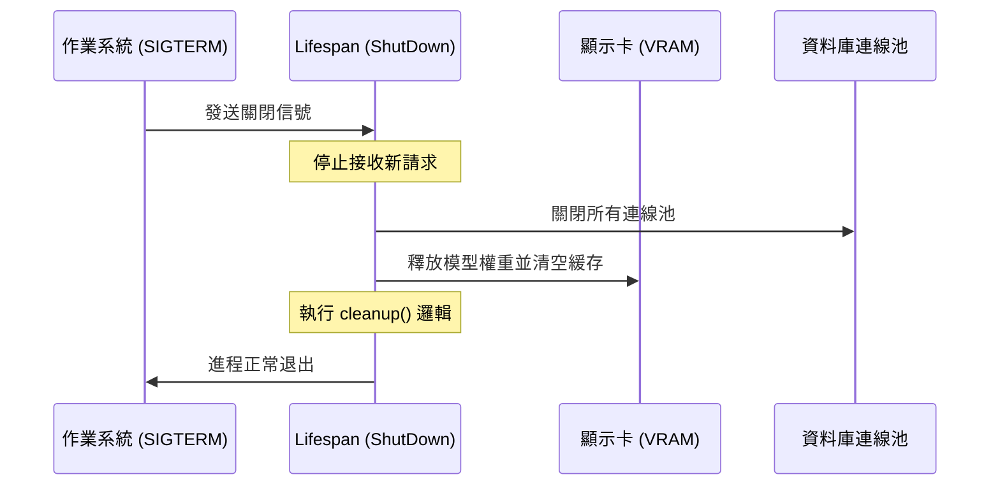

# Lifespan 事件管理實務

在現代 AI 服務架構中，模型（Model）通常是資源密集型資產，動輒佔用數 GB 的內存或顯存（VRAM）。身為架構師，我們必須確保這些重型資源在伺服器生命週期中被妥善管理。FastAPI 提供的 `lifespan` 機制是處理這類問題的工業級標準，它能有效避免「冷啟動延遲」並確保「優雅關閉（Graceful Shutdown）」。

以下是針對 AI 模型生命週期管理的實戰指導。

---

### 情境 1：優先選用 `lifespan` 異步上下文管理器而非舊式事件

**核心概念簡述**
早期的 FastAPI 使用 `@app.on_event("startup")` 和 `"shutdown"`，但這對邏輯分離並不友善。現代架構應使用 `asynccontextmanager` 定義 `lifespan`。這不僅能處理初始化，還能透過 `yield` 確保清理邏輯與初始化邏輯在同一個上下文內，提升程式碼的健壯性。

**程式碼範例**

```python
# ❌ Bad: 使用已棄用的事件處理方式，邏輯分散且難以維護狀態
@app.on_event("startup")
async def startup_event():
    app.state.model = load_model() # 狀態掛載在 app 上，缺乏類型提示

@app.on_event("shutdown")
async def shutdown_event():
    app.state.model.cleanup()

# ✅ Better: 使用 lifespan 統一管理生命週期，結構清晰且支援異常捕獲
@asynccontextmanager
async def lifespan(app: FastAPI):
    # [啟動階段] 執行重型初始化
    model_instance = load_ai_model()
    app.state.ai_model = model_instance
    print("AI Model preloaded successfully.")

    yield  # 伺服器在此處開始接收請求

    # [關閉階段] 執行優雅卸載與資源釋放
    model_instance.unload()
    print("AI Model unloaded and VRAM released.")

app = FastAPI(lifespan=lifespan)
```

**底層原理探討與權衡**
`lifespan` 的本質是一個異步生成器。當伺服器啟動時，它會執行 `yield` 之前的程式碼；當伺服器接收到停止信號（如 SIGTERM）時，它會恢復執行 `yield` 之後的邏輯。這種方式確保了即便在初始化過程中發生異常，我們也能在同一個區塊內捕獲並處理。

---

### 情境 2：將模型載入置於請求路徑之外，消除冷啟動延遲

**為什麼 (Rationale)**
在 API 請求處理函數（Handler）內部載入模型是初學者常見的錯誤。這會導致每個用戶在第一次請求時面臨長達數秒甚至數分鐘的等待，且會重複佔用內存，最終導致伺服器崩潰。我們必須在伺服器準備好接收請求之前完成載入。

**程式碼範例**

```python
# ❌ Bad: 在 Handler 內載入模型，造成嚴重的 I/O 阻塞與延遲
@app.post("/predict")
async def predict_bad(data: Data):
    model = load_heavy_llm() # 每次請求都重新載入，系統性能瞬間降至冰點
    return model.generate(data)

# ✅ Better: 在啟動時預載入至全域狀態或單例對象
@app.post("/predict")
async def predict_good(request: Request, data: Data):
    # 從 app.state 獲取已載入的模型實例
    model = request.app.state.ai_model
    return model.generate(data)
```

**適用場景：拇指法則 (Rule of Thumb)**
*   **規則**：模型檔案 > 100MB 或載入時間 > 500ms 時，務必預載入至 `lifespan`。
*   **例外**：如果系統需要動態切換數千個微型模型（如個人化適配器），則應配合 LRU Cache 機制進行動態加載。

---

### 情境 3：確保關閉時執行「資源優雅卸載」以釋放顯存

**核心概念簡述**
AI 模型通常佔用大量 GPU 顯存（VRAM）。如果伺服器重啟時沒有明確釋放資源，可能會導致新的進程無法獲取足夠的 VRAM 而啟動失敗。優雅卸載應包含關閉資料庫連線池、清理暫存檔以及顯存釋放。

**流程說明 (Mermaid)**



---

### 更多說明：模型載入策略對比表

| 特性 | 請求時載入 (On-demand) | Lifespan 預載入 (Preload) | 外部模型伺服器 (Externalized) |
| :--- | :--- | :--- | :--- |
| **首屏延遲** | 極高 (冷啟動) | 無 | 低 (僅網路開銷) |
| **內存利用率** | 不穩定 (易 OOM) | 恆定 | 最優 (支援共享) |
| **開發難度** | 極低 | 中 | 高 (需維護 vLLM/BentoML) |
| **適用對象** | 簡易 POC | 小型/中型 AI 服務 | 高併發生產環境 |

---

### 延伸思考

**1️⃣ 問題一**：如果在 `lifespan` 載入模型時超時，FastAPI 會如何處理？

**👆 回答**：FastAPI（及底層的 Uvicorn）會等待 `lifespan` 完成。如果模型過大（如 70B 參數，約 140GB）導致載入時間過長，雲端平台的健康檢查（Health Check）可能會判定容器啟動失敗而將其殺掉。
**策略**：應適度調大雲端平台的啟動等待時間（Initial Delay），或使用「模型烘焙（Model Baking）」技術將權重直接包含在 Docker 鏡像中以加速讀取。

---

**2️⃣ 問題二**：如何在高併發場景下避免多進程（Multiprocessing）重複載入模型？

**👆 回答**：FastAPI 本身不支援跨進程共享內存的模型實例。如果你開啟 4 個 Uvicorn Worker，系統會嘗試載入 4 份模型，極易造成內存溢出。
**建議**：將模型服務「外部化」，使用專門的推理引擎如 **vLLM** 或 **BentoML** 獨立部署模型，FastAPI 則透過異步 API（如 `httpx`）與之通訊。這樣可以實現 Web 層與推理層的獨立擴展。

---

**3️⃣ 問題三**：在關閉階段，如何處理尚未完成的背景任務？

**👆 回答**：FastAPI 的 `BackgroundTasks` 在生命週期結束前會嘗試完成任務，但這不保證在強制切斷（SIGKILL）下依然安全。
**建議**：對於關鍵任務（如 RAG 向量入庫），應使用 `Queue.join()` 或外部任務隊列（如 Celery/Redis），並在 `lifespan` 的 `yield` 之後加入檢查點，等待隊列清空後再完全退出。