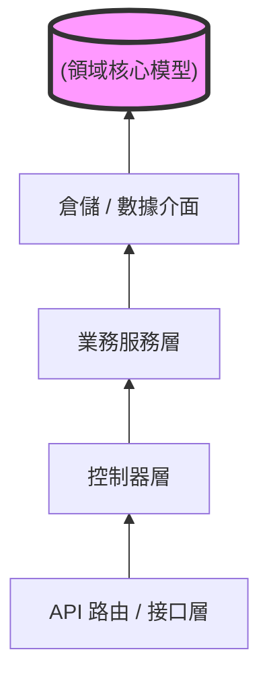

# 洋蔥架構實戰：隔離業務邏輯與模型技術實現

在建構生產級的 Generative AI 服務時，最常見的架構陷阱就是將「模型調用邏輯」、「資料庫查詢」與「業務規則」通通塞進 FastAPI 的路由處理函數（Handler）中。這不僅讓程式碼變得難以測試，更會在模型升級或更換資料庫時引發災難性的「連鎖修改」。

洋蔥架構（Onion Architecture）的核心在於**依賴反轉原則（Dependency Inversion Principle）**：高層業務邏輯不應依賴低層技術實現，所有依賴方向都應向內指向領域核心。以下是將此架構應用於 FastAPI 與 AI 服務的實戰指導。

---

### 情境 1：利用依賴注入（DI）實現資料庫與模型生命週期隔離

**核心概念簡述**
路由處理器（Controller）應僅負責「接收請求」與「分發任務」，而不應知道如何建立資料庫連線或初始化重型 AI 模型。透過 FastAPI 的依賴注入系統，我們可以將資源管理移至架構的外層，確保核心邏輯的純粹性。

**程式碼範例**

```python
# ❌ Bad: 在 Handler 內部手動管理資源，違反單一職責原則且難以維護
@app.get("/user/messages")
async def get_messages(user_id: int):
    db = DatabaseSession() # 手動創建連線，與底層技術耦合
    try:
        messages = db.fetch_all(f"SELECT * FROM messages WHERE user_id={user_id}")
        return messages
    finally:
        db.close() # 必須記得手動關閉，否則造成資源洩漏

# ✅ Better: 使用 Depends 注入，由框架管理生命週期與依賴方向
async def get_db():
    db = DatabaseSession()
    try:
        yield db # 資源生命週期在此處集中管理
    finally:
        db.close()

@app.get("/user/messages")
async def get_messages(db: Annotated[DatabaseSession, Depends(get_db)]):
    # Handler 不再關心 DB 如何建立或關閉，僅關注業務調用
    return db.fetch_messages()
```

**底層原理探討與權衡**
這種做法實踐了「控制反轉」（IoC）。FastAPI 會在請求生命週期內快取依賴項的輸出，避免重複運算。雖然這增加了函數定義的視覺複雜度，但它提供了極佳的**測試性**——在單元測試中，你可以輕易地注入一個 Mock 物件來取代真實的資料庫。

---

### 情境 2：透過倉儲模式（Repository Pattern）隔離 AI 模型與持久層

**核心概念簡述**
AI 服務的數據往往涉及多種形式（如關係型數據與向量數據）。倉儲模式充當業務邏輯與資料存取層之間的中介。在洋蔥架構中，業務服務（Services）應該調用倉儲接口，而不必理會底層是用 SQLAlchemy 還是 Qdrant。

**程式碼範例**

```python
# ❌ Bad: 在路由中直接寫 SQLAlchemy 語法，與資料庫框架高度綁定
@app.get("/conversations/{id}")
async def get_conv(id: int, db: AsyncSession = Depends(get_db)):
    # 業務邏輯與底層 SQL 語法混雜，難以遷移或重用
    result = await db.execute(select(Conversation).where(Conversation.id == id))
    return result.scalars().first()

# ✅ Better: 實作抽象介面與具體倉儲，隔離技術細節
class ConversationRepository(Repository): # 繼承自抽象接口
    async def get(self, id: int) -> Conversation:
        # 將資料存取邏輯封裝於此
        result = await self.db.execute(select(Conversation).where(Conversation.id == id))
        return result.scalars().first()

@app.get("/conversations/{id}")
async def get_conv(id: int, service: ConversationService = Depends()):
    # 透過 Service 調用 Repository，實現多層隔離
    return await service.get_conversation(id)
```

**適用場景：拇指法則（Rule of Thumb）**
*   **規則**：當你的業務邏輯需要跨表查詢、或是 AI 模型輸出需要同步存入多個儲存媒介（如 Redis + PostgreSQL）時，務必使用 Repository 模式。
*   **例外**：如果只是極度簡單的 CRUD 專案，單純的 Pydantic 模型可能就足夠，避免過度工程。

---

### 更多說明 (架構比較與層次定義)

下表定義了洋蔥架構中各層的職責歸屬：

| 架構層級 | 組件範例 | 職責說明 | 依賴方向 |
| :--- | :--- | :--- | :--- |
| **外層 (Infrastructure)** | API Routers, Middleware | 處理 HTTP 請求、認證過濾與 CORS 設定 | 向內依賴 Controllers |
| **中外層 (Application)** | Controllers, Guards | 驗證請求 Schema、調用業務服務 | 向內依賴 Services |
| **中內層 (Domain Service)** | Business Services | 核心業務邏輯（如：RAG 檢索策略、模型調度） | 向內依賴 Repositories |
| **核心層 (Domain Model)** | Pydantic Schemas, Entities | 定義業務數據結構與驗證規則 | **不依賴任何外部技術** |

**洋蔥架構依賴圖 (Mermaid)**



---

### 延伸思考

**1️⃣ 問題一**：在 AI 服務中，如果模型推理時間很長（如 Stable Diffusion），洋蔥架構如何處理這種非同步任務？

**👆 回答**：這通常會在 **Service 層** 進行處理。Service 不會等待模型返回，而是調用底層的「背景任務系統」（FastAPI `BackgroundTasks` 或 Celery）。Service 層會先寫入一筆狀態為 `pending` 的資料庫紀錄（透過 Repository），隨即返回給用戶一個 `Task ID`。

---

**2️⃣ 問題二**：洋蔥架構是否會導致程式碼量增加，造成開發緩慢？

**👆 回答**：初期確實會增加一些 Boilerplate 程式碼（如接口定義）。但對於長期維護的 AI 專案來說，這是值得的投資。它解決了「霰彈式修改」（Shotgun Updates）的問題——即修改一個地方卻得動到數十個文件。透過模組化封裝，你可以確保修改 AI 模型參數時，不會破壞用戶認證系統。

---

**3️⃣ 問題三**：Pydantic 模型應該放在哪一層？

**👆 回答**：根據洋蔥架構，**核心 Pydantic 模型（Domain Models）** 應放在最內層，因為它們定義了系統的數據契約。然而，為了應對不同接口的需求（如 API 請求 vs. 資料庫內部紀錄），我們會定義不同的 Pydantic 變體（如 `UserCreate`, `UserRead`），並在 Service 或 Mapper 層進行轉換。