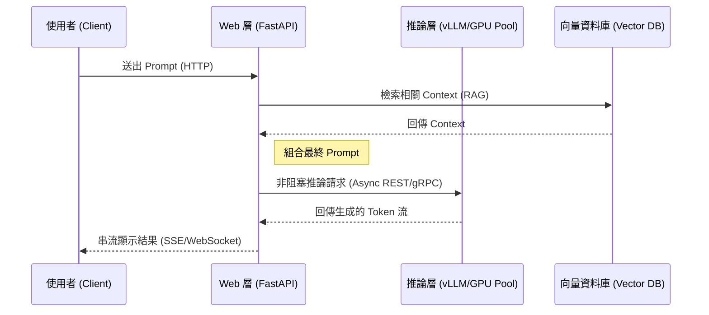

# 外部化模型服務與解耦實戰

在建構生產級的 AI 服務時，最常見的架構錯誤就是將「模型權重」直接加載到 Web 伺服器（如 FastAPI）的進程中。這種單體架構（Monolithic）會導致網路層與推論層互相爭奪 CPU/GPU 資源，甚至因為推論的計算密集特性而阻塞整個事件迴圈。作為架構師，我們必須實踐「職責分離」，將 Web 層與推論層完全解耦。

---

### 情境 1：嚴禁在 Web 伺服器內核直接執行計算密集型推論

**核心概念簡述**
AI 模型推論是高度「計算密集（Compute-bound）」且「記憶體密集（Memory-bound）」的操作。FastAPI 雖然擅長處理非同步 I/O，但如果在 `async def` 中直接執行如 `pipeline(prompt)` 這種會卡住 CPU/GPU 數秒的操作，會直接導致事件迴圈（Event Loop）停擺，無法回應其他使用者的網路請求。

**程式碼範例**
下列範例對比了將模型內嵌於伺服器（單體）與調用外部專門推論引擎（解耦）的差異。

```python
# ❌ Bad: 在 FastAPI 進程中直接載入模型，推論時會阻塞事件迴圈
@app.post("/generate")
async def bad_inference(prompt: str):
    # 這裡的運算會霸佔 CPU/GPU，導致 Web 伺服器在執行期間無法處理其他任何 Request
    result = model.generate(prompt)
    return {"result": result}

# ✅ Better: 將推論職責外推給 vLLM 等專業引擎，Web 層僅透過非阻塞 I/O 通訊
@app.post("/generate")
async def good_inference(prompt: str):
    async with aiohttp.ClientSession() as session:
        # 透過非阻塞的 HTTP 呼叫外部推論伺服器
        async with session.post("http://vllm-server:8000/v1/completions", json={"prompt": prompt}) as resp:
            result = await resp.json()
            return result
```

**底層原理探討與權衡**
當推論被外部化後，Web 伺服器的 CPU 僅負責請求轉換與驗證，而 GPU 則專注於執行高效的深度學習推論。使用 vLLM 等專用伺服器可以獲得「連續批次處理（Continuous Batching）」與「PagedAttention」等優化技術，這能將吞吐量提升至 23 倍，並大幅降低延遲。

---

### 情境 2：透過「故障隔離」提升系統穩定性

**為什麼 (Rationale)**
模型推論伺服器可能會因為 GPU 記憶體溢出（OOM）或硬體故障而崩潰。如果模型與網路層結合，一旦模型崩潰，整個 API 服務都會下線。解耦後，我們可以針對推論層實施強大的「錯誤恢復」與「降級策略」。

**比較表：單體架構 vs. 解耦架構 (如 vLLM)**

| 特性 | 單體架構 (Monolithic) | 解耦架構 (External Inference) |
| :--- | :--- | :--- |
| **擴展性** | 需同時複製 Web 與 模型，極度浪費記憶體 | Web 層與推論層可根據需求獨立擴展 |
| **穩定性** | 模型 OOM 會導致 Web 伺服器同步停擺 | 模型失效時，Web 層可回傳 503 或切換至備用模型 |
| **資源利用率** | 低，CPU 與 GPU 常處於互相等待狀態 | 高，可利用專用伺服器的 Tensor Parallelism |

---

### 情境 3：正確使用專用推論引擎進行「分流處理」

**核心概念簡述**
專業的推論引擎（如 vLLM, Ray Serve, NVIDIA Triton）支援「OpenAI 兼容 API」，這讓架構能像「隨插即用」的硬體一樣靈活。這也實現了所謂的「精簡架構（Be Lean）」，讓 FastAPI 僅作為邏輯協調層（Logical Layer）。

**流程說明**

展示 Web 層與外部推論伺服器之間的互動流程：



---

### 情境 4：優先考慮硬體特性進行「記憶體管理」

**為什麼 (Rationale)**
對於大語言模型（LLM），推論通常是「記憶體頻寬受限（Memory-bandwidth bound）」而非單純的計算受限。這意味著將模型與應用程式邏輯混在一起會進一步壓縮可用的記憶體頻寬。將模型獨立部署到具備高頻寬記憶體（HBM）的硬體上是唯一解法。

**適用場景：拇指法則 (Rule of Thumb)**
*   **規則 1**：當模型參數超過 7B，或是預期每秒請求數（RPS）大於 1 時，**務必**外部化推論層。
*   **規則 2**：若需要在邊緣設備（如手機）運行，則應選用專門的「小語言模型（SLM）」並進行「量化（Quantization）」處理，而非使用通用的 Web 服務架構。
*   **例外**：在開發初期進行極小規模的 POC 驗證，且模型檔案極小（如 TinyLlama）時，可暫時採用單體部署以加速原型開發。

---

### 情境 5：使用 Google ADK 搭配 vLLM 實現企業級推論解耦

**核心概念簡述**
在企業級應用中，我們應避免將代理程式（Agent）邏輯與特定推論實體綁死。透過 Google ADK 的 `LiteLlm` 模型適配器，我們可以輕易地將 Agent 的執行環境與後端 vLLM 推論集群對接。這不僅落實了「依賴反轉（Dependency Inversion）」，更讓系統具備了在多個 vLLM 節點間進行負載平衡的能力。

**程式碼範例**
下列範例展示了如何利用 ADK 的標準介面封裝 vLLM 外部調用，確保業務邏輯的純粹性。

```python
# ❌ Bad: 寫死特定的 Request Logic 或在 Agent 內部直接處理 HTTP 負擔
class HeavyAgent:
    async def chat(self, prompt):
        # 這是錯誤的做法：將網路協定細節混入 Agent 邏輯
        async with aiohttp.ClientSession() as s:
            async with s.post("http://vllm-node/v1/chat", json={"p": prompt}) as r:
                return await r.json()

# ✅ Better: 利用 ADK 的 LiteLlm 適配器封裝 vLLM，實現標準化模型替換
from google.adk.agents import LlmAgent
from google.adk.models.lite_llm import LiteLlm

# 封裝後的 vLLM 模型定義
vllm_model = LiteLlm(
    model="hosted_vllm/google/gemma-3-27b-it", # 指定端點上的模型名稱
    api_base="https://vllm-cluster.internal/v1", # 內部高可用 vLLM 端點
    extra_headers={"Authorization": f"Bearer {INTERNAL_TOKEN}"}
)

# 業務邏輯 Agent 僅需面向標準化介面
agent_vllm = LlmAgent(
    model=vllm_model,
    name="enterprise_assistant",
    instruction="你是一個運行在企業內部 vLLM 集群上的資深顧問。"
)
```

**底層原理探討與權衡**
vLLM 的強大之處在於其內建的 `Continuous Batching`，它能動態地將多個請求合併。當 ADK 透過非同步呼叫 `vLLM` 時，Web 伺服器的 I/O 執行緒會立即被釋放（yield），等待 vLLM 回傳結果。這種模式比 Python `multiprocessing` 更具擴展性，因為推論的平行度是由 vLLM 服務端（通常是多 GPU 分散式環境）控制，而非單機的 CPU 核心數。

**效能提升比較表**

| 維度 | ADK + 內嵌模型 | ADK + vLLM 集群 (解耦) |
| :--- | :--- | :--- |
| **首個 Token 延遲 (TTFT)** | 高 (受限於單機資源爭搶) | 低 (專用 GPU HBM 預加載) |
| **每秒請求數 (RPS)** | 極低 (~1-2 RPS) | 高 (可達 20+ RPS，取決於 Batching) |
| **部署彈性** | 需重啟整個 Web App | 可動態增減 GPU 節點，無感擴容 |

---

### 延伸思考

**1️⃣ 問題一**：外部化模型伺服器會增加網路延遲嗎？

**👆 回答**：雖然增加了內部網路通訊的開銷（約 10-50ms），但相較於模型加載與推論所需的數秒時間，這點延遲微乎其微。更重要的是，專業引擎帶來的推論效能提升（如 Continuous Batching）遠遠超過了網路延遲的損耗。

---

**2️⃣ 問題二**：如何保護 Web 層與推論層之間的通訊？

**👆 回答**：根據 A2A (Agent-to-Agent) 協議或標準生產規範，建議在內網使用「機密權限（Secret Token）」進行基礎身份驗證，或部署在 VPC (Virtual Private Cloud) 內，確保推論伺服器不暴露於公網。

---

**3️⃣ 問題三**：如果推論伺服器回應緩慢，Web 層該如何處理？

**👆 回答**：這正是解耦的優勢。你可以實施「斷路器（Circuit Breaker）」模式或設置嚴格的「超時監控器（Watchdog Timeout）」。當推論伺服器無回應時，FastAPI 可以立刻回傳 503 並嘗試自動重新連接或切換到輕量級的備用模型（Fallback Model），確保系統不會完全癱瘓。