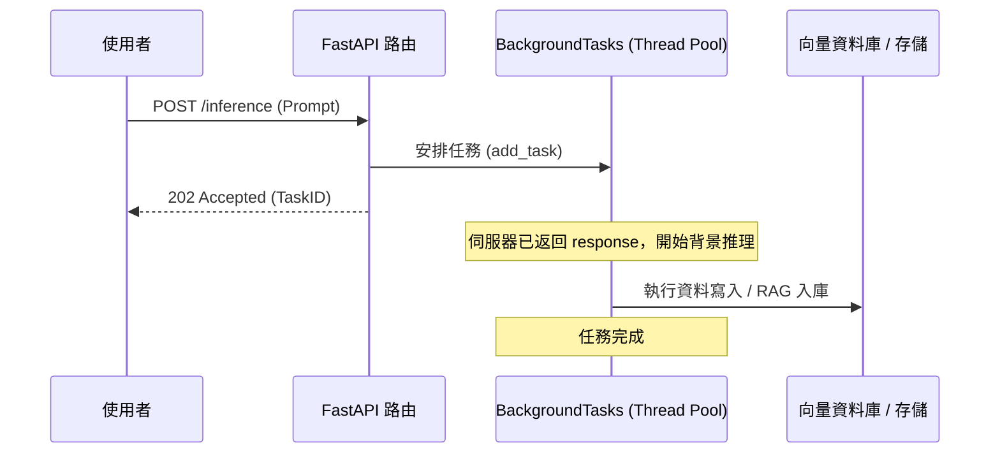
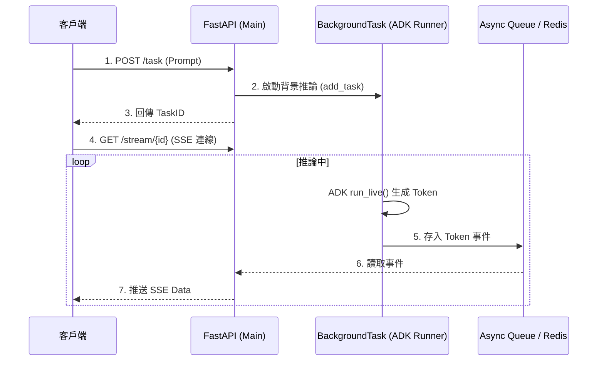

# FastAPI 背景任務與推理性能優化

在構建 Generative AI 服務時，模型推理（Inference）往往是系統中最耗時的環節。例如，Stable Diffusion 生成一張圖片可能需要數秒甚至數分鐘。身為架構師，我們絕不能讓使用者在 HTTP 連線中苦苦等待直到推理完成，這不僅會導致瀏覽器逾時，更會耗盡伺服器的連線資源。FastAPI 的 `BackgroundTasks` 提供了一種優雅的機制，讓我們能在返回回應後，繼續在後台執行耗時任務。

---

### 情境 1：優先返回「202 Accepted」而非阻塞等待

**核心概念簡述**
對於耗時超過 500ms 的任務，應立即返回給使用者一個「任務已接收」的訊號（如任務 ID），並將推理邏輯移至後台執行。這能極大地提升 UI 的反應速度，讓使用者感覺系統是即時響應的。

**程式碼範例**

```python
# ❌ Bad: 在 Request-Response 循環中直接推理，使用者必須等待模型生成
@app.post("/generate/image/slow")
async def generate_bad(prompt: str):
    # 這會阻塞連線，直到圖片生成完畢
    image_data = await model.generate(prompt)
    return {"image_url": save_to_disk(image_data)}

# ✅ Better: 立即返回任務 ID，並啟動背景任務進行推理
@app.post("/generate/image/fast", status_code=202)
async def generate_good(prompt: str, background_tasks: BackgroundTasks):
    task_id = str(uuid.uuid4())
    # 安排任務在返回 response 後執行
    background_tasks.add_task(heavy_inference_job, task_id, prompt)
    return {"task_id": task_id, "message": "Task accepted and processing in background."}
```

**底層原理探討與權衡**
`BackgroundTasks` 會在 FastAPI 發送 HTTP 回應後立即觸發指定的函式。這改變了傳統的「請求-等待-回應」模型，變為「請求-接受-輪詢」。雖然增加了客戶端需要二次查詢（Polling）或使用 WebSocket 接收結果的複雜度，但這換取了極高的系統可用性與使用者體驗。

---

### 情境 2：正確區分 `def` 與 `async def` 以避免阻塞主執行緒

**為什麼 (Rationale)**
這是初學者最常犯的錯誤：在背景任務中使用 `async def` 執行運算密集型（CPU-bound）的推理任務。FastAPI 的背景任務如果宣告為 `async def`，它依然運行在主事件迴圈（Event Loop）上。如果該任務是純計算而沒有頻繁的 `await`，它會卡死整個伺服器，導致其他使用者的請求無法被處理。

**程式碼範例**

```python
# ❌ Bad: 在 async 背景任務中執行 CPU 密集型推理，會卡死 Event Loop
async def async_inference_task(prompt: str):
    # 假設這是耗時的 CPU 運算，沒有 yield 給 event loop
    result = cpu_heavy_model_run(prompt)
    save_result(result)

# ✅ Better: 使用同步 def 宣告，FastAPI 會將其放入執行緒池中運行
def sync_inference_task(prompt: str):
    # 這會在獨立執行緒中運行，不會阻塞主伺服器的異步操作
    result = cpu_heavy_model_run(prompt)
    save_result(result)

@app.post("/tasks")
def create_task(prompt: str, bt: BackgroundTasks):
    bt.add_task(sync_inference_task, prompt)
    return {"status": "ok"}
```

**適用場景：拇指法則 (Rule of Thumb)**
*   **規則**：如果任務涉及重型 CPU/GPU 計算（如模型推論），請定義為 `def`。
*   **例外**：如果背景任務主要是 I/O 操作（如發送 Webhook 通知、寫入資料庫），則應使用 `async def` 並正確 `await`。

---

### 情境 3：確保應用程式關閉時任務的優雅完成

**核心概念簡述**
當伺服器接收到重啟或關閉訊號時，正在執行的背景任務可能會被強制中斷，導致數據不一致。身為架構師，我們必須結合 `lifespan` 或 `join()` 機制，確保關鍵任務完成後再停止進程。

**流程說明 (Mermaid)**



---

### 情境 4：在大規模場景下將背景任務「外部化」

**為什麼 (Rationale)**
FastAPI 內建的 `BackgroundTasks` 是記憶體內的排隊機制，不具備「持久化」能力。如果伺服器當機或重啟，所有排隊中的任務都會消失。此外，它無法處理任務失敗後的自動重試邏輯。在生產環境中，對於關鍵推理任務，應優先考慮分散式任務佇列（如 Celery + Redis）。

**比較表：內建背景任務 vs. 外部任務佇列**

| 特性 | FastAPI 內建 (BackgroundTasks) | 分散式佇列 (如 Celery / RabbitMQ) |
| :--- | :--- | :--- |
| **持久性** | 無 (存於 RAM，重啟即消失) | 有 (存於 Broker，系統崩潰不丟失) |
| **擴展性** | 受限於單機資源 | 可橫向擴展至多台 Worker 節點 |
| **失敗處理** | 需手動實作重試邏輯 | 支援自動重試與錯誤監控 |
| **適用場景** | 簡單的 I/O、郵件發送、小規模任務 | 重型 AI 推理、大規模批次處理 |

---

### 情境 5：結合 SSE 與背景任務實現非同步推論回傳 (sse_background_tasks)

**核心概念簡述**
在某些場景下，使用者發起請求後可能不希望保持一個長連接（如 WebSocket），但仍需要獲取推論過程中的即時反饋（Token 串流）。這時可以利用 Google ADK 的非同步 `runner.run_live()` 配合 FastAPI 的 `BackgroundTasks` 與 SSE（Server-Sent Events）。這種架構讓伺服器能先返回任務 ID，隨後在背景執行推論，並透過一個專門的串流端點將結果推送回客戶端。

**程式碼範例**
下列範例展示了如何利用 ADK 的 `LiveRequestQueue` 在背景啟動推論，並透過非同步生成器實現 SSE 回傳。

```python
# ❌ Bad: 試圖在普通的 BackgroundTasks 中直接控制 HTTP Response 串流
@app.post("/generate")
async def bad_sse(prompt: str, bt: BackgroundTasks):
    # 背景任務無法直接存取已返回的 Response 物件進行串流寫入
    bt.add_task(run_and_stream_logic, prompt)
    return {"status": "started"}

# ✅ Better: 背景任務負責產生結果到緩衝區，由 SSE 端點負責推送 (整合 ADK)
from sse_starlette.sse import EventSourceResponse
from google.adk.agents.live_request_queue import LiveRequestQueue

# 全域或 Redis 緩衝區，用於跨進程/執行緒傳遞 SSE 事件
task_streams = {}

async def adk_inference_worker(task_id: str, prompt: str, runner: Runner):
    queue = LiveRequestQueue()
    # 立即發送內容到 ADK 隊列
    queue.send_content(types.Content(parts=[types.Part(text=prompt)]))

    # 使用 ADK 的事件迴圈在背景處理推論
    async for event in runner.run_live(user_id="sys", session_id=task_id, live_request_queue=queue):
        if event.text:
            # 將產出的 Token 放入對應任務的串流隊列中
            await task_streams[task_id].put(event.text)

    # 任務結束訊號
    await task_streams[task_id].put(None)
    queue.close()

@app.get("/stream/{task_id}")
async def sse_endpoint(task_id: str):
    async def event_publisher():
        while True:
            token = await task_streams[task_id].get()
            if token is None: break
            yield {"data": token}

    return EventSourceResponse(event_publisher())
```

**底層原理探討與權衡**
此架構實踐了「生產者-消費者」模式。`BackgroundTasks` 內的 ADK Runner 是生產者，它持續產出 Token 事件並填充至 `asyncio.Queue`；SSE 端點則是消費者，它負責消耗隊列並將數據封裝成 SSE 協議。這種做法的好處是：即使 Client 的網路暫時抖動（SSE 斷開），背景的推論任務（GPU 運算）依然能完整跑完，Client 重新連線後可從緩衝區恢復部分進度。

**處理流程圖**



**適用場景：拇指法則 (Rule of Thumb)**
*   **規則 1**：當推論時間極長（>30秒）且需要即時進度更新時，應優先考慮此模式。
*   **規則 2**：若客戶端環境不支援 WebSocket（如某些企業防火牆），SSE 是最佳的串流替換方案。
*   **注意**：在分散式環境中，`task_streams` 緩衝區必須從內存 `asyncio.Queue` 升級為 `Redis` 或 `Pub/Sub` 系統，否則不同 Pod 間無法存取數據。

---

### 延伸思考

**1️⃣ 問題一**：如果我在背景任務中需要更新資料庫狀態，應該如何管理連線？

**👆 回答**：建議不要在背景任務中直接傳入資料庫 Session 物件，因為該 Session 可能會隨著主請求的結束而被關閉。正確的做法是將 `SessionLocal` 傳入背景任務，或是在任務內部重新開啟一個獨立的資料庫連線上下文，確保事務的完整性。

---

**2️⃣ 問題二**：如何監控背景任務的進度並告知使用者？

**👆 回答**：這通常需要一個中間狀態存儲（如 Redis）。背景任務在執行不同階段（如 25%、50%、100%）更新 Redis 中的狀態位。前端可以透過短輪詢（Short Polling）或 WebSocket 連線來讀取該進度資訊。

---

**3️⃣ 問題三**：背景任務過多會導致伺服器崩潰嗎？

**👆 回答**：會的。內建背景任務預設沒有嚴格的併發限制。如果短時間內湧入大量推理任務，會導致執行緒池爆滿或 CPU 過載。對於這種情況，應配合「信號標（Semaphore）」來限制同時執行的任務數量，或將任務轉移到外部更強大的 Worker 節點上處理。