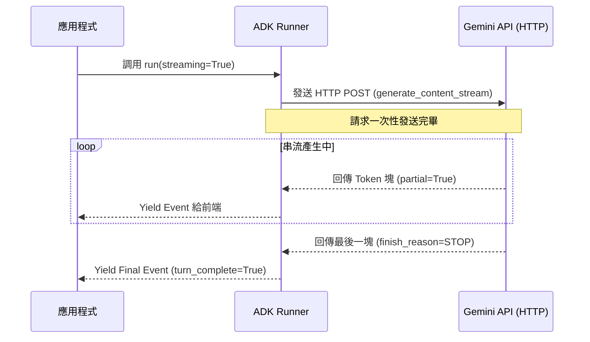

# 伺服器發送事件 (SSE) 流式回應

在分散式系統與生成式 AI 的架構設計中，**延遲（Latency）** 是使用者體驗的頭號殺手。傳統的「請求-回應」模型要求伺服器必須等整個 Token 序列生成完畢後才一次性回傳，這對於長文本生成會導致數秒甚至數十秒的空白等待期。伺服器發送事件 (Server-Sent Events, SSE) 提供了一種輕量級、基於 HTTP 的單向流式傳輸機制，讓 Token 產生的瞬間就能同步到前端，將**首字時間 (TTFT)** 降至最低。

---

### 情境 1：優先使用非同步產生器 (Async Generator) 以避免阻塞事件循環

**核心概念**：
在 Python 的 `asyncio` 環境中，執行流式傳輸必須確保生成邏輯是非同步的。若在 `async def` 路由中使用同步阻塞（如同步的 `time.sleep` 或同步 API 調用），將會直接卡死整個 FastAPI 或 ADK Runner 的事件循環，導致其他併發請求無法處理。

**程式碼範例**：

```python
# ❌ Bad: 使用同步循環阻塞事件循環，導致無法併發處理其他流
@app.get("/generate")
async def generate_bad(prompt: str):
    # 同步阻塞操作會卡住整個 Worker
    response = llm.generate_sync(prompt)
    return {"text": response}

# ✅ Better: 使用 `async for` 配合 ADK `run_async` 實現非同步流**
@app.get("/run_sse")
async def run_sse(user_id: str, session_id: str, prompt: str):
    # ADK Runner 提供非同步生成器，能讓出控制權給事件循環
    content = types.Content(parts=[types.Part(text=prompt)])

    async def event_generator():
        async for event in runner.run_async(user_id, session_id, content):
            # 僅傳輸 partial token 以優化體驗
            if event.partial and event.content:
                yield f"data: {event.model_dump_json()}\n\n"
            if event.turn_complete:
                yield "data: [DONE]\n\n"

    return StreamingResponse(event_generator(), media_type="text/event-stream")
```

**底層原理探討與權衡**：
*   **非同步的威力**：`async for` 允許程式碼在等待下一個 Token 產生時掛起，將 CPU 讓給其他任務。
*   **資源開銷**：雖然 SSE 比 WebSocket (WS) 更輕量（不需要雙向握手），但伺服器仍需為每個流維護一個掛起的 HTTP 連接。

---

### 情境 2：正確區分 `partial=True` 與 `turn_complete` 標記

**核心概念**：
Token 輸出的精髓在於「增量更新」。開發者必須正確處理 `partial` 標記。`partial=True` 代表該事件僅包含自上次以來的新 Token，而當 `partial=False` 且 `turn_complete=True` 時，代表整個回合已結束，這時才是更新資料庫狀態的最佳時機。

**程式碼範例**：

```javascript
// ❌ Bad: 前端每次收到事件都覆蓋整個區塊，導致閃爍
// 前端錯誤處理邏輯
source.onmessage = (event) => {
  document.getElementById("chat").innerText = event.data; // 錯誤：這會導致畫面只顯示最後一個 token
};


// ✅ Better: 根據 `partial` 標記進行增量追加與結束檢測**
let fullText = "";
const source = new EventSource("/run_sse");

source.onmessage = (e) => {
  const eventData = JSON.parse(e.data);

  if (eventData.partial === true) {
    // 增量追加 Token
    const newToken = eventData.content.parts.text;
    fullText += newToken;
    updateUI(fullText);
  }

  if (eventData.turnComplete === true) {
    // 標記結束，隱藏輸入提示動畫
    finalizeUI();
    source.close();
  }
};
```

**適用場景與規則**：
*   **拇指法則**：始終依賴 ADK 的 `is_final_response()` 輔助方法來識別適合存檔或顯示完整訊息的事件。

---

### 情境 3：實施伺服器端節流 (Throttling) 以防止客戶端回壓

**核心概念**：
當 LLM 生成速度極快（如使用高併發的 vLLM 後端時），每秒可能產生數十個事件。若客戶端處理（如複雜的 Markdown 渲染）跟不上，會造成記憶體堆積。在伺服器端進行輕微的節流，能確保流動的平滑感。

**程式碼範例**：

```python
# ❌ Bad: 不計代價以最高速推播事件
async for event in raw_stream:
    yield event # 若 LLM 生成太快，可能導致前端 DOM 渲染瓶頸


# ✅ Better: 引入小量延遲確保串流平滑穩定**
async for event in runner.run_live(..., run_config=run_config):
    # 在 yielding 之間加入微小等待 (如 20ms-50ms)
    # 這能讓 TCP 緩衝區與前端渲染引擎有喘息空間
    await asyncio.sleep(0.02)
    yield event
```

---

### SSE 與 WebSocket (WS) 流程對比

根據來源資料，我們可以用表格與流程圖來總結這兩者的決策模型：

| 特性         | SSE (BIDI/SSE Mode)        | WebSocket (BIDI Mode)       |
| :----------- | :------------------------- | :-------------------------- |
| **通訊協定** | 標準 HTTP                  | TCP 升級 (ws://)            |
| **方向性**   | 單向 (Server -> Client)    | 雙向 (Full-duplex)          |
| **自動重連** | 瀏覽器原生支持             | 需手動實作                  |
| **最佳用途** | 文字聊天、通知、Token 串流 | 語音/影像即時互動、多人協作 |

#### SSE 串流生命週期流程圖


---

### 延伸思考

**1️⃣ 問題一**：如果在使用 SSE 串流時，使用者突然斷網，伺服器會發生什麼事？

**👆 回答**：在非同步環境下，當底層 TCP 連接斷開時，`StreamingResponse` 會拋出一個中斷異常。良好的實踐是在 `event_generator` 外層包覆 `try...finally` 區塊，並在 `finally` 中顯式調用 `live_request_queue.close()`，否則可能會在後端產生「喪屍會話 (Zombie Sessions)」，浪費雲端配額。

---

**2️⃣ 問題二**：SSE 只能發送文本嗎？如果我想傳輸 AI 生成的圖片或音訊該怎麼辦？

**👆 回答**：SSE 的 `Content-Type` 雖為 `text/event-stream`，但您可以透過 Base64 編碼將二進位資料封裝在 JSON Payload 中傳送。然而，Base64 會增加約 33% 的傳輸體積。若有大量音訊或影像串流需求，來源建議切換至 `StreamingMode.BIDI` (WebSocket)，利用二進位影格 (Binary Frames) 來提升效能。

---

**3️⃣ 問題三**：Google ADK 提到的 `output_key` 在流式回應中扮演什麼角色？

**👆 回答**：`output_key` 是一個便利功能，它會在 `run_async` 偵測到 `turn_complete=True`（最後一個非 partial 事件）時，自動將該回合生成的**完整文本內容**寫入 `session.state` 中。這確保了在串流結束後的下一個對話回合，其他 Agent 或工具能直接從 Session 讀取歷史，而不需要前端重新傳回。